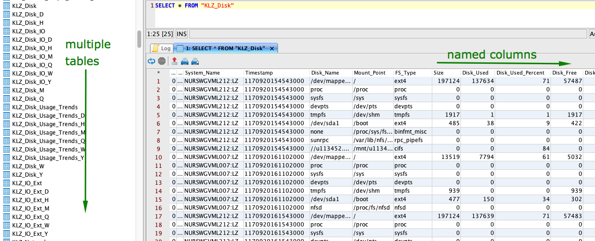
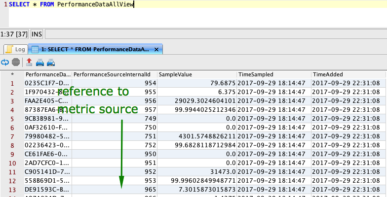

# Compression Tests

## Overview

The following tests estimate the amount of disk space required to store the same dataset containing 10+ million `time:value` samples in different databases.

## Results

| **Database** | **Version** | **Schema** | **Compressed** | **Bytes per Sample** | **Test Link** |
|:---|:---|:---|:---|---:|---|
| **ATSD**       | **17340** | **Universal**  | **Yes** | **1.9**  | [view](atsd.md)  |
| Microsoft SQL Server | 14.0.1000.169   | Specific   | Yes | 9.4  | [view](mssql.md) |
| Microsoft SQL Server | 14.0.1000.169   | Specific   | No  | 19.3 | [view](mssql.md) |
| Microsoft SQL Server | 14.0.1000.169   | Universal  | Yes | 42.9 | [view](mssql.md) |
| Microsoft SQL Server | 14.0.1000.169   | Universal  | No  | 89.5 | [view](mssql.md) |
| MySQL      | 5.7   | Specific   | Yes | 8.2  | [view](mysql.md) |
| MySQL      | 5.7   | Specific   | No  | 15.6 | [view](mysql.md) |
| MySQL      | 5.7   | Universal  | Yes | 34.5 | [view](mysql.md) |
| MySQL      | 5.7   | Universal  | No  | 70.7 | [view](mysql.md) |
| Oracle      | 12.2.0.1   | Specific   | Yes | 9.4  | [view](oracle.md) |
| Oracle      | 12.2.0.1   | Specific   | No  | 13.4 | [view](oracle.md) |
| Oracle      | 12.2.0.1   | Universal  | Yes | 39.3 | [view](oracle.md) |
| Oracle      | 12.2.0.1   | Universal  | No  | 52.5 | [view](oracle.md) |
| PostgreSQL | 9.6   | Specific   | No  | 21.6 | [view](postgres.md) |
| PostgreSQL | 9.6   | Universal  | No  | 83.7 | [view](postgres.md) |
| Vertica | 7.1.1-0   | Specific   | Yes | 2.4 | [view](vertica.md) |
| Vertica | 7.1.1-0   | Universal  | Yes | 5.6 | [view](vertica.md) |

## Dataset

The dataset represents 20+ years of historical minute stock trade data available from the [Kibot](http://www.kibot.com/buy.aspx) company.

The one minute trade statistics are available for IBM stock traded on the New York Stock Exchange. The recording starts on February 1st, 1998 and lasts until the last trading day.

The data is provided in the commonly used OHLCV [format](http://www.kibot.com/support.aspx#data_format).

```csv
Date,Time,Open,High,Low,Close,Volume
01/02/1998,09:30,104.5,104.5,104.5,104.5,67000
...
09/08/2017,17:38,142.45,142.45,142.45,142.45,3556
```

The records be downloaded from the following url: [http://api.kibot.com/?action=history&symbol=IBM&interval=1&unadjusted=0&bp=1&user=guest](http://api.kibot.com/?action=history&symbol=IBM&interval=1&unadjusted=0&bp=1&user=guest).

The file contains over 2 million lines. The OHLC metrics contain values with up to four decimal places. The volume metric is an integer. The dates are recorded in `US/Eastern` time.

Each row consists of 5 metrics for a given 1-minute interval:

```
09/08/2017,15:42,142.53,142.5399,142.49,142.49,10031
...
time   = 09/08/2017 15:42
open   = 142.53
high   = 142.5399
low    = 142.49
close  = 142.49
volume = 10031
```

## Schema Alternatives

The tests are performed using two schema options:

### Trade Table.

The **Trade Table** schema uses a named column for each metric.

This option requires less disk space however the underlying table can not be extended to store different sets of columns for different instrument types. As a result, multiple tables need to be created to store data for various instrument types.

Example: IBM Tivoli Data Warehouse



### Universal Table

The **Universal Table** schema uses a `metricId` column to refer to the metric defined in a separate dictionary table.

This option allows adding new metrics without altering the tables. This can be done by creating a dictionary table for metrics and referencing the metric id in each data table row.

Example: Microsoft System Center Operations Manager Data Warehouse


