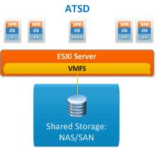
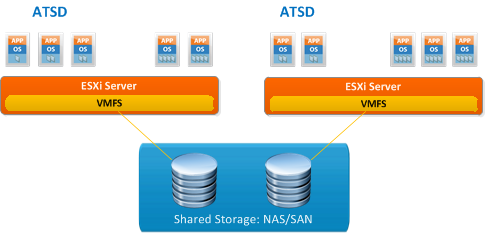
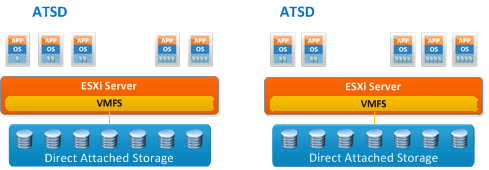

Deployment
==========

ATSD Community Edition can be installed on a single Linux virtual
machine or bare-metal server.

ATSD Standard Edition can be installed on two machines: one for ATSD
itself and the other for HBase.

ATSD Enterprise Edition can be installed in a fully distributed
configuration as illustrated below.

