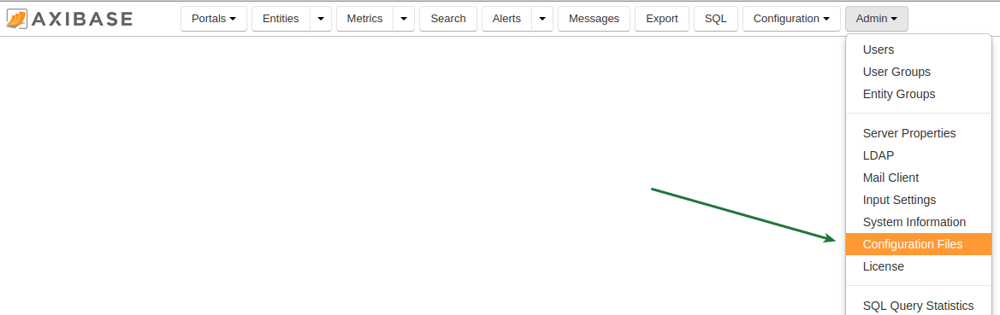
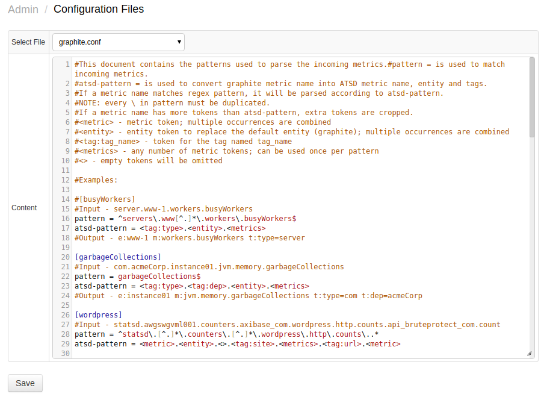

# Editing Configuration Files

The Configuration File Editor allows the editing of ATSD configuration
files directly in the user interface. Only files that are located in the
`/opt/atsd/atsd/conf` directory can be edited.

This is especially useful and convenient when editing `graphite.conf` to
support new metrics that are being written in graphite format.

The Configuration Files Editor can be found under the **Admin >
Configuration Files**:

Configuration Files Editor:

