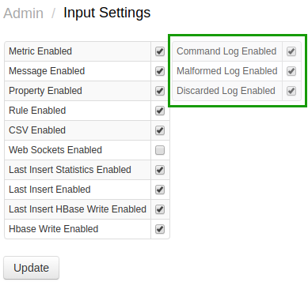

# Logging

The database logs are located in the `/opt/atsd/atsd/logs` directory.

The logs can be also downloaded from the **Admin > Server Logs** page.

Logs are rolled over and archived according to the `/opt/atsd/atsd/conf/logback.xml` settings.

## Log Files

|**Log Name**|**Description**|
|---|:---|
|`atsd.log`| Main database log.|
|`command.log`| Received commands log.|
|`command_malformed.log`| Malformed commands log. Includes commands with invalid syntax.|
|`command_discarded.log`| Discarded commands log. Includes commands received for disabled entities/metrics.|
|`command_ignored.log`| Ignored commands log. |
|`update.log`| Update log. |
|`metrics.txt`| Snapshot of current database metrics. Refreshed every 15 seconds. |
|`start.log`| Start log.|
|`stop.log`| Stop log.|
|`err.log`| Standard error. |
|`alert.log`| Alert log. |

## Logging Properties

### File Count

To increase the number of files stored by a given logger, increase `maxIndex` attribute.

```xml
   <maxIndex>20</maxIndex>
```

### File Size

To increase the size of files rolled over by a given logger, increase `maxFileSize` attribute. This will determine the size of the file before it is rolled over and compressed. The size of the compressed file is typically 10-20 smaller than the original file.

```xml
   <maxFileSize>100Mb</maxFileSize>
```

### File Name

To change the name of the current and archived files, change the `file` and `fileNamePattern` attributes.

```xml
  <file>../logs/command.log</file>
  <fileNamePattern>../logs/command.%i.log.zip</fileNamePattern>
```

### Logging Level

To adjust tracing level, add a logging declaration containing the full class name and the level such as 'DEBUG', 'INFO', 'WARN', 'ERROR'.

```xml
  <logger name="com.axibase.tsd.service.MetricServiceImpl" level="DEBUG"/>
```

## Applying Changes

Changes in logging properties can be made by modifying the `logback.xml` file on the file system or using the **Admin > Configuration Files** editor.

Database restart is **not** required, the changes are automatically refreshed and applied every 60 seconds.

## Enabling Command Logging

For performance purposes, logging to `command*.log` files is controlled both by loggers configured in the `logback.xml` file as well as with controls on **Admin > Input Settings** page.


