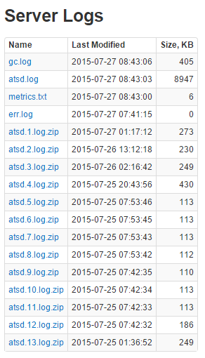

# Logging

The database logs are located in `/opt/atsd/atsd/logs` directory.

The logs can be also downloaded from **Admin:Server Logs** page.

Logs are rolled over and archived according to `/opt/atsd/atsd/conf/logging.properties` settings.

|**Log Name**|**Description**|
|---|:---|
|atsd.log|Application log|
|command.log|Received command log|
|command_discarded.log|Discarded commands for disabled metrics.|
|command_malformed.log|Malformed commands with invalid syntax etc.| 
|command_ignored.log|Commands ignored by parsers, e.g. nmon. |
|command_rule_engine_expired.log|Commands with old timestamp, ignored by rule engine|
|command_rule_engine_forward.log|Commands with forward timestamp, ignored by rule engine|
|gc.log|Garbage collection log|
|metrics.txt|Current database metrics|
|stopstart.log|Start/stop log for ATSD, HBase, HDFS|
|stdout.log|Standard out|
|err.log|Standard error|

* Rule Engine ignores commands that are 1 minute behind or 1 minute ahead of the current server time.<br>When enabled, the ignored commands are logged to `*_expired.log` and `*_forward.log` files respectively.



Command processings logs should be enabled on **Admin:Input Settings** page:


## Logging Properties Reloading

On old instances of ATSD, any change in logging properties requires database restart. To avoid that, add `scan="true"` attribute to the top `<configuration>` node in `/opt/atsd/atsd/conf/logback.xml` file and restart the database. Subsequent changes in logging properties can be made without restarting the database. They are automatically refreshed (scanned) and applied every 60 seconds.

    ```xml
    <?xml version="1.0" encoding="UTF-8"?>
    <configuration scan="true">
	
		<!-- override default command logging properties in command.log.xml -->
        <include resource="command.log.xml"/>
		
		<!-- remaining settings -->
    </configuration>
    ```

## Modifying command.log

The command log contains a record of all commands received by the database and is disabled by default. To turn it on, change settings on **Admin>Input Settings** page. No database restart is required in this case.

The command log is configured to store up to 10 files of up to 10 megabytes each.  The settings can be adjusted to store more commands on instances with a high write throughput.

1. Create `command.log.xml` in `/opt/atsd/atsd/conf` directory.

    ```
    nano /opt/atsd/atsd/conf/command.log.xml
    ```
    
    ```xml
    <included>
        <appender name="commandsLogRoller" class="ch.qos.logback.core.rolling.RollingFileAppender">
            <file>../logs/command.log</file>
    
            <rollingPolicy class="ch.qos.logback.core.rolling.FixedWindowRollingPolicy">
                <fileNamePattern>../logs/command.%i.log.zip</fileNamePattern>
                <minIndex>1</minIndex>
                <maxIndex>20</maxIndex>
            </rollingPolicy>
    
            <triggeringPolicy class="ch.qos.logback.core.rolling.SizeBasedTriggeringPolicy">
                <maxFileSize>100MB</maxFileSize>
            </triggeringPolicy>
    
            <encoder>
                <pattern>%date{ISO8601};%logger;%message%n</pattern>
            </encoder>
        </appender>
    
        <logger name="atsd" level="DEBUG" additivity="false">
			<appender-ref ref="commandsLogRoller"/>
		</logger>
        <logger name="atsd.internal.command" level="DEBUG" additivity="false">
			<appender-ref ref="commandsLogRoller"/>
		</logger>
    </included>
    ```

2. Include `command.log.xml` reference into `/opt/atsd/atsd/conf/logback.xml` under the top `<configuration>` node.

    ```
    nano /opt/atsd/atsd/conf/logback.xml
    ```
    
    ```xml
    <?xml version="1.0" encoding="UTF-8"?>
    <configuration scan="true">
	
		<!-- override default command logging properties in command.log.xml -->
        <include resource="command.log.xml"/>
		
		<!-- remaining settings -->
    </configuration>
    ```
	
3. New logging settings will be applied within 60 seconds. No database restart is required.