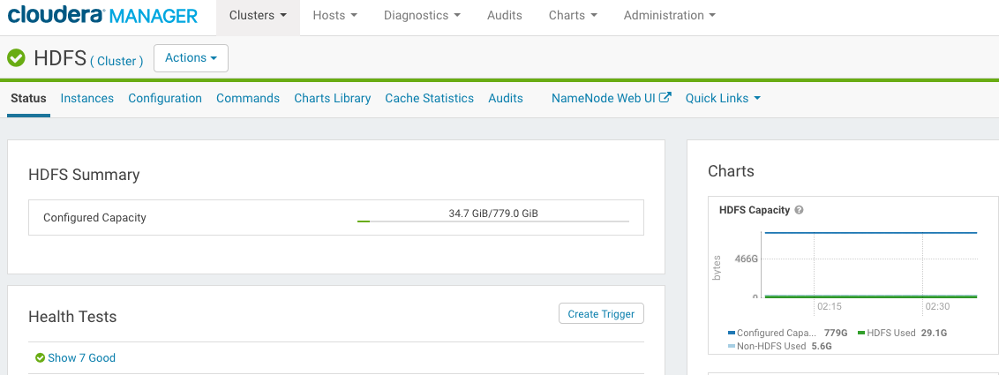
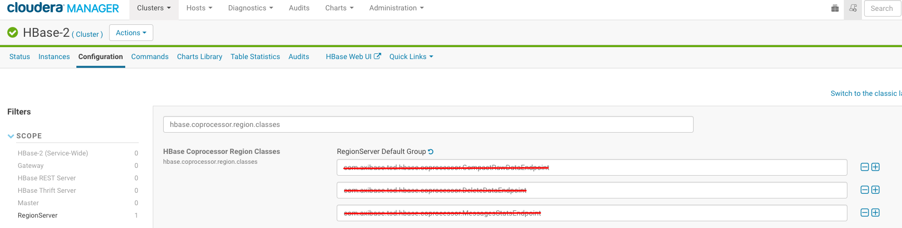

# ATSD Cluster Migration

These instructions describe how to upgrade an Axibase Time Series Database instance running on the Cloudera CDH cluster.

For non-distributed installations, refer to the following [migration guide](README.md).

## Versioning

| **Code** | **ATSD Revision Number** | **Java Version** | **Cloudera Manager Version**| **CDH Version** |
|---|---|---|---|---|
| Old | 16999 and earlier | 1.7 | 5.1 - 5.11| 5.1 - 5.9 |
| New | 17000 and later   | 1.8 | 5.12     | 5.10    |

## Requirements

### Disk Space

The migration procedure requires up to 30% of the current `atsd_d` table size to store new records before old data can be deleted.

Open **Clusters > Cluster > HDFS > Status** page in Clouder Manager.

Make sure that enough configured capacity is available in HDFS.



### Memory

The migration task is implemented as a Map-Reduce job and requires at least 4 GB of RAM available on each HBase region server.

## Check Record Count for Testing

Login into ATSD and open the **SQL** tab.

Execute the following query to count rows for one of the key metrics.

```sql
SELECT COUNT(*) FROM mymetric
```

The number should match the results after the migration.

## Prepare ATSD For Upgrade

Stop ATSD.

```sh
/opt/atsd/atsd/bin/stop-atsd.sh
```

Take note of the **table prefix** specified in the `/opt/atsd/atsd/conf/server.properties` file. 

```sh
cat /opt/atsd/atsd/conf/server.properties | grep "hbase.table.prefix" | cut -f 2 -d "="
```

The prefix will be required in subsequent steps.

## Install Java 8

[Install Java 8](install-java-8.md) on the ATSD server.

## Upgrade Cloudera Cluster

* Upgrade Cloudera Manager to version 5.12.

* Upgrade CDH to version 5.10.

* Start HDFS, HBase, YARN and HistoryServer services.

## Configure Migration Map-Reduce Job

Login into the server where YARN ResourceManager is running.

Locate the `yarn.keytab` file.

```bash
sudo find / -name "yarn.keytab" | xargs ls -la | tail -n 1
-rw------- 1 yarn        hadoop        448 Jul 29 16:44 /run/cloudera-scm-agent/process/7947-yarn-RESOURCEMANAGER/yarn.keytab
```

Switch to the 'yarn' user.

```bash
sudo su yarn
```

### Initiate a Kerberos session.

Obtain the fully qualified hostname of the YARN ResourceManager server.

```bash
hostname -f
```

Authenticate with Kerberos using the located `yarn.keytab` file and the full hostname of the YARN ResourceManager.

```bash
kinit -k -t /run/cloudera-scm-agent/process/7947-yarn-RESOURCEMANAGER/yarn.keytab yarn/{yarn_rm_full_hostname}
```

Download the `migration.jar` file to the temporary `/tmp/migration/` directory.

```sh
mkdir /tmp/migration 
curl -o /tmp/migration/migration.jar https://axibase.com/public/atsd-125-migration/migration-hbase-1.2.0-cdh5.10.0.jar
```

Check that current Java version is 8.

```sh
java -version
```

Add `migration.jar`, HBase configuration files, and HBase classes used by the migration job to Java and Hadoop classpaths.

```sh
export CLASSPATH=$CLASSPATH:$(hbase classpath):/tmp/migration/migration.jar
export HADOOP_CLASSPATH=/opt/cloudera/parcels/CDH-5.10.0-1.cdh5.10.0.p0.41/lib/hbase/bin/../conf:$(hbase mapredcp):/tmp/migration/migration.jar
```

Modify Map-Reduce [settings](mr-settings.md) using parameters recommended by Axibase support based on the [Data Reporter](reporter.md) logs.

## Run Migration Map-Reduce Job

Execute the below steps under the 'yarn' user on the YARN ResourceManager server.

### Backup `atsd_d` Table

Run the `TableCloner` task to rename `atsd_d` table into `atsd_d_backup` table.

```sh
java com.axibase.migration.admin.TableCloner --table_name=atsd_d
```

If a custom table prefix is specifed in the `server.properties` file, for example it's set to 'atsd_custom_', change the `table_name` parameter accordingly:

```sh
java com.axibase.migration.admin.TableCloner --table_name=atsd_custom_d
```

### Migrate Records

Launch the migration job with the `nohup` command.

```sh
nohup yarn com.axibase.migration.mapreduce.DataMigrator --forced --source=atsd_d_backup --destination=atsd_d &> /tmp/migration/migration.log &
```

If the table prefix has been customized, adjust the above command accordingly:

```sh
nohup yarn com.axibase.migration.mapreduce.DataMigrator --forced --source=atsd_custom_d_backup --destination=atsd_custom_d &> /tmp/migration/migration.log &
```

The job will create a new data table, convert data from the backup table to the new format, and store it in the new table.

The job may take several hours to complete. 

Open **Clusters > Cluster > YARN > Web UI > ResourseManager Web UI** in Cloudera Manager.

Monitor the job progress.

```
tail -f /tmp/migration/migration.log
```

Note that Yarn interface will be stopped automatically once the job is finished.

Once the job is complete, the `migration.log` file should contain the following line:

```
17/08/01 10:44:31 INFO mapreduce.DataMigrator: HFiles loaded, data table migration job completed, elapsedTime: 45 minutes.
```

## Deploy ATSD Coprocessors

### Copy New Coprocessors into HDFS

Login into HDFS NameNode server or another server with the DFS client.
 
Switch to the 'hdfs' user.

```sh
sudo su hdfs
```

Copy `atsd-hbase.17140.jar` to the HDFS `hbase.dynamic.jars.dir` directory.
The path to this directory is set to `${hbase.rootdir}/lib` by default in HBase.

```
hadoop fs -ls /hbase/lib/       #   check existence
hadoop fs -mkdir /hbase/lib/    #   if not exists
curl -O https://axibase.com/public/atsd-125-migration/atsd-hbase.17140.jar
hadoop fs -put -f atsd-hbase.17140.jar /hbase/lib/atsd-hbase.jar
hadoop fs -ls /hbase/lib
    Found 1 items
    -rw-r--r--   3 hdfs hbase     547320 2017-08-23 13:03 /hbase/lib/atsd-hbase.jar
```

Note that this path should match the `coprocessors.jar` setting specified in the `/opt/atsd/atsd/conf/server.properties` file in ATSD server as outlined below.

### Remove Old Coprocessors

ATSD coprocessors that were added to HBase CoprocessorRegion Classes are now loaded automatically and therefore must be removed from HBase settings in Cloudera Manager. 

The old jar files should be removed from the local file system on each HBase Region Server.

#### Remove Coprocessor Settings

Open the **Clusters > Cluster > HBase-2** in Cloudera Manager.

Open the **Configuration** tab.

Search for the `hbase.coprocessor.region.classes` setting.

Remove all ATSD coprocessors and save settings:



#### Remove Coprocessor jar Files

Find ATSD coprocessors jar files on each Region Server:

```bash
sudo find /opt/cloudera/parcels/CDH-5.10.0-1.cdh5.10.0.p0.41/ -name "atsd*.jar"
```

Remove the found files.

Restart HBase.

## Configure ATSD

Login into ATSD Server.

Switch to the 'axibase' user.

```sh
sudo su axibase
```

Remove deprecated settings.

```sh
sed -i '/^hbase.regionserver.lease.period/d' /opt/atsd/atsd/conf/hadoop.properties
```

Add path to coprocessor jar file.

```bash
echo "coprocessors.jar=hdfs:///hbase/lib/atsd-hbase.jar" >> /opt/atsd/atsd/conf/server.properties
```

Upgrade jar files and startup scripts.

```sh
rm -f /opt/atsd/atsd/bin/*
curl -o /opt/atsd/atsd/bin/atsd.17140.jar https://axibase.com/public/atsd-125-migration/atsd.17140.jar
curl -o /opt/atsd/scripts.tar.gz https://axibase.com/public/atsd-125-migration/scripts.tar.gz
tar -xf /opt/atsd/scripts.tar.gz -C /opt/atsd/  atsd
rm /opt/atsd/scripts.tar.gz
rm -rf /opt/atsd/hbase
rm -rf /opt/atsd/collectors
```

Update `JAVA_HOME` in the `start-atsd.sh` file:

```sh
jp=`dirname "$(dirname "$(readlink -f "$(which javac || which java)")")"`; sed -i "s,^export JAVA_HOME=.*,export JAVA_HOME=$jp,g" /opt/atsd/atsd/bin/start-atsd.sh
```

Edit the `/opt/atsd/atsd/conf/atsd-env.sh` file. 

Increase 'Xmx' memory to 50% of available RAM memory on the ATSD server:

```bash
JAVA_OPTS="-server -Xmx4096M -XX:+HeapDumpOnOutOfMemoryError -XX:HeapDumpPath="$atsd_home"/logs"
```

Start ATSD.

```sh
/opt/atsd/atsd/bin/start-atsd.sh
```

Review the start log for any errors:

```sh
tail -f /opt/atsd/atsd/logs/atsd.log
```

You should see a **ATSD start completed** message at the end of the `start.log`.

## Check Migration Results

Open the **SQL** tab in ATSD.

Execute the following query and compare the row count.

```sql
SELECT COUNT(*) FROM mymetric
```

The number of records should match the results prior to migration.

## Delete Backup Table

Login into HBase shell.

Drop `atsd_d_backup` table. Adjust the table name if a custom prefix is specified in the `server.properties` file.

```sh
/usr/lib/hbase/bin/hbase shell
  hbase(main):001:0> disable 'atsd_d_backup'
  hbase(main):002:0> drop 'atsd_d_backup'
  hbase(main):003:0> exit
```

## Delete Temporary Migration Folder

```sh
rm -rf /tmp/migration
```
