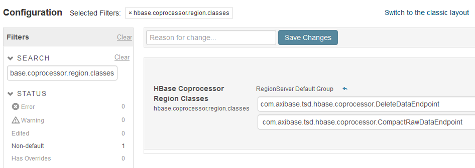

# ATSD Cloudera Cluster Migration

These instructions describe how to upgrade an Axibase Time Series Database instance running on the Cloudera cluster. For host-base installations, refer to the following [migration guide](README.md).

## Versioning

| **Code** | **ATSD Revision Number** | **Java Version** | **Cloudera Manager Version**| **CDH Version** |
|---|---|---|---|---|
| Old | 16854 and earlier | 1.7 | 5.1 - 5.11| 5.1 - 5.9 |
| New | 16855 and later   | 1.8 | 5.12     | 5.10    |


## Requirements

### Disk Space

It is suggested to make backup of all ATSD data before migration. Migration procedure also needs more disk size before old data can be deleted. This additional size can be up to 30% of disk size used to store old data.

## Check Record Count for Testing

Log in to the ATSD web interface and open the **SQL** tab. Execute the following query to count rows for one of the key metrics in the ATSD server.

```sql
SELECT COUNT(*) FROM mymetric
```

The number of records should match the results after the migration.

## Prepare ATSD For Upgrade

Stop ATSD.

```sh
/opt/atsd/atsd/bin/stop-atsd.sh
```

Remove deprecated settings.

```
sed -i '/^hbase.regionserver.lease.period/d' /opt/atsd/atsd/conf/hadoop.properties
```

## Prepare `atsd_d` Table Survey

Follow [this](data_table_survey.md) instruction in order to prepare and report `atsd_d` table survey. This survey is used to make correct memory settings for migration map-reduce job.

## Backup

Make full backup of all ATSD data.

## Upgrade Cloudera Claster

Follow ??? guide to update Java to version 8, upgrade Cloudera Manager to version 5.12, and upgrade CDH to version 5.10.

## Start Map-Reduce Services

After upgrade to CDH 5.10 start HDFS, HBase, Yarn services and HistoryServer in order to run ATSD migration as map-reduce job.

## Customize Map-Reduce Settings

Communicate with Axibase support to set up correct memory settings for map-reduce migration job.

## Configure Classpaths for Migration Job

Download the `migration.jar` file to the `/opt/atsd` directory.

```sh
curl -o /opt/atsd/migration.jar https://axibase.com/public/atsd-cdh-migration/migration.jar
```

Check that current Java version is 8.

```sh
java -version
```

Add `migration.jar`, HBase configuration files, and HBase classes used by map-reduce to Java and Hadoop classpaths.

```sh
export CLASSPATH=$CLASSPATH:/usr/lib/hbase/conf:$(hbase mapredcp):/opt/atsd/migration.jar
export HADOOP_CLASSPATH=/usr/lib/hbase/conf:$(hbase mapredcp):/opt/atsd/migration.jar
```

## Run Migration Map-Reduce Job

### Create Backup Table

Launch the table backup task and confirm its execution. 

```sh
java com.axibase.migration.admin.TableCloner --table_name=atsd_d
```

This command creates `atsd_d_backup` table which points to the same data as the `atsd_d` table.

### Migrate Records from Backup Table

Run migration map-reduce job. The job will create new empty `atsd_d` table with new schema, converts data from `atsd_d_backup` table to new format, and store converted data in the `atsd_d` table.

```sh
nohup yarn com.axibase.migration.mapreduce.DataMigrator -r &> migration.log &
```

As the job will be completed the `migration.log` file should contain the line: 

```
...
17/08/01 10:44:31 INFO mapreduce.DataMigrator: HFiles loaded, data table migration job completed, elapsedTime: 45 minutes.
...
```

The `DataMigrator` job may take a long time to complete. You can monitor the job progress via ResourseManager web interface available via ResourseManager page at Cloudera Manager. The Yarn interface will be automatically terminated once the `DataMigrator` is finished.

Migration is now complete.

## Start the New Version of ATSD

### Upgrade ATSD jars and scripts on ATSD server.

```sh
rm -f /opt/atsd/atsd/bin/*
curl -o /opt/atsd/atsd/bin/atsd.16944.jar https://axibase.com/public/atsd-cdh-migration/atsd.16944.jar
curl -o /opt/atsd/scripts.tar.gz https://axibase.com/public/atsd-cdh-migration/scripts.tar.gz
tar -xf /opt/atsd/scripts.tar.gz -C /opt/atsd/bin
rm /opt/atsd/scripts.tar.gz
rm -f /opt/atsd/hbase/lib/*
curl -o /opt/atsd/hbase/lib/atsd-hbase.16944.jar https://axibase.com/public/atsd-cdh-migration/atsd-hbase.16944.jar
```

Set `JAVA_HOME` in `/opt/atsd/atsd/bin/start-atsd.sh` file:

```sh
jp=`dirname "$(dirname "$(readlink -f "$(which javac || which java)")")"`; sed -i "s,^export JAVA_HOME=.*,export JAVA_HOME=$jp,g" /opt/atsd/atsd/atsd/bin/start-atsd.sh
```
### Deploy ATSD Coprocessors

Copy `/opt/atsd/hbase/lib/atsd.jar` to the `/usr/lib/hbase/lib` directory on each HBase region server.

### Enable ATSD Coprocessors

Open Cloudera Manager, select the target HBase cluster/service, open Configuration tab, search for the setting `hbase.coprocessor.region.classes`. Delete `com.axibase.tsd.hbase.coprocessor.CompactRawDataEndpoint` coprocessor, and set following
axibase coprocessors.

* com.axibase.tsd.hbase.coprocessor.DeleteDataEndpoint
* com.axibase.tsd.hbase.coprocessor.MessagesStatsEndpoint

??? TODO change image !!!


Start ATSD.

```
/opt/atsd/atsd/bin/start-atsd.sh
```

Review the start log for any errors:

```
tail -f /opt/atsd/atsd/logs/atsd.log
```

You should see a **ATSD start completed** message at the end of the `start.log`.

Web interface is accessible on port 8088 (http) and 8443 (https).
## Check Migration Results

Log in to the ATSD web interface.

Open the **SQL** tab.

Execute the query and compare the row count.

```sql
SELECT COUNT(*) FROM mymetric
```

The number of records should match the results prior to migration.

## Delete the `atsd_d_backup` Table

```sh
  /opt/atsd/hbase/bin/hbase shell
  hbase(main):001:0> disable 'atsd_d_backup'
  hbase(main):002:0> drop 'atsd_d_backup'
  hbase(main):003:0> exit
```
