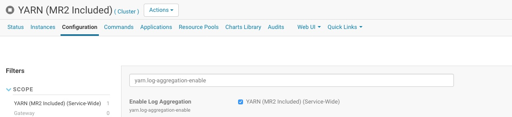

# Data Reporter

## Overview

The purpose of the reporter is to identify large daily rows in the 'atsd_d' table for the purpose of estimating RAM required for by the migration process.
The migration is a Map-Reduce job which transforms the data stored in the `atsd_d` table. During the migration all data for the same metric, entity and day is grouped in memory and processed. This amount of data in a given day can be large for high-frequency/high-cardinality series. The memory allocated to Map-Reduce mappers during the migration should be enough to retain data for such rows in memory. 

> High-cardinality series is a series containing a large number of series tags for the same metric and entity.

The reporter estimates physical memory required to store processed data during migration. 
It estimates size of java objects created by a mapper for each combination (metric, entity, day), and reports maximal size for each region of the 'atsd_d' table. While these estimates are lower than actual physical memory requirements due to additional overhead, they can still be useful in setting memory settings.

The DataTableReporter is implemented as Map-Reduce job.

## Running Reporter

Execute the below steps on the server running the Resourse Manager on the target cluster.

### Check Services

* Login into Cloudera Manager.
* Open **Hosts > All Hosts**, expand the **Roles** and verify that ResourceManager, NodeManagers and HistoryServer services are running on cluster. 
* Open **Clusters > Cluster > YARN (MR2 Included) > Configuration**, search for 'yarn.log-aggregation-enable' and check that this property is checked.



### Prepare Map-Reduce Job

Login into server where YARN ResourceManager is running.

Create temporary directory and download the DataTableReporter jar file.

```sh
mkdir /tmp/reporter
curl -o /tmp/reporter/reporter.jar https://axibase.com/public/atsd-125-migration/reporter.jar
```

Set `HADOOP_CLASSPATH` setting. In Cloudera distribution HBase home directory should be `/usr/lib/hbase`, if you have different HBase home folder use it in `export` command. 

```sh
export HADOOP_CLASSPATH=/usr/lib/hbase/conf:$(hbase mapredcp):/tmp/reporter/reporter.jar
```

Check that HBase classes are present in output.

```
echo $HADOOP_CLASSPATH
/usr/lib/hbase/conf:/usr/lib/hbase/lib/hbase-hadoop-compat-1.2.5.jar:/usr/lib/hbase/lib/hbase-server-1.2.5.jar:/usr/lib/hbase/lib/guava-12.0.1.jar:/usr/lib/hbase/lib/hbase-prefix-tree-1.2.5.jar:/usr/lib/hbase/lib/hbase-client-1.2.5.jar:/usr/lib/hbase/lib/hbase-common-1.2.5.jar:/usr/lib/hbase/lib/netty-all-4.0.23.Final.jar:/usr/lib/hbase/lib/hbase-protocol-1.2.5.jar:/usr/lib/hbase/lib/protobuf-java-2.5.0.jar:/usr/lib/hbase/lib/zookeeper-3.4.6.jar:/usr/lib/hbase/lib/metrics-core-2.2.0.jar:/usr/lib/hbase/lib/htrace-core-3.1.0-incubating.jar:/tmp/reporter/reporter.jar
```

### Initiate Kerberos Session

Copy the `/opt/atsd/atsd/conf/axibase.keytab` file [generated](../../installation/cloudera.md#generate-keytab-file-for-axibase-principal) for the `axibase` principal from ATSD server to folder `/tmp/reporter/`  in ResourceManager server, and initiate Kerberos session.

```sh
kinit -k -t /tmp/reporter/axibase.keytab axibase
```

## Run Map-Reduce Job

The reporter can take a while to complete. Launch it with the `nohup` command and save output to a file.

```sh
nohup yarn com.axibase.reporter.mapreduce.DataTableReporter &> /tmp/reporter/reporter.log &
```

View the log file in order to monitor the job progress. 

```sh
tail -F /tmp/reporter/reporter.log
``` 

When the job is comleted, the log will display a summary as follows:

```sh
...
17/08/09 12:15:55 INFO mapreduce.Job: Job job_1502265066318_0006 completed successfully
17/08/09 12:15:55 INFO mapreduce.Job: Counters: 55
...
	Map-Reduce Framework
		Map input records=4534313
...
	com.axibase.reporter.mapreduce.DataTableReporter$JobStatics
		ANNOTATIONS_COUNT=56
		ROWS_AFTER_MIGRATION=1435293
		ROWS_READ=4534313
		SAMPLES_COUNT=196354701
		VERSIONED_VALUES_COUNT=0
		VERSIONS_COUNT=0
	File Input Format Counters
		Bytes Read=0
	File Output Format Counters
		Bytes Written=183403
17/08/09 12:15:55 INFO mapreduce.DataTableReporter: Map-reduce job success!
17/08/09 12:15:55 INFO mapreduce.DataTableReporter: Start processing results of the map-reduce jab.
...
17/08/09 12:15:55 INFO reporter.ResultHandler: ---------------------------------
maximum in region: 427ae8f2fc8926a7fefe3c984f6027cf
size in MB: 25
metric ID: 121
metric name: high-cardinality-for-scan-metric
entity ID: 4
entity name: high-cardinality-for-scan-entity
timestamp in seconds: 1479427200
date: 2016-11-18
rows read: 5784
max row size in KB: 84
series count (tags combinations): 5761
samples count: 11520
annotations count: 0
versioned values count: 0
versions count: 0
start key: \x00\x00y\x00\x00\x04X.D\x80...
stop key: \x00\x00y\x00\x00\x04X/\x96\x00...
...
17/08/09 12:15:57 INFO client.ConnectionManager$HConnectionImplementation: Closing zookeeper sessionid=0x15dc5f8cb520260
17/08/09 12:15:57 INFO zookeeper.ClientCnxn: EventThread shut down
17/08/09 12:15:57 INFO zookeeper.ZooKeeper: Session: 0x15dc5f8cb520260 closed
17/08/09 12:15:57 INFO mapreduce.DataTableReporter: Results are written to files:
17/08/09 12:15:57 INFO mapreduce.DataTableReporter: hdfs://nurswgvml303.axibase.com:8020/user/axibase/data_table_report/000009/summary.log
17/08/09 12:15:57 INFO mapreduce.DataTableReporter: hdfs://nurswgvml303.axibase.com:8020/user/axibase/data_table_report/000009/maximum-per-region.log
```

## Collect Results

The last two lines of the log file identify two files: `summary.log`, and `maximum-per-region.log` where the DataTableReporter class stored results.

Copy these files from HDFS to the local file system.

```sh
hdfs dfs -copyToLocal hdfs://nurswgvml303.axibase.com:8020/user/axibase/data_table_report/000009/summary.log /tmp/reporter/
hdfs dfs -copyToLocal hdfs://nurswgvml303.axibase.com:8020/user/axibase/data_table_report/000009/maximum-per-region.log /tmp/reporter/
```

Email `reporter.log`, `summary.log`, and `maximum-per-region.log` files to `support-atsd@axibase.com` for review and calculation of resources required for the subsequent migration.

### Report Result Files

The report contains the following summary counters:

* `ANNOTATIONS_COUNT` - The number of annotations (text columns) stored in the `atsd_d` table.
* `ROWS_AFTER_MIGRATION` - The estimated number of daily rows in the `atsd_d` table to be created after migration. 
* `ROWS_READ` - The number of hourly rows currently present in the `atsd_d` table. Equal to `Map input records` counter.
* `SAMPLES_COUNT` - The total number of `timestamp=value` samples for all series in the `atsd_d` table.
* `VERSIONED_VALUES_COUNT` - The total number of samples which have several versions of values for the same timestamp.
* `VERSIONS_COUNT` - The total number of all versions for all series samples.

The report includes memory required by the mapper. This maximum is reported for each region in the `atsd_d` table, for example:

* Region hashed name is `427ae8f2fc8926a7fefe3c984f6027cf`.
* Mapper needs `25` MB of heap memory to store objects while processing data from the region.
* The metric identifier is `121`.
* The metric name is `high-cardinality-for-scan-metric`.
* The entity identifier is `4`.
* The entity name is `high-cardinality-for-scan-entity`.
* Timestamp in seconds for the date is `1479427200`.
* The day is `2016-11-18`.
* Number of rows in current `atsd_d` table with given combination of the metric, entity, and date equals to `5784`.
* Maximum estimated size of a row among these 5784 rows is `84` KB.
* There are `5761` different series for the given combination of metric, entity, and day. These series differ by tags, so there are `5761` different combinations of tags.
* Total number of time series samples for the given metric, entity , and day is `11520`.
* There are no annotations and no versioned samples.
* The `atsd_d` table stores data for the displayed metric, the entity, and the day in rows from the specifed `start key` (inclusive) to `stop key` (exclusive).

