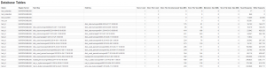

# Monitoring metrics : Database Tables

Database Tables statistics can be viewed directly in the ATSD UI under
Admin -\> Database Tables.

Direct url: `atsd_server:8088/admin/database-tables`

Database Tables allows to:

-   View the size of individual tables and their partitions both in
    memory and on disk.
-   View the number of read and write requests in order to identify hot
    spots – regions of the table receiving a disproportional amount of
    queries.

