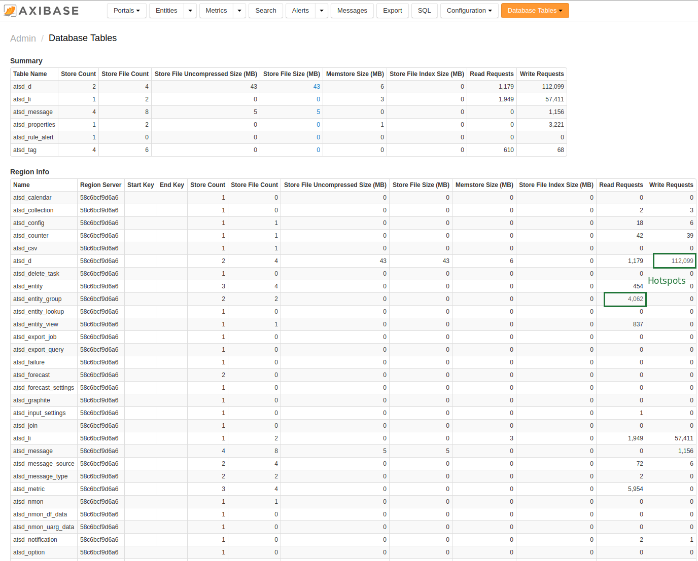

# Monitoring Metrics using Database Tables

Database Table statistics can be viewed directly in the ATSD user interface under
**Admin > Database Tables**.

Direct url: `atsd_hostname:8088/admin/database-tables`

Database Tables allows you to:

-   View the size of individual tables and their partitions, both in
    memory and on disk.
-   View the number of read and write requests in order to identify hot
    spots – regions of the table receiving a disproportional amount of
    queries.

