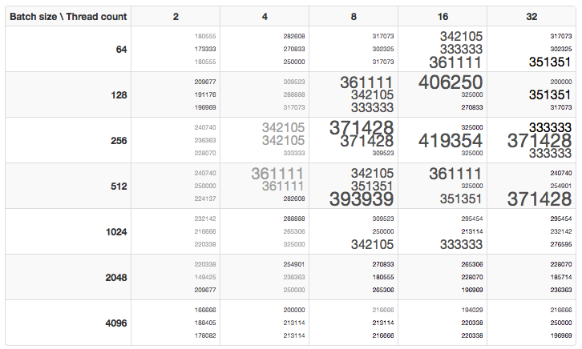

# Monitoring Metrics using the HBase Write Test

The HBase Write Test can be run directly from the ATSD user interface under **Admin > Diagnostics > I/O Tests**.

Direct url: `atsd_hostname:8088/admin/hbase-test`

HBase Write Test allows you to:

-   Analyze the data being ingested, i.e. the number of unique
    metric/entity/tag combinations, and run a write throughput test.
-   Launch an Auto Test to view a matrix of throughput statistics for
    different batch sizes and thread count combinations.
-   Apply test results to modify the default configuration parameters in
    the ATSD `server.properties` file:

```properties
 series.batch.size = 1024                                                 
 series.queue.pool.size = 4                                               
```

Auto Test Example Results:



| Field | Description |
| --- | --- |
| Entity prefix | Entity name prefix. |
| Metric prefix | Metric name prefix. |
| Entities count | Number of entities that will be written. |
| Metrics count | Number of metrics that will be written. |
| Tags count | Number of tags that will be assigned to each series. Tag count should represent a realistic number of tags that are normally assigned to your series for the results to be accurate. |
| Series count | Total number of series that will be stored. |
| Batch size | Size of each test batch. |
| Thread count | Number of threads used for each test. |
| Start time | Start timestamp with which the generated series will be written. |
| Period, minutes | Period will be added to the Start Time timestamp with each iteration. |
| Log interval, seconds | Interval between log outputs. |
| Auto test delay, seconds | Delay between finishing one test and starting the next test in Auto Test mode. |


