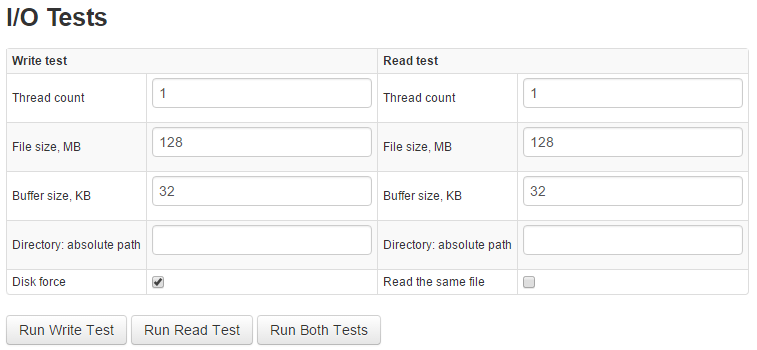

# Monitoring Metrics using I/O Tests

I/O Tests can be run directly from the ATSD user interface under **Admin > Diagnostics > I/O Tests**.

Direct url: `atsd_hostname:8088/admin/io-tests`

I/O Tests allow you to:

-   Execute disk read and write tests for the server on which the ATSD
    instance is running.
-   Identify any abnormalities, such as slower than expected write speed.

| Field | Description |
| --- | --- |
| Thread count | Number of threads that will be tested. |
| File size, MB | Size of the file that will be written to disk. |
| Buffer Size | Size of the buffer for writing/reading the file. |
| Directory: absolute path | Absolute path where the test file will be written to or from which the file will be read. |
| Disk force | Force the data to be written to disk. |
| Read the same file | Use a single prepared file to test all threads. |

