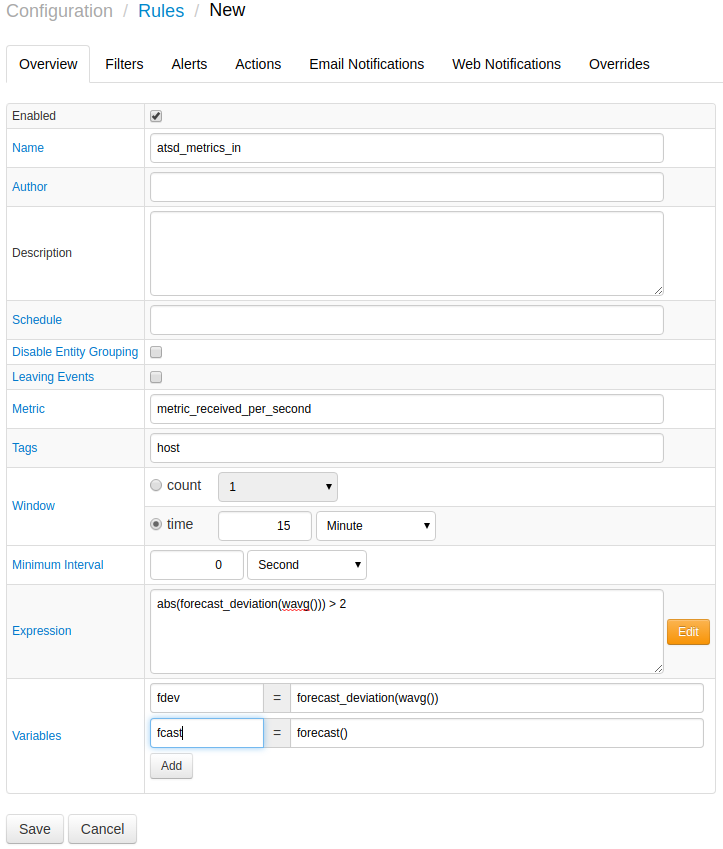

# Monitoring Metrics using Rule Engine

Rule Engine can monitor ATSD metrics to raise alerts in case of abnormal
deviations.

For example:

Monitoring the `metric_received_per_second` metric can be done based on
its forecast. In the example below, a forecast is generated for the
 `metric_received_per_second` metric using the built-in Forecasting
tool. Based on the forecast a rule is created with the following
expression:

```sh
 abs(forecast_deviation(wavg())) > 2                                      
```

This rule will raise an alert if the absolute forecast deviates from the
15 minute weighted average by more than 2 standard deviations.

Email notifications can be setup for alerts to be delivered when the rule is triggered.



Below is an example sent email alert if the rule is triggered.


