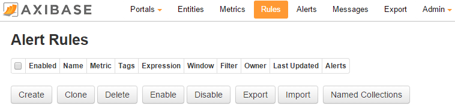
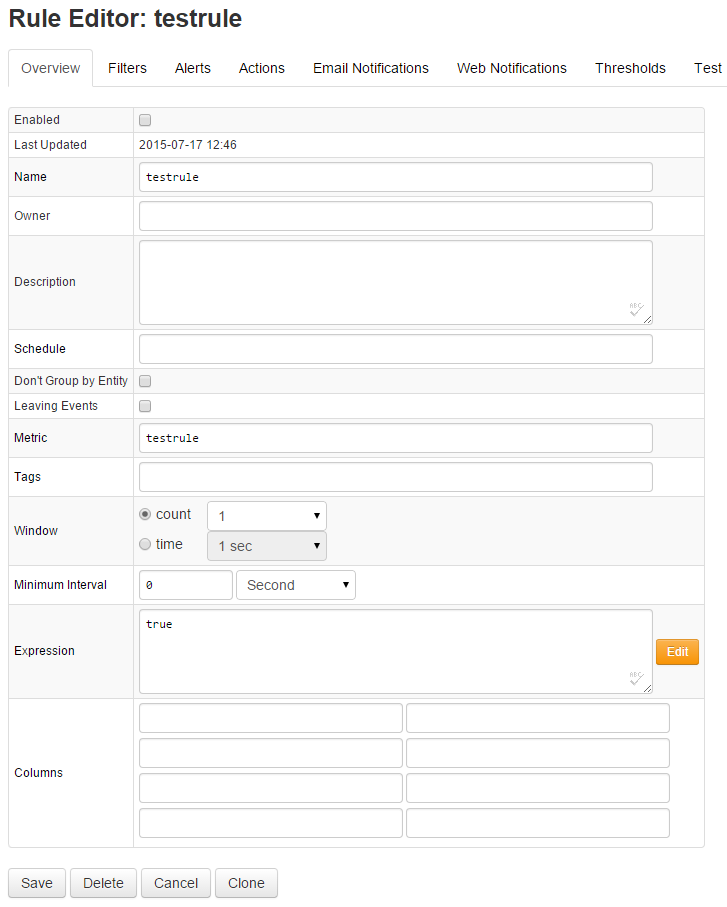
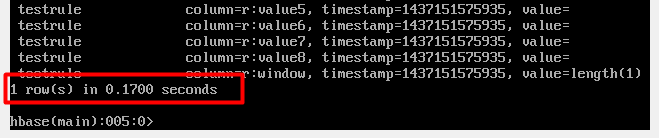

# Replication


This article describes how to configure replication for the Axibase Time
Series Database.

The replication process is from master to slave, meaning where all transactions on the master
cluster are replayed to the slave cluster.

In the guide `atsd_master` is the hostname of the master host and
`atsd_slave` is the hostname of the slave host.

> Note: This guide should be executed only on new ATSD installations.
Executing this guide on an existing ATSD installation will lead to the
loss of all stored data on both the master and slave machines.

> Note: If master loses connection with slave, it will accumulate all the
data and events for the duration of the connection loss and will start
transferring the accumulated data once connection with slave is
re-established. No data should be lost in the process.

#### Requirements

Both the master and slave machines must have static a IP addresses in the
local network.

Both machines must have identical hardware configurations. [See ATSD
requirements.](requirements.md)

The same versions of ATSD must be installed on both machines. [See ATSD
installation
guides.](http://axibase.com/products/axibase-time-series-database/download-atsd/ "ATSD Install Guides")

#### Installation

**MASTER & SLAVE: the following steps must be executed on both machines
– master and slave.**

Stop ATSD and all components:

```sh
/opt/atsd/bin/atsd-all.sh stop
```

Change `/etc/hosts` to form:

```sh
sudo nano /etc/hosts
```

```sh
 127.0.0.1    localhost
 master_ip    master_hostname
 slave_ip     slave_hostname
 ```

> Note: the following lines should not be contained in the `hosts` file.
This is the case for both master and slave.

```sh
127.0.1.1    atsd_master
```

```sh
 127.0.1.1    atsd_slave
```

Example of a correct `hosts` file:

```sh
 127.0.0.1    localhost
 172.30.0.66    atsd_master
 172.30.0.78    atsd_slave
```

Add the `hbase.replication` property to the `configuration` tag in the
`hbase-site.xml` file:

```xml
<property>
    <name>hbase.replication</name>
    <value>true</value>
</property>
```

**SLAVE: the following steps must be executed only on the slave
machine.**

Edit the `atsd-all.sh` file to disable ATSD startup:

```sh
sudo nano /opt/atsd/bin/atsd-all.sh
```

Comment out the following strings in the `start_all` function:

```sh
     ${ATSD_TSD} start
     if [ ! $? -eq 0 ]; then                                              
         return 1                                                         
     fi
```

Result:

```sh
 #   ${ATSD_TSD} start
 #   if [ ! $? -eq 0 ]; then
 #       return 1
 #   fi
```

Start Hadoop and HBase:

```sh
 /opt/atsd/bin/atsd-all.sh start
```
Run the replication configuration script:

```sh
/opt/atsd/hbase_util/configure_replication.sh slave
```

This command truncates all ATSD tables.

Verify that ATSD tables are present.

Start HBase shell and list tables:

```bash
 echo "list" | /opt/atsd/hbase/bin/hbase shell
```
The output should contain a list of ATSD tables, all starting with `atsd_`:


**MASTER: the following steps must be executed only on the
master machine.**

Start Hadoop and HBase:

```sh
/opt/atsd/bin/atsd-dfs.sh start
/opt/atsd/bin/atsd-hbase.sh start
```

Execute the `add_peer` command:

```bash
echo "add_peer '1', \"atsd_slave:2181:/hbase\"" | /opt/atsd/hbase/bin/hbase shell
```

> Note:: If your ATSD installation has suffered an unexpected shutdown or
ungraceful stop and your Zookeeper is corrupted, [after solving this
issue using our
guide](corrupted-zookeeper.md),
be sure to execute the `add_peer` commands again to restart the
replication.

Make sure that the peer has been added:

```bash
echo "list_peers" | /opt/atsd/hbase/bin/hbase shell


PEER_ID CLUSTER_KEY STATE
1 atsd_slave:2181:/hbase ENABLED
1 row(s) in 0.0930 seconds
```

Run replication configuration script:

```
/opt/atsd/hbase_util/configure_replication.sh master
```

This command truncates all ATSD tables and enables replication on all
ATSD column families.

Start ATSD:

```sh
/opt/atsd/bin/atsd-tsd.sh start
```

Verify that ATSD tables are present: list tables

```bash
 echo "list" | /opt/atsd/hbase/bin/hbase shell
```

Output should contain a list of ATSD tables, all starting with `atsd_`:


#### Enabling Replication for New Tables

If after updating ATSD, or for any other reason, a new table was created
in HBase with the name containing `atsd_` (for example `atsd_new`),
execute the following steps to make sure this table is added to
replication.

**MASTER: the following steps must be executed only on the
master machine.**

Write the table schema to a file:


```sh
/opt/atsd/hbase_util/configure_replication.sh schema atsd_new > atsd_new_schema.txt
```

Copy table schema file to the slave machine:

```sh
scp atsd_new_schema.txt atsd_slave:/tmp
```

**SLAVE: the following steps must be executed only on the slave
machine.**

Create the new table in the slave database:

```bash
/opt/atsd/hbase/bin/hbase shell < /tmp/atsd_new_schema.txt
```

**MASTER: the following steps must be executed only on the
master machine.**

Enable replication for the new table:

```sh
/opt/atsd/hbase_util/configure_replication.sh flag atsd_new
```

Verify that the new table is being replicated using the verification
instructions below.

#### Verifying Replication

To verify that replication is working correctly, execute the following
steps:

##### Option 1:

**SLAVE: the following steps must be executed only on the slave
machine.**

Check HBase logs for replication activity:

```sh
tail -n 1000 /opt/atsd/hbase/logs/hbase-axibase-regionserver-atsd_slave.log | grep replicated
```

The output should contain replication activity and the of amount tables
replicated on the slave machine:

```sh
 2015-07-17 16:39:22,926 INFO  regionserver.ReplicationSink (ReplicationS
 ink.java:replicateEntries(158)) - Total replicated: 4                    
 2015-07-17 16:39:24,019 INFO  regionserver.ReplicationSink (ReplicationS 
 ink.java:replicateEntries(158)) - Total replicated: 1                    
 2015-07-17 16:39:25,083 INFO  regionserver.ReplicationSink (ReplicationS 
 ink.java:replicateEntries(158)) - Total replicated: 1                    
 2015-07-17 16:39:31,122 INFO  regionserver.ReplicationSink (ReplicationS 
 ink.java:replicateEntries(158)) - Total replicated: 1
```

##### Option 2:

**MASTER: the following steps must be executed only on the
master machine.**

Open ATSD user interface and navigate to Rules tab located on the main menu.



Click the [CREATE] button to create a new rule. Complete the following
fields as specified below:

`Name` – testrule

`Metric` – testrule

`Expression` – true

Then click SAVE.



Scan the `atsd_rule` table and note down the amount of line contained in the
table:

```bash
echo "scan 'atsd_rule'" | /opt/atsd/hbase/bin/hbase shell
```

Output:



**SLAVE: the following steps must be executed only on the slave
machine.**

Scan the `atsd_rule` table and note down the amount of line contained in the
table:

```bash
echo "scan 'atsd_rule'" | /opt/atsd/hbase/bin/hbase shell
```

The output should contain the same amount of rows as on the master:


