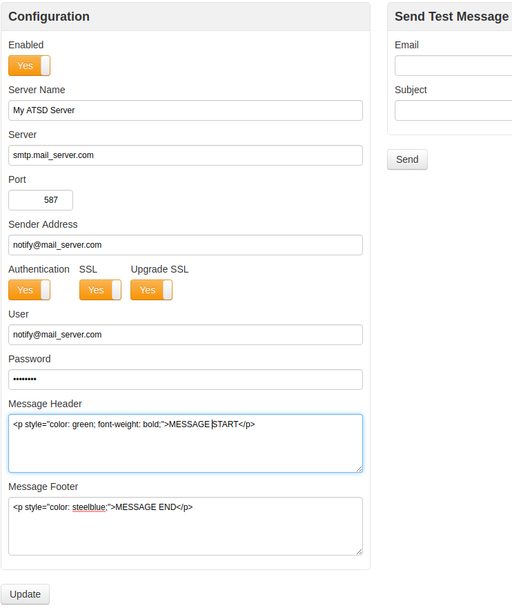

# Mail Client

Mail Client in ATSD is used for sending email notifications generated by the rule engine.

* Login into the ATSD web interface
* Open the **Admin > Mail Client** page
* Configure the Mail Client properties to enable email notifications
* Click [Update]
* Click [Send Message] to test the configuration by sending a message to a recipient

| **Field** | **Description** |
| :--- | :--- |
| Enabled | Set this property to true in order to enable email notifications. |
| Server Name | Server specified in the "From" field, for example `ATSD {hostname} - DEV`. |
| Server | Hostname or IP address of your mail server, for example `smtp.mycompany.com`. |
| Port | Mail server port. |
| Sender Address | Address specified in the "From" field, for example `notify@mycompany.com`. |
| Authentication | Set this property to true to enable authentication. |
| SSL | Set this property to enable SSL encryption. |
| Upgrade SSL | Upgrade an insecure connection to a secure connection using SSL/TLS. |
| User | Username of the mailbox user. |
| Password | Password of the mailbox user. |
| Message Header | Plain text or HTML markup that will appear at the top of email messages. |
| Message Footer | Plain text or HTML markup that will appear at the bottom of email messages. |

