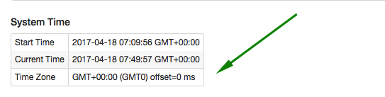

# Timezone

The timezone in which the database runs determines how [endtime](/end-time-syntax.md) keywords are evaluated and how the intervals are split into DAY-based [periods](/api/data/series/period.md).

By the default, the timezone is inherited from the timezone of the operating system on which ATSD is running.

## Viewing the Time Zone

The current timezone is displayed on the **Admin: System Information** page.



## Changing the Time Zone

* Select Timezone ID from the following [list](/api/network/timezone-list.md), for example, "US/Pacific".

* Open `/opt/atsd/atsd/bin/start-atsd.sh` file and scroll down to the section with uncommented $java_command for "GC logs disabled".

  ```
  echo " * [ATSD] ATSD `$java_command -version 2>&1 | head -n 1`"
  #GC logs disabled
  if grep -qi "arm" /proc/cpuinfo; then
      "$java_command" -server -Xmx4096M -XX:MaxPermSize=128m ...
  else
      "$java_command" -server -Xmx4096M -XX:MaxPermSize=128m ...
  fi
  ```

* Add property `-Duser.timezone` to the second command (not "arm").

  ```
  echo " * [ATSD] ATSD `$java_command -version 2>&1 | head -n 1`"
  #GC logs disabled
  if grep -qi "arm" /proc/cpuinfo; then
      "$java_command" -server -Xmx4096M -XX:MaxPermSize=128m ...
  else
      "$java_command" -server -Duser.timezone=US/Pacific -Xmx4096M -XX:MaxPermSize=128m ...
  fi
  ```

* Restart ATSD.

```bash
/opt/atsd/atsd/bin/stop-atsd.sh
/opt/atsd/atsd/bin/start-atsd.sh
```

* Open the **Admin: System Information** page and verify that the new timezone setting is set.
