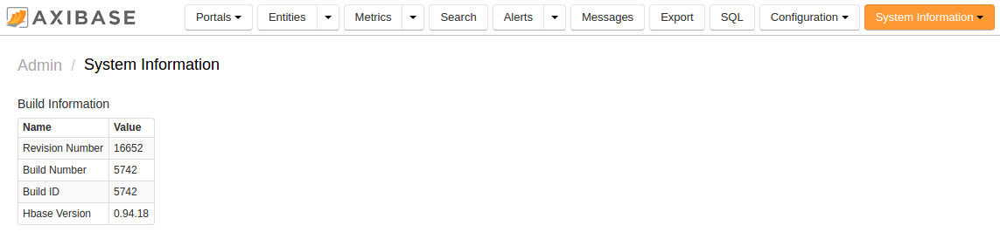

# Update


Update Axibase Time Series Database to the latest version by running the `update.sh` script. 
The script automates the process of downloading the latest ATSD artifacts, 
copying files, and gracefully restarting ATSD services.

> Access to axibase.com from the target server is required to download installation files. If the server is not connected to the Internet, switch to the [manual update](update-manual.md) option.

## Check Revision

* Open the **Admin / System Information** page
* Take note of the current Revision Number

## Update Command

```sh
/opt/atsd/bin/update.sh
```

### Update Command in Docker Container

Assuming `atsd` is the name of the container:

```
docker exec -it atsd /bin/bash
/opt/atsd/bin/update.sh
```

## Validation

Once the update is completed, the script will print out the following message:

```
Update process finished successfully.
```

The update process may take a few minutes to complete.

To verify that ATSD is working correctly, open the ATSD web interface:

```sh
 https://atsd_host:8443/
```

* Open the **Admin / System Information** page
* Verify that the Revision Number has changed compared to the pre-installation stage



## Restart

In the case the web interface is not accessible for more than 5 minutes after the update, initiate a [restart](restarting.md).
