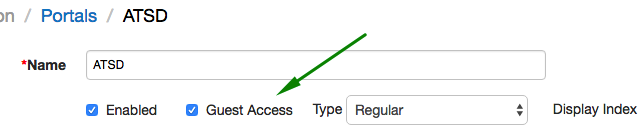
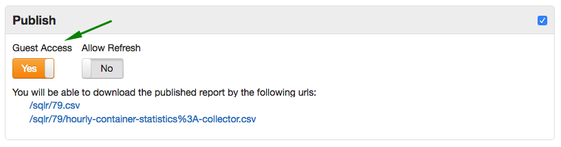

# User Authentication

Authentication mechanisms implemented in the Axibase Time Series Database specify how users can verify their identity when accessing protected resources such as web pages and API endpoints.

## Authentication Mechanisms

### Form-based Authentication

When an unauthenticated user requests access to a protected view in the user interface, the server redirects the user to a login page containing user name and password fields.

The user is granted access if the account for the specified username exists and the password is correct.

The **[Remember Me]** option on the login form, when activated, stores the submitted username in local browser cache for convenience.

### HTTP Basic Authentication

A HTTP request to an API URL `/api/*` is required to include an `Authorization` header with type `Basic`. See [examples](#http-basic-authorization-examples) below.

If the `Authorization` header is missing, the client is prompted to provide user name and password.

Once the credentials are verified, subsequent API requests within the same session can be executed without repetitive authentication.

## User Account Types

Access to protected resources is provided to user accounts stored in the Axibase Time Series Database.

The user account can be configured to use either **Local** or **LDAP** authentication.

### Local Accounts

In case of Local authentication, ATSD stores the hashcode of the user's password in the underlying HBase database.

The user's identity is verified if the hashcode of the submitted password matches the stored hashcode for the specified username.

The password is subject to the requirements outlined [below](#password-requirements).

### LDAP Accounts

In case of LDAP authentication, ATSD verifies that the account exists in ATSD and the password is confirmed by submitting an authentication request to the remote LDAP server.

If the LDAP server locates the specified account and confirms its password, the user is allowed to access ATSD.

The access is denied if the LDAP server cannot find the account or if the LDAP account is locked, disabled, or password change is required.

## Password Requirements

The following password rules apply to **Local** accounts:

* Password must contain at least **six** characters by default.

* The default minimum length can be adjusted in the `server.properties` file with the `user.password.min.length` setting.

* Passwords are case-sensitive.

* Password can contain the following characters:

    - Unicode character categorized as an alphanumeric character.

    - Special characters:

```
      ~!@#$%^&*_-+=`|\(){}[]:;”‘<>,.?/"'
```

## Built-in Account

-   When accessed for the first time after the installation, the database presents a web page for configuring the default administrator account. This account is granted an `ADMIN` role which has `All Entities: Read / Write` permissions.

## Changing the Password

-   Users with Local accounts can modify their password by clicking on the user icon in the top menu.

-   Users are not allowed to change their own type, roles, group membership, or entity permissions.

## Resetting Password

* User passwords for Local accounts are stored as hashcodes. As a result, recovering a lost password is not supported.

* To reset the password for a user account:

    - Open the `server.properties` file.
    - Add `user.password.reset.username={username}` and `user.password.reset.password={new-password}` settings and save the file.
	  - Restart ATSD.
	  - Remove the above settings from the `server.properties` file to prevent password resets on subsequent restarts.

* If the account being reset is configured as LDAP type, the type will be changed to Local.

## Guest Access to Data API

To enable anonymous access to Data API query methods, set `api.guest.access.enabled=true` in the `server.properties` file and restart the ATSD process.

## Guest Access to Portals

To expose the portal to all visitors, open **Configuration > Portals** page, open the portal editor and check the 'Guest Access' field.

Since charts displayed in the portals are loaded via Data API, the Guest Access option is available only when Data API is configured for anonymous access.



## Guest Access to SQL Reports

SQL query results can be published to all visitors by checking 'Guest Access' field on the SQL configuration page.



> Note that guest access to Data API is not required in this case.

## HTTP Basic Authorization Examples

* Java Example:

```java
	URL url = new URL("http://10.102.0.6:8088/api/v1/series");
	HttpURLConnection conn = (HttpURLConnection) url.openConnection();
	conn.setDoOutput(true);
	conn.setRequestMethod("POST");
	conn.setRequestProperty("charset", "utf-8");

	String authString = userName + ":" + password;
	String authEncoded = DatatypeConverter.printBase64Binary(authString.getBytes());
	conn.setRequestProperty("Authorization", "Basic " + authEncoded);
```

* `curl` Example:

```bash
curl http://10.102.0.6:8088/api/v1/properties/query \
  --user {username}:{password} \
  --header "Content-Type: application/json" \
  --request POST \
  --data '[{"type":"disk","entity":"nurswgvml007","startDate":"2016-05-25T04:00:00Z","endDate":"now"}]'
```
