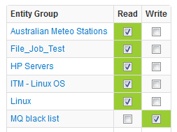
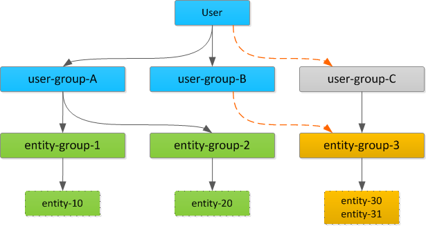

# User Authorization

Axibase Time Series Database implements Role Based Access Control (RBAC) to restrict user access to protected information.

## Role Based Access Control

Authenticated users are allowed to access protected resources based on
their role. The role specifies which URLs and HTTP methods the user can access. Each user can be assigned multiple roles.

### API Roles
| Role | Description |
| --- | --- |
|API_DATA_READ | Query Data API to read series, properties, messages, and alerts from the database.|
|API_DATA_WRITE | Submit Data API requests to insert series, properties, and messages into the database.|
|API_META_READ | Query Meta Data API to read metric, entity, and entity group settings.|
|API_META_WRITE | Submit Meta Data API requests to change metric and entity settings.  Requests to change entity groups or add/remove members require an `ENTITY_GROUP_ADMIN` role.|

### User Interface Roles

| Role | Description |
| --- | --- |
| USER | View information on all pages except Configuration, Entity Group, and Admin pages.  Includes `API_DATA_READ` and `API_META_READ` roles. |
| EDITOR | View and edit information on all pages except Admin and Entity Group pages.  Includes `USER` role. |
| ENTITY_GROUP_ADMIN | Edit entity groups.  Includes `USER` role. |
| ADMIN | View and edit information on all pages.  Includes all roles. |

## Entity Permissions

Permissions to read and write data for entities in a particular Entity Group are granted to the User Group level.

In order to read data for an entity, the user must have an `API_DATA_READ` role. In addition, one of the user’s User
Groups must be granted a Read permission to an Entity Group containing the
entity.

In order to write data for an entity the user must have an `API_DATA_WRITE` role. In addition, one of the user’s User Groups must be granted a Write permission to an Entity Group containing the entity. Effective user permissions are calculated as a union of all User Groups permissions to which the user belongs.

*In the following diagram, to read data for entity-30, the user must be either added to user-group-C as a member, or
entity-group-3 must be assigned to user-group-B or user-group-A.*

### All Entities Permissions

In addition to specific Entity Group permissions, user groups can be granted a special `All Entities: Read` or `All Entities: Write` permission which allows reading or writing data to any entity, including entities that do not belong to any Entity Group. Users inherit `All Entities` permissions from the
User Groups to which they belong.

### Inserting Data for New Entities

Since non-existent entities cannot be assigned to a group, the `All Entities: Write` permission is required to create
entities either in the user interface or by inserting data via API. User with a `API_DATA_WRITE` role but without the
`All Entities: Write` permission are able to insert data only for existing entities.

### Wildcard Requests

Users without `All Entities: Read` permission are allowed to query Data API using wildcards as part of entity name as well as execute SQL queries without entity name conditions. However in both cases, the results will be filtered based on the user's effective permissions, therefore different users may see different results for the same API request or SQL query depending on their entity permissions.

## Entity View Permissions

The user is implicitly authorized to access an Entity View if it has read permissions to the Entity Group specified in the Entity View configuration.

## Portal Permissions

The portal permissions define which portals the user is authorized to view.

Permissions to view the portal are granted to User Groups.

The permissions are enforced both for template and regular portals.

### All Portals Permission

A user group can be granted an `All Portal` permission whereby its members are authorized to view all portals enabled in the system.
The permission to view all portals is automatically granted to users with an `ADMIN` role.

## Implementation Notes

The User's role, group membership, and entity permissions are cached while the user's session is active. The session is invalidated in case the user's authorization is changed by an administrator, in which case the user has to re-login.
