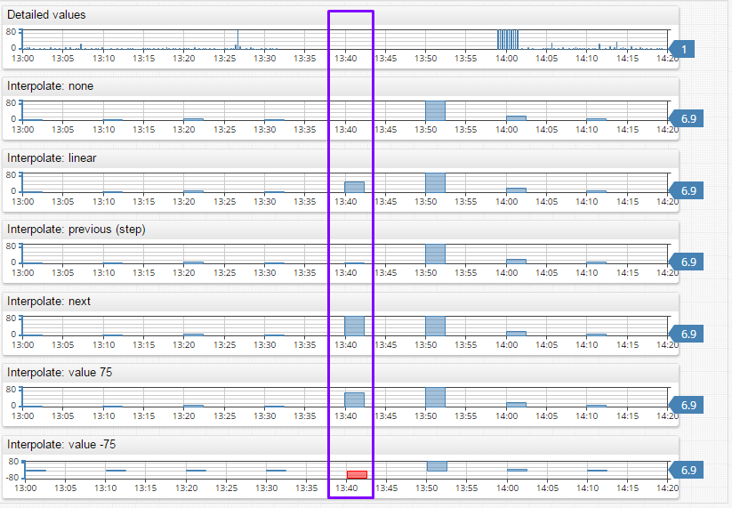

# Aggregate Processor

## Overview

Computes statistics for the specified time periods. By default, the periods are aligned with the beginning of calendar units as specified in period.

## Fields

| **Name** | **Type**  | **Description**   |
|:---|:---|:---|
| type  | string        | [**Required**] [Statistical function](/api/data/aggregation.md) applied to detailed values in the period, such as `AVG`, `SUM`, or `COUNT`. |
| types | array          | Array of [statistical functions](/api/data/aggregation.md) `DETAIL`, `AVG`, `SUM`. Either `type` or `types` fields are required in each query. |
| period  | object     | [**Required**] [Period](#period.md) is a repeating time interval used to group detailed values occurred in the period in order to apply a statistical function.<br>For example, `"period": { "count": 1, "unit": "HOUR" }`  |
| interpolate  | string  | Generates aggregation periods in case of missing detailed samples using an [interpolation function](#interpolation), for example, `PREVIOUS` or `LINEAR`   |
| threshold    | object  | Object containing minimum and and maximum range for a `THRESHOLD_*` aggregator.  |
| calendar     | object  | calendar settings for a `THRESHOLD_*` aggregator. |
| workingMinutes | object | working minutes settings for a `THRESHOLD_*` aggregator.  |
| order         | number           | Change the order in which `aggregate` and `group` are executed, the higher the value of `order` the later in the sequence will it be executed.             |

### calendar

| **Name** | **Type**| **Description** |
|:---|:---|:---|
| name | string | Custom calendar name |

### threshold

| **Name** | **Type**| **Description** |
|:---|:---|:---|
| min  | number | min threshold |
| max  | number | max threshold |

### workingMinutes

| **Name** | **Type**| **Description** |
|:---|:---|:---|
| start | number | Working date start time, in minutes. If working day starts at 9:30 then `start` can be specified as `570` (9 * 60 + 30). |
| end   | number |  Working date end time, in minutes.  |

## Examples

```json
{
    "aggregate": {
        "types": [
            "AVG",
            "MAX"
        ],
        "period": {
            "count": 1,
            "unit": "HOUR"
        },
        "interpolate": "NONE"
    }
}
```

```json
{
    "aggregate" : {
        "type": "AVG",
        "period": {"count": 1, "unit": "HOUR"}
    }
}
```

### Interpolation

By the default, if the period doesn't contain any detailed values, it will be excluded from the results.
The behaviour can be changed by specifying an interpolation function.

| **Name** | **Description** |
|:---|:---|
| NONE | No interpolation. Periods without any raw values are excluded from results. |
| PREVIOUS | Set value for the period based on the previous period's value. |
| NEXT | Set value for the period based on the next period's value. |
| LINEAR | Calculate period value using linear interpolation between previous and next period values. |
| VALUE| Set value for the period to a specific number. |

#### Examples

**PREVIOUS**:

```json
            "aggregate" : {
               "type": "AVG",
               "period": {"count": 1, "unit": "HOUR"},
               "interpolate" : {
                  "type": "PREVIOUS"
               }
            }
```

**LINEAR**:

```json
            "aggregate" : {
               "type": "AVG",
               "period": {"count": 1, "unit": "HOUR"},
               "interpolate" : {
                  "type": "LINEAR"
               }
            }
```

**VALUE**:

```json
            "aggregate" : {
               "type": "AVG",
               "period": {"count": 1, "unit": "HOUR"},
               "interpolate" : {
                  "type": "VALUE",
                  "value": 0
               }
            }
```

[Chartlab Example](https://apps.axibase.com/chartlab/d8c03f11/3/)




