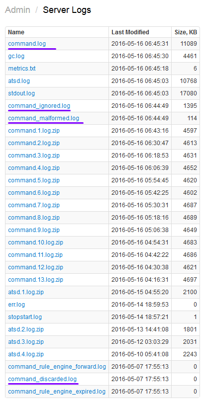

# Network API

Network API provides a set of plain text commands for inserting numeric time series, key=value properties, and tagged messages into the Axibase Time Series Database (ATSD) via **TCP** and **UDP** network protocols.

You can use `netcat`, `telnet`, `Bash tcp/udp pseudo-device files`, or any programming language such as [Java](examples/AtsdTcpClient.java) that lets you connect to the ATSD server via TCP/UDP protocol.

## Supported Commands

### Data Commands

* [series](series.md)
* [property](property.md)
* [message](message.md)
* [csv](csv.md)
* [nmon](nmon.md)

### Meta Commands

* [entity](entity.md)
* [metric](metric.md)

### Control Commands

* [ping](ping.md)
* [debug](#debugging)
* [time](time.md)
* [version](version.md)
* [exit](exit.md)

### Extended Data Commands

* [tcollector](extended-commands.md#tcollector)
* [statsd](extended-commands.md#statsd)
* [graphite](extended-commands.md#graphite)

## Ports

By default, the ATSD server listens for incoming commands on the following ports:

* 8081 TCP
* 8082 UDP

## Encryption

To encrypt TCP traffic, setup an [SSH tunnel](http://axibase.com/products/axibase-time-series-database/writing-data/nmon/ssh-tunneling/) or create a VPN connection.

## Authentication

Authentication and authorization are not supported for plain text commands received over TCP and UDP protocols.

Utilize the [HTTP command](../../api/data/ext/command.md) to send plain-text commands over http/https protocols with authentication and authorization enabled.

## Connection

### Single Command

To send a single command, connect to an ATSD server, send the command in plain text, and terminate the connection.

* netcat: echo

```ls
echo -e "series e:station_1 m:temperature=32.2 m:humidity=81.4 d:2016-05-15T00:10:00Z" | nc atsd_host 8081
```

* netcat: printf

```ls
printf 'series e:station_2 m:temperature=32.2 m:humidity=81.4 s:1463271035' | nc atsd_host 8081
```

* Bash [tcp pseudo-device file](http://tldp.org/LDP/abs/html/devref1.html#DEVTCP)

```ls
echo -e "series e:station_3 m:temperature=32.2 m:humidity=81.4" > /dev/tcp/atsd_host/8081
```

> `/dev/tcp/host/port` and `/dev/udp/host/port` are built-in Bash pseudo-device files which can be used in redirection. If host is a valid hostname or Internet address, and port is an integer port number or service name, Bash attempts to open a TCP connection to the corresponding socket.

* telnet: one line

```ls
telnet atsd_host 8081 << EOF
series e:station_4 m:temperature=32.2 m:humidity=81.4
EOF
```

* telnet: session

```ls
$ telnet atsd_host 8081
Trying atsd_host...
Connected to atsd_host.
Escape character is '^]'.
series e:station_5 m:temperature=32.2 m:humidity=81.4
^C
Connection closed by foreign host.
```

* java: socket

```java
Socket s = new Socket("atsd_host", 8081);
PrintWriter writer = new PrintWriter(s.getOutputStream(), true);
writer.println("series e:station_6 m:temperature=32.2");
s.close();
```

The above examples insert timestamped **temperature** and **humidity** metric samples for **station** entities.

### Multiple Commands

Separate commands by a line feed symbol `\n` (LF, `0x0A`) when sending a batch containing multiple commands over the same connection.

A trailing line feed is not required for the last command in the batch.

Use the `-e` flag in `echo` commands to enable interpretation of backslash escapes.

```ls
echo -e "series e:station_1 m:temperature=32.2 m:humidity=81.4 d:2016-05-15T00:10:00Z\nseries e:station_1 m:temperature=32.1 m:humidity=82.4 d:2016-05-15T00:25:00Z" | nc atsd_host 8081
```

```java
Socket s = new Socket("atsd_host", 8081);
PrintWriter writer = new PrintWriter(s.getOutputStream(), true);
writer.println("series e:station_6 m:temperature=30.1\nseries e:station_7 m:temperature=28.7");
s.close();
```

### Persistent Connection

A client application can establish a persistent connection in order to continuously write commands, one command per line, and close the connection.

Trailing line feed is not required for the last command when the connection is closed.

Commands are processed as they are received by the server, without buffering.

To prevent the connection from timing out the client may send a [`ping`](ping.md) command at a regular interval.

Clients can submit different types of commands over the same connection.

```ls
$ telnet atsd_host 8081
Trying atsd_host...
Connected to atsd_host.
Escape character is '^]'.
series e:station_1 m:temperature=32.2
property e:station_2 t:location v:city=Cupertino v:state=CA v:country=USA
^C
Connection closed by foreign host.
```

Note that the server will **terminate** the connection if it receives an unsupported or malformed command.

```ls
$ telnet atsd_host 8081
Trying atsd_host...
Connected to atsd_host.
Escape character is '^]'.
unknown_command e:station_1 m:temperature=32.2
Connection closed by foreign host.
```

If the connection is terminated due to client error, all valid commands sent prior to the first invalid command will be stored.

Due to the fact that closing the channel due to client error may take some time, the database may also store a few valid commands received after the discarded command.

```
valid command   - stored
...             - stored
valid command   - stored
invalid command - discarded -> initiate channel closing
valid command   - possibly stored if present in buffer
...
```

The above behavior can be modified by changing the `input.disconnect.on.error` setting to `No` on the **Admin > Server Properties** page.

This will cause the database to maintain a client connection even if one of the received commands is malformed or unknown.

### UDP Datagrams

The UDP protocol doesn't guarantee delivery but may have a higher throughput compared to TCP due to lower overhead.

In addition, sending commands with UDP datagrams decouples the client application from the server to minimize the risk of blocking I/O time-outs.

```ls
echo -e "series e:station_3 m:temperature=32.2 m:humidity=81.4" | nc -u -w1 atsd_host 8082
```

```ls
printf 'series e:station_3 m:temperature=32.2 m:humidity=81.4' | nc -u -w1 atsd_host 8082
```

Unlike TCP, the last command in a multi-command UDP datagram must be terminated with the line feed character.

```ls
echo -e "series e:station_33 m:temperature=32.2\nseries e:station_34 m:temperature=32.1 m:humidity=82.4\n" | nc -u -w1 atsd_host 8082
```

### Duplicate Commands

Multiple commands with the same timestamp and key fields may override each others value.

If such commands are submitted at approximately the same time, there is no guarantee that they will be processed in the order they were received.

* Duplicate example: same key, same current time

```ls
echo -e "series e:station_1 m:temperature=32.2\nseries e:station_1 m:temperature=42.1" | nc atsd_host 8081
```

* Duplicate example: same key, same time

```ls
echo -e "series e:station_1 m:temperature=32.2 d:2016-05-15T00:10:00Z\nseries e:station_1 m:temperature=42.1  d:2016-05-15T00:10:00Z" | nc atsd_host 8081
```

## Syntax

### Line Syntax

* A command must start with a name such as `series` followed by space-separated fields each identified with a prefix, followed by a (:) colon symbol and field name=value.

```ls
command-name field-prefix:field-name[=field-value]
```

* The order of fields is not important.
* Refer to the ABNF rules of a particular command for its exact rules.

Field name:

* A field name can contain only printable characters.
* If the field name contains a double-quote (") or an equal (=) sign, it must be enclosed in double quotes. For example: `v:"os=name"=Ubuntu` or `v:"os""name"=Ubuntu`
* Any double quote character in the value must be escaped with another double quote.

Field value:

* A field value can contain printable and non-printable characters including space, line breaks, tab.
* If the field value contains a double-quote (") or equal (=) sign or a non-printable character, it must be enclosed in double quotes. For example: `v:os="Ubuntu 14.04"` or `v:os="Ubuntu=""14"""`
* Any double quote character in the value must be escaped with another double quote.

Use CSV escaping methods in core libraries where available, for example [StringEscapeUtils.escapeCsv](https://commons.apache.org/proper/commons-lang/javadocs/api-2.6/org/apache/commons/lang/StringEscapeUtils.html#escapeCsv%28java.io.Writer,%20java.lang.String%29) in Java.


### Case Sensitivity

* Field names are case-insensitive and are converted to lower case when stored in the database.
* Field values are **case-sensitive** and are stored as submitted, except for entity names, metric names, and property types, which are converted to lower case.

```ls
# input command
series e:nurSWG m:Temperature=38.5 t:Degrees=Celsius
# stored record
series e:nurswg m:temperature=38.5 t:degrees=Celsius
```

### Command Limits

#### Length Limit

The command length cannot exceed **128 Kb** (1024 * 128 bytes).

The client must split a command that is too long into multiple commands.

#### Tag Count Limit

The number of tags included in the command cannot exceed the following limit:

| **Command** | **Maximum Tags** |
|:---|:---|
| series | 1024 series tags |
| property | 1024 keys and tags |
| message | 1024 message tags |

### Schema

* New entities, metrics, and tags are created automatically when inserting data.
* The number of unique identifiers is subject to the following limits:

|**Type**| **Maximum Identifier**|
|:---|:---|
|metric| 65535 <br>16777215 in ATSD on HBase 1.x|
|entity| 16777215|
|tag_key| 65535|
|tag_value| 16777215 |
|message_type| 65535 |
|message_source| 65535 |

### Time Field

The timestamp field records the time of an observation or an event as determined by the source and can be specified with `ms`, `s`, or `d` fields.

|**Field**|**Type**|**Description**|
|:---|:---|:---|
|ms|long|UNIX milliseconds since 1970-01-01T00:00:00Z |
|s|int|UNIX seconds since 1970-01-01T00:00:00Z|
|d|string|[ISO 8601 date format](../../api/data/date-format.md). Supported formats:<br>UTC timezone (Z) = yyyy-MM-dd'T'HH:mm:ss[.SSS]'Z', for example 2016-06-09T16:15:04.005Z<br>Timezone offset = yyyy-MM-dd'T'HH:mm:ss[.SSS]±hh:mm, for example 2016-06-09T12:15:04.005-04:00<br>Time zone +hh:mm is ahead of UTC and timezone -hh:mm is behind UTC.|

Date limits:

* The minimum time that can be stored in the database is **1970-01-01T00:00:00.000Z**, or 0 milliseconds from Epoch time.
* The maximum date that can be stored by the database is **2106-02-07T06:59:59.999Z**, or 4294969199999 milliseconds from Epoch time.
* If the timestamp field is not specified, time is set to current server time.

### Number Formatting

* The decimal separator is a period (`.`).
* No thousands separator.
* No digit grouping.
* Negative numbers use the negative sign (`-`) at the beginning of the number.
* Not-a-Number is literal `NaN`.

## Debugging

By default, ATSD doesn't return acknowledgements to the client after processing data commands.
Include the `debug` command at the start of the line to instruct the server to respond with `ok` for each processed command.

* `debug` with valid command

```ls
$ echo -e "debug series e:station_1 m:temperature=32.2" | nc atsd_host 8081
ok
```

* `debug` with unknown command

```ls
$ echo -e "debug my_command e:station_1 m:temperature=32.2" | nc atsd_host 8081
>no response, connection closed
```

## Command Validation

To validate a network received from a client, launch the `netcat` utility in server mode, reconfigure the client to send data to the netcat port, and dump incoming data to file:

```elm
nc -lk 0.0.0.0 2081 > command-in.log &

echo -e "series e:station_1 m:temperature=32.2 m:humidity=81.4 d:2016-05-15T00:10:00Z" | nc localhost 2081

cat command-in.log
```

## TCP Client Examples

* [Java: AtsdTcpClient.java](examples/AtsdTcpClient.java)
* [Java: AtsdSendExample.java](examples/AtsdTcpClient.java)
* [Java: AtsdParseExample.java](examples/AtsdParseExample.java)

## Dropped Commands

Reasons why ATSD server can drop commands:

* Entity, metric, or tag names are not valid.
* Timestamp is negative or earlier than `1970-01-01T00:00:00Z`.
* Timestamp field `s:`/`ms:` is not numeric or if the `d` field is not in ISO format.
* Metric value could not be parsed as a number using `.` as the decimal separator. Scientific notation is supported.
* Multiple data points for the same entity, metric, and tags have the same timestamp in which case commands are considered duplicates and some of them are dropped. This could occur when commands with the same key are sent without a timestamp.
* Data is sent using the UDP protocol and the client UDP send buffer or the server UDP receive buffer overflows.
* Value is below 'Min Value' or above 'Max Value' limit specified for the metric and the 'Invalid Value Action' is set to `DISCARD`.
* Last command in a multi-line UDP packed doesn't terminate with line feed symbol.

To review dropped commands, `open command*.log` files in ATSD.


