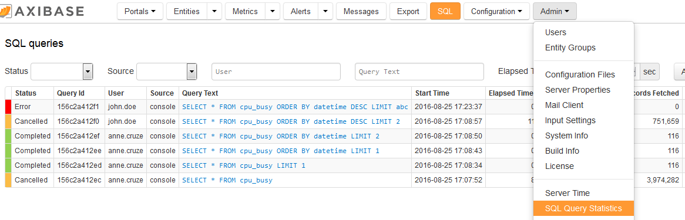
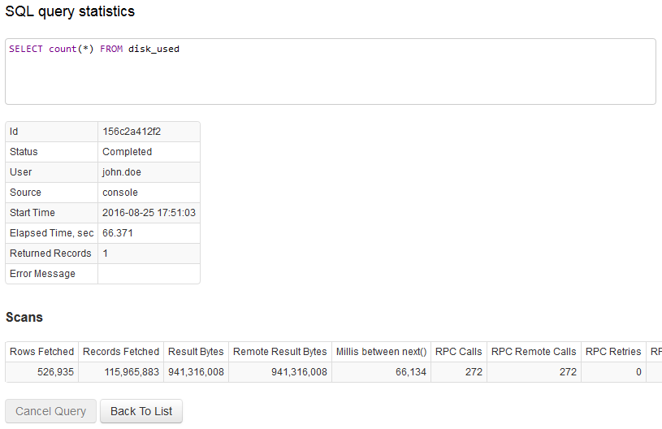

# Overview

Axibase Time Series Database supports SQL query language for retrieving time series data.

The SQL statements can be executed interactively via the SQL console as well as on [schedule](scheduled-sql.md). 

Scheduled execution allows for generated report files to be distributed to email subscribers or stored on a local file system.

The data returned by SQL statements can be exported in the following formats:

|**Endpoint**|**Formats**|
|:---|:---|
|API  |CSV, JSON|
|Web Interface  |CSV, JSON, HTML|
|Scheduler|CSV, JSON, Excel|

* [Syntax](#syntax)
  * [Columns](#columns)
  * [Aliases](#aliases)
  * [Time Condition](#time-condition)
  * [Aggregation Functions](#aggregation-functions)
  * [Time Formatting Functions](#time-formatting-functions)
  * [Mathematical Functions](#mathematical-functions)
  * [Arithmetic Operators](#arithmetic-operators)
  * [Match Expressions](#match-expressions)
  * [NULL](#null)
  * [Not a Number](#not-a-number-nan)
  * [Processing Sequence](#processing-sequence)
  * [Keywords](#keywords)
* [Period](#period)
* [Interpolation](#interpolation)
* [Regularization](#regularization)
* [Grouping](#grouping)
* [Partitioning](#partitioning)
* [Ordering](#ordering)
* [Limiting](#limiting)
* [Joins](#joins)
* [Options](#options)
* [Authorization](#authorization)
* [API Endpoint](#api-endpoint)
* [Monitoring](#monitoring)
* [Performance](#query-performance)
* [Optimizing](#optimizing)
* [Unsupported Features](#unsupported-sql-features)
* [Examples](#examples)

## Syntax

The `SELECT` statement consists of a `SELECT` expression, a `FROM` query, a `WHERE` clause, and other clauses for filtering, grouping, and ordering the results.

```sql
SELECT { * | { expr [ .* | [ AS ] alias ] } }
  FROM metric [[ AS ] alias ]
    [ [OUTER] JOIN metric [[ AS ] alias ] [USING entity] ]
[ WHERE expr(boolean) ]
  [ WITH ROW_NUMBER expr ]
[ GROUP BY expr [, ...] ]
  [ HAVING expr(boolean) ]
  [ WITH LAST_TIME expr ]
  [ WITH INTERPOLATE expr ]
[ ORDER BY expr [{ ASC | DESC }] [, ...] ]
[ LIMIT count [ OFFSET skip ]]
  [ OPTION(expr) [...]]
```

Example:

```sql
SELECT datetime, entity, value     -- SELECT expression
  FROM "mpstat.cpu_busy"           -- query
WHERE datetime > now - 1 * HOUR    -- WHERE clause
  LIMIT 1                          -- other clauses
```

The statement may be terminated with a semicolon character.

### SELECT expression

The SELECT expression consists of one or multiple columns and expressions applied to query results.

### Query

The `FROM` query can reference virtual tables that correspond to metric names.

Virtual table represents a subset of records for the given metric stored by the database in the shared physical table.

```sql
SELECT datetime, entity, value 
  FROM "mpstat.cpu_busy" 
WHERE datetime > now - 1*MINUTE
```

In the example above, "mpstat.cpu_busy" table contains records for `mpstat.cpu_busy` metric.

Virtual tables are currently supported only for series. Access to properties, messages, and alerts is currently not available.

As an alternative to specifying metric names as table names, the `FROM` query can refer to the pre-defined [`atsd_series` table](examples/select-atsd_series.md) and include `metric` name in the `WHERE` clause instead.

```sql
SELECT entity, metric, datetime, value 
  FROM atsd_series 
WHERE metric = 'mpstat.cpu_busy' 
  AND datetime > current_hour
```

### WHERE Clause

The `WHERE` clause is a condition which rows must satisfy in order to match the query. 

Columns referenced in the `WHERE` clause are replaced by their value for the given row. The clause is then evaluated for each row, and if true, the row is included in the result set.  

Typically the `WHERE` clause includes a [time condition](#time-condition) for which the data must be analyzed, although this is not required.

The clause can be built from multiple conditions each comparing values using comparison operators:

* Numeric operators: `<, >, <=, >=, =, <>, !=`.
* String operators: `<, >, <=, >=, =, <>, !=, LIKE, REGEX, IS NULL, IS NOT NULL`.

> Operators `!=` and `<>` cannot be applied to time columns: `time` and `datetime`.

> Operators `<, >, <=, >=` applied to string values, such as series/entity/metric tag values, perform [lexicographical comparison](examples/filter-operators-string.md).

The result of evaluating a condition is a boolean value. Multiple conditions can be combined using logical operators `AND`, `OR`, and `NOT`.  Operator `AND` takes precedence over `OR` and operator `NOT` takes precedence over both `AND` and `OR`. 

Arithmetic operators `*`, `-`, `+`, `/`, and `%` (modulo) may be applied to values before they are compared.

```sql
SELECT entity, datetime, value, tags.*
  FROM "df.disk_used"
WHERE datetime > now - 15 * minute
  AND (entity IN ('nurswgvml007', 'nurswgvml010') 
       OR tags.file_system LIKE '/dev/*'
       OR value/1024 > 100000)
```

### Other Clauses

* **JOIN / OUTER JOIN**
* **GROUP BY**
* **HAVING**
* **ORDER BY**
* **LIMIT**, **OFFSET**

### Functions

* **ROW_NUMBER** returns row index within each partition.
* **LAST_TIME** returns last insert time in millisecond for each series.

### Comments

Comments can be inserted into SQL statements with `--` (two hyphens) and `/* */` (multi-line) to provide descriptive information about the query and its expected results.

```sql
-- comment until line break

/* 
comment text on 
multiple line
*/
```

Comments are not allowed after the statement termination character `;`.

## Processing Sequence

* **FROM** retrieves records from virtual tables.
* **JOIN** merges records from different tables.
* **WHERE** filters out records.
* **GROUP BY** assigns records to groups (sets, buckets).
* **HAVING** filters out the buckets.
* **SELECT** creates rows containing columns.
* **ORDER BY** sorts rows.
* **LIMIT** selects a subset of rows with optional **OFFSET**.

## Columns

### Predefined Columns

Since the underlying data is physically stored in the same shared partitioned table, all virtual tables have the same set of pre-defined columns:

|**Name**|**Type**|**Description**|
|:---|:---|:---|
|`time`|long|Record time in Unix milliseconds since 1970-01-01T00:00:00Z, for example `1408007200000`.<br>In `GROUP BY` query with `PERIOD`, time column returns period start time, same as `PERIOD()` column specified in `GROUP BY` clause.|
|`datetime`|string|Record time in ISO 8601 format, for example `2016-06-10T14:00:15.020Z`.<br>In `GROUP BY` query with `PERIOD`, datetime column returns period start time in ISO format, same as `date_format(PERIOD())` column specified in `GROUP BY` clause.|
|`period`|long|Period start time in Unix milliseconds since 1970-01-01T00:00:00Z, for example `1408007200000`.|
|`value`|number|Series value.|
|`metric`|string|Metric name, same as virtual table name.|
|`entity`|string|Entity name.|
|`tags.{name}`|string|Series tag value. Returns `NULL` if the specified tag doesn't exist for this series.|
|`tags`|string|All series tags, concatenated to `name1=value;name2=value` format.|
|`tags.*`|string|Expands to multiple columns, each column containing a separate series tag.|
|`entity.tags.{name}`|string|Entity tag value. Returns `NULL` if the specified tag doesn't exist for this entity.|
|`entity.tags`|string|All entity tags, concatenated to `name1=value;name2=value` format.|
|`metric.tags.{name}`|string|Metric tag value. Returns `NULL` if the specified tag doesn't exist for this metric.|
|`metric.tags`|string|All metric tags, concatenated to `name1=value;name2=value` format.|
|`metric.tags.*`|string|Expands to multiple columns, each column containing a separate metric tag.|
|`entity.groups`|string|List of entity groups, to which the entity belongs, separated by semi-colon `;`.|

Tag columns `tags.{name}`, `entity.tags.{name}`, and `metric.tags.{name}` where `{name}` contains reserved characters such as `-`,`*`,`,` should be enclosed in quotes or double quotes, for example, `entity.tags."file-system"`. 

Quotes and double quotes in column names can be escaped by doubling the quote symbol, for example, if tag name is `hello"world`, the column name can be referred to as follows: `tags."hello""world"`.

New columns can be created by applying functions and arithmetic expressions to existing columns. The computed columns can be included both in `SELECT` expression as well as in `WHERE`, `HAVING`, and `ORDER BY` clauses.

```sql
SELECT t1.datetime, t1.entity, t1.value + t2.value AS cpu_sysusr
  FROM "mpstat.cpu_system" t1
  JOIN "mpstat.cpu_user" t2
WHERE t1.datetime > now - 1*MINUTE
```

The list of available predefined columns may be requested with `SELECT *` syntax, except for queries with `GROUP BY` clause.

```sql
SELECT * FROM "mpstat.cpu_busy" t1 
  OUTER JOIN "meminfo.memfree" t2
WHERE t1.datetime >= '2016-06-16T13:00:00.000Z' AND t1.datetime < '2016-06-16T13:10:00.000Z'
  AND t1.entity = 'nurswgvml006'
```

```ls
| t1.entity       | t1.datetime              | t1.value       | t2.entity      | t2.datetime              | t2.value      | 
|-----------------|--------------------------|----------------|----------------|--------------------------|---------------| 
| nurswgvml006    | 2016-06-16T13:00:01.000Z | 37.1           | nurswgvml006   | 2016-06-16T13:00:01.000Z | null          | 
| nurswgvml006    | 2016-06-16T13:00:12.000Z | null           | nurswgvml006   | 2016-06-16T13:00:12.000Z | 67932.0       | 
| nurswgvml006    | 2016-06-16T13:00:17.000Z | 16.0           | nurswgvml006   | 2016-06-16T13:00:17.000Z | null          | 
| nurswgvml006    | 2016-06-16T13:00:27.000Z | null           | nurswgvml006   | 2016-06-16T13:00:27.000Z | 73620.0       | 
```

In case of `JOIN` query, `SELECT *` syntax can be applied to each table separately.

```sql
SELECT t1.*, t2.value FROM "mpstat.cpu_busy" t1 
  OUTER JOIN "meminfo.memfree" t2
WHERE t1.datetime >= '2016-06-16T13:00:00.000Z' AND t1.datetime < '2016-06-16T13:10:00.000Z'
  AND t1.entity = 'nurswgvml006'
```

```ls
| t1.entity       | t1.datetime              | t1.value       | t2.value | 
|-----------------|--------------------------|----------------|----------| 
| nurswgvml006    | 2016-06-16T13:00:01.000Z | 37.1           | null     | 
| nurswgvml006    | 2016-06-16T13:00:12.000Z | null           | 67932.0  | 
| nurswgvml006    | 2016-06-16T13:00:17.000Z | 16.0           | null     | 
| nurswgvml006    | 2016-06-16T13:00:27.000Z | null           | 73620.0  | 
```

`time` and `datetime` column are interchangeable and can be used as equivalents, for example in the `GROUP BY` clause and `SELECT` expression.

```sql
SELECT entity, datetime, count(*)
  FROM "df.disk_used"
WHERE datetime >= "2016-07-03T21:02:00Z" AND datetime < "2016-07-03T21:02:15Z"
  GROUP BY entity, time
```

### Series Tag Columns

Tag values are referenced in `SELECT` expression by specifying `tags.*`, `tags`, or `tags.{tag-name}` as column name.

`tags` is a map object whose properties can be accessed with key. When specified in SELECT expression, `tags.*` creates multiple columns for each key in the map. 

If the property is not present, the `tags.{tag-name}` expression returns `NULL`.

```sql
SELECT datetime, entity, value, tags.*, tags, tags.mount_point, tags.file_system
  FROM "df.disk_used" 
WHERE entity = 'nurswgvml010' AND datetime > now - 1*MINUTE
  ORDER BY datetime
```

```ls
| datetime                 | entity       | value      | tags.mount_point | tags.file_system | tags                                   | tags.mount_point | tags.file_system | 
| 2016-06-18T11:22:35.000Z | nurswgvml010 | 6478200.0  | /                | /dev/sda1        | file_system=/dev/sda1;mount_point=/    | /                | /dev/sda1        | 
| 2016-06-18T11:22:35.000Z | nurswgvml010 | 30440664.0 | /app             | /dev/sdb1        | file_system=/dev/sdb1;mount_point=/app | /app             | /dev/sdb1        | 
```

To filter records with or without specified series tags, use `IS NOT NULL` or `IS NULL` operators.

`tags` and `tags.{tag-name}` syntax can also be used in `WHERE`, `ORDER`, `GROUP BY` and other clauses.

```sql
SELECT entity, count(value), tags.*
 FROM "df.disk_used"
WHERE datetime > now - 5 * minute
 AND entity = 'nurswgvml010'
 AND tags.mount_point = '/'
GROUP BY entity, tags
```

```ls
| entity       | count(value) | tags.mount_point | tags.file_system | 
|--------------|--------------|------------------|------------------| 
| nurswgvml010 | 20.0         | /                | /dev/sda1        | 
```

### Entity Tag Columns

Entity tag values can be included in `SELECT` expression by specifying `entity.tags.{tag-name}` or `{entity.tags}` as column name.

`entity.tags` is a map object whose properties can be accessed with `{tag-name}` key.

If there is no record for the specified key, the `entity.tags.{tag-name}` expression returns `NULL`.

```sql
SELECT entity, entity.tags.os, entity.tags.app, avg(value) 
  FROM "mpstat.cpu_busy"
WHERE datetime > current_hour
  GROUP BY entity 
```

```ls
| entity       | entity.tags.os | entity.tags.app       | avg(value) | 
|--------------|----------------|-----------------------|------------| 
| nurswgvml006 | Linux          | Hadoop/HBASE          | 29.9       | 
| nurswgvml007 | Linux          | ATSD                  | 32.4       | 
| nurswgvml009 | null           | Oracle EM             | 35.9       | 
| nurswgvml010 | Linux          | SVN, Jenkins, Redmine | 6.4        | 
| nurswgvml011 | Linux          | HMC Simulator, mysql  | 5.6        | 
| nurswgvml102 | Linux          | Router                | 1.5        | 
| nurswgvml502 | null           | null                  | 16.3       | 
```

To filter records with or without specified entity tags, use `IS NOT NULL` or `IS NULL` operators:

```sql
SELECT entity, entity.tags.os, entity.tags.app, avg(value) 
  FROM "mpstat.cpu_busy"
WHERE datetime > current_hour
  AND entity.tags.os IS NULL
GROUP BY entity 
```

```ls
| entity       | entity.tags.os | entity.tags.app | avg(value) | 
|--------------|----------------|-----------------|------------| 
| nurswgvml009 | null           | Oracle EM       | 37.2       | 
| nurswgvml502 | null           | null            | 15.4       | 
```

### Metric Tag Columns

Metric tag values can be included in `SELECT` expression by specifying `metric.tags.*`, `metric.tags`, or `metric.tags.{tag-name}` as column name.

`metric.tags` is a map object whose properties can be accessed with `{tag-name}` key.

If there is no record for the specified key, the `metric.tags.{tag-name}` expression returns `NULL`.

Metric tag columns are supported only in `SELECT` expression.

```sql
SELECT entity, avg(value), metric.tags.*, metric.tags, metric.tags.table
  FROM "mpstat.cpu_busy"
WHERE datetime > current_hour
  GROUP BY entity 
```

```ls
| entity       | avg(value) | metric.tags.source | metric.tags.table | metric.tags                | metric.tags.table | 
|--------------|------------|--------------------|-------------------|----------------------------|-------------------| 
| nurswgvml006 | 13.1       | iostat             | System            | source=iostat;table=System | System            | 
| nurswgvml007 | 10.8       | iostat             | System            | source=iostat;table=System | System            | 
| nurswgvml009 | 21.2       | iostat             | System            | source=iostat;table=System | System            | 
```

### Entity Group Column

`entity.group` column contains a list of entity groups to which the entity belongs.

The column can be specified in `SELECT` expression to print out the ordered list of entity group names, separated by semi-colon.

```sql
SELECT datetime, entity, value, entity.groups
  FROM "mpstat.cpu_busy"
WHERE entity LIKE 'nurswgvml00*'
  AND datetime > current_hour
ORDER BY datetime 
```

```ls
| datetime                 | entity       | value | entity.groups                            | 
|--------------------------|--------------|-------|------------------------------------------| 
| 2016-07-14T15:00:06.000Z | nurswgvml009 | 3.0   | nur-collectors;nmon-linux                | 
| 2016-07-14T15:00:07.000Z | nurswgvml007 | 44.7  | java-loggers;nur-collectors;nmon-linux   | 
| 2016-07-14T15:00:16.000Z | nurswgvml006 | 4.0   | nur-collectors;nmon-linux;nmon-sub-group | 
```

`entity.group` column can be referenced in the `WHERE` clause to filter results based on group membership.

Supported syntax:

```sql
entity.groups IN ('group-1', 'group-2') -- entity belongs to one of the groups listed in IN clause
entity.groups NOT IN ('group-1', 'group-1') -- entity does NOT belong to any of the groups listed in IN clause
'group-1' IN entity.groups -- entity belongs to the specified group
'group-1' NOT IN entity.groups -- entity does NOT belong to the specified group
```

Entity Group names are case-sensitive.

```sql
SELECT datetime, entity, value, entity.groups
  FROM "mpstat.cpu_busy"
WHERE 'java-loggers' IN entity.groups
  AND datetime > current_hour
ORDER BY datetime
```

```ls
| datetime                 | entity       | value | entity.groups                            | 
|--------------------------|--------------|-------|------------------------------------------| 
| 2016-07-14T15:00:07.000Z | nurswgvml007 | 44.7  | java-loggers;nur-collectors;nmon-linux   | 
| 2016-07-14T15:00:21.000Z | nurswgvml102 | 4.0   | java-loggers;network-rtr                 | 
```

### Group By Columns

In `GROUP BY` query, `datetime` and `PERIOD()` columns return the same value, the period's start time, in ISO format. In this case, `date_format(PERIOD(5 minute))` can be omitted.

```sql
SELECT entity, datetime, date_format(PERIOD(5 minute)), AVG(value) 
  FROM "mpstat.cpu_busy"
WHERE time >= current_hour AND time < next_hour
  GROUP BY entity, PERIOD(5 minute)
```

Columns referenced in the `SELECT` expression must be included in the `GROUP BY` clause.

### Versioning Columns

Versioning columns (`version_status`, `version_source`, `version_time`, `version_datetime`) are currently not supported.

## Aliases

Table and column aliases can be unquoted or enclosed in quotes or double-quotes.

Unquoted alias should start with letter `[a-zA-Z]`, followed by letter, digit or underscore.

`AS` keyword is optional.

```sql
SELECT tbl.value*100 AS "cpu_percent", tbl.datetime 'sample-date'
  FROM "mpstat.cpu_busy" tbl 
WHERE datetime > now - 1*MINUTE
```

For aliased columns, the underlying column and table names, or expression text are included in table schema section of the metadata.

```json
"tableSchema": {
	"columns": [{
		"columnIndex": 1,
		"name": "cpu_percent",
		"titles": "tbl.value*100",
		"datatype": "float",
		"table": "tbl"
	}, {
		"columnIndex": 2,
		"name": "sample-date",
		"titles": "datetime",
		"datatype": "xsd:dateTimeStamp",
		"table": "tbl",
		"propertyUrl": "atsd:datetime",
		"dc:description": "Sample time in ISO8601 format"
	}]
}
```

## Arithmetic Operators

Arithmetic operators, including `+`, `-`, `*`, `/`, and `%` (modulo) can be applied to one or multiple numeric data type columns.

```sql
SELECT datetime, sum(value), sum(value + 100) / 2 
  FROM gc_invocations_per_minute 
WHERE datetime > now - 10 * minute 
  GROUP BY period(2 minute)
```

```sql
SELECT avg(metric1.value*2), sum(metric1.value + metric2.value) 
  FROM metric1 
  JOIN metric2
WHERE metric1.datetime > now - 10 * minute 
```

The modulo operator `%` returns the remainder of one number divided by another, for example `14 % 3` (= 2).

## Match Expressions

### LIKE Expression

`?` and `*` wildcards are supported in `LIKE` expressions with backslash available as an escape character.

```sql
SELECT datetime, entity, value, tags.mount_point, tags.file_system 
  FROM "df.disk_used_percent" 
WHERE tags.file_system LIKE '/dev/*'
  AND datetime > now - 1*HOUR
```

### REGEX Expression

REGEX expression matches column value against a regex pattern and returns true if the text is matched.

```sql
SELECT datetime, entity, value, tags.mount_point, tags.file_system 
  FROM "df.disk_used_percent" 
  WHERE tags.file_system REGEX '.*mapp.*'
  AND datetime > now - 1*HOUR
```

## Time Condition

Time condition is specified in the `WHERE` clause using `time` or `datetime` columns.

The `time` column accepts Unix milliseconds whereas `datetime` column accepts literal date in ISO 8601 format with optional millisecond precision.

```sql
SELECT datetime, entity, value 
  FROM "mpstat.cpu_busy" 
WHERE time >= 1465685363345 AND datetime < '2016-06-10T14:00:15.020Z'
```

Both columns support [End Time](/end-time-syntax.md) syntax.

```sql
SELECT datetime, entity, value 
  FROM "mpstat.cpu_busy" 
WHERE time >= previous_minute AND datetime < current_minute
```

> Operators `!=` and `<>` are **not** supported with time columns: `time` and `datetime`.

## Period

Period is a repeating time interval used to group detailed values occurred in the period into buckets in order to apply aggregation functions.

Period syntax:

```sql
PERIOD({count} {unit} [, option])
```

`option` = interpolate | align | extend

* `interpolate` = PREVIOUS | NEXT | LINEAR | VALUE {number}
* `extend` = EXTEND
* `align` = START_TIME, END_TIME, FIRST_VALUE_TIME, CALENDAR

Period options are separated by comma and can be specified in any order.

```sql
PERIOD(5 MINUTE)
PERIOD(5 MINUTE, END_TIME)
PERIOD(5 MINUTE, CALENDAR, VALUE 0)
PERIOD(5 MINUTE, LINEAR, EXTEND)
```

| **Name** | **Description** |
|:---|:---|
| count | [**Required**] Number of time units contained in the period. |
| unit | [**Required**] [Time unit](/api/series/time-unit.md) such as `MINUTE`, `HOUR`, `DAY`. |
| interpolate | Apply [interpolation function](#interpolation), such as `LINEAR` or `VALUE 0`, to add missing periods.|
| extend | Add missing periods at the beginning and end of the selection interval using `VALUE {n}` or `NEXT` and `PREVIOUS` interpolation functions.|
| align | Align the period's start/end. Default: `CALENDAR`. <br>Possible values: `START_TIME`, `END_TIME`, `FIRST_VALUE_TIME`, `CALENDAR`.<br>Refer to [period alignment](#period-alignment).|


```sql
SELECT entity, date_format(PERIOD(5 minute, END_TIME)), AVG(value) 
  FROM "mpstat.cpu_busy" 
WHERE datetime >= current_hour AND datetime < next_hour
  GROUP BY entity, PERIOD(5 minute, END_TIME)
```

The period specified in `GROUP BY` clause can be entered without option fields in the `SELECT` expression. 

```sql
SELECT entity, PERIOD(5 minute), AVG(value) 
  FROM "mpstat.cpu_busy" 
WHERE datetime >= current_hour AND datetime < next_hour
  GROUP BY entity, PERIOD(5 minute, END_TIME)
```

In grouping queries, `time` column returns the same value as `PERIOD()` and `datetime` returns the same value as `date_format(PERIOD())`.

```sql
SELECT entity, datetime, AVG(value) 
  FROM "mpstat.cpu_busy" 
WHERE datetime >= current_hour AND datetime < next_hour
  GROUP BY entity, PERIOD(5 minute, END_TIME)
```

### Period Alignment

By default, periods are aligned to calendar grid according to time unit specified in the period.

For example, `period(1 HOUR)` starts at 0 minutes of each hour within the timespan.

For DAY, WEEK, MONTH, QUARTER, and YEAR units the start of the day is determined according to server timezone.

The default `CALENDAR` alignment can be changed to `START_TIME`, `END_TIME`, or `FIRST_VALUE_TIME`.

| **Alignment** | **Description**|
|:---|:---|
| CALENDAR | Period start is rounded down to the nearest time unit. |
| START_TIME | First period begins at start time specified in the query. |
| FIRST_VALUE_TIME | First period begins at the time of first retrieved value. |
| END_TIME | Last period ends on end time specified in the query. |

* For `START_TIME` and `END_TIME` options, `WHERE` clause must contain start and end time of the selection interval, respectively.

```sql
SELECT entity, datetime, COUNT(value) 
  FROM "mpstat.cpu_busy"
WHERE datetime >= now-1*HOUR AND datetime < now
  AND entity = 'nurswgvml006'
GROUP BY entity, PERIOD(5 MINUTE, END_TIME)
```

#### `CALENDAR` Alignment

Calendar alignment rounds the time to next unit and increments period until period start is equal or greater than startDate. 

The next time unit for `DAY` is `MONTH`.

The next time unit for `WEEK` is the first Monday of the given `MONTH`.

For instance, if period unit is `MINUTE`, the time is rounded to start of the hour (next unit) containing `startDate`.

Example: `45 MINUTE` with `startDate` of `2016-06-20T15:05:00Z`.
Time is rounded to `15:00` and then incremented by 45 minutes until period start is >= `2016-06-20T15:05:00Z`.
Such period is `[2016-06-20T15:45:00Z - 2016-06-20T16:30:00Z)`.

```ls
| Period     | Start Date            | End Date              | 1st Period            | 2nd Period            | Last Period          | 
|------------|-----------------------|-----------------------|-----------------------|-----------------------|----------------------| 
| 45 MINUTE  | 2016-06-20T15:05:00Z  | 2016-06-24T00:00:00Z  | 2016-06-20T15:45:00Z  | 2016-06-20T16:30:00Z  | 2016-06-23T23:15:00Z | 
| 45 MINUTE  | 2016-06-20T15:00:00Z  | 2016-06-24T00:00:00Z  | 2016-06-20T15:00:00Z  | 2016-06-20T15:45:00Z  | 2016-06-23T23:15:00Z | 
| 1 HOUR     | 2016-06-20T16:00:00Z  | 2016-06-24T00:00:00Z  | 2016-06-20T16:00:00Z  | 2016-06-20T17:00:00Z  | 2016-06-23T23:00:00Z | 
| 1 HOUR     | 2016-06-20T16:05:00Z  | 2016-06-23T23:55:00Z  | 2016-06-20T17:00:00Z  | 2016-06-20T18:00:00Z  | 2016-06-23T23:00:00Z | 
| 1 HOUR     | 2016-06-20T16:30:00Z  | 2016-06-24T00:00:00Z  | 2016-06-20T17:00:00Z  | 2016-06-20T18:00:00Z  | 2016-06-23T23:00:00Z | 
| 7 HOUR     | 2016-06-20T16:00:00Z  | 2016-06-24T00:00:00Z  | 2016-06-20T21:00:00Z  | 2016-06-21T04:00:00Z  | 2016-06-23T19:00:00Z | 
| 10 HOUR    | 2016-06-20T16:00:00Z  | 2016-06-24T00:00:00Z  | 2016-06-20T20:00:00Z  | 2016-06-21T06:00:00Z  | 2016-06-23T18:00:00Z | 
| 1 DAY      | 2016-06-01T16:00:00Z  | 2016-06-24T00:00:00Z  | 2016-06-02T00:00:00Z  | 2016-06-03T00:00:00Z  | 2016-06-23T00:00:00Z | 
| 2 DAY      | 2016-06-01T16:00:00Z  | 2016-06-24T00:00:00Z  | 2016-06-03T00:00:00Z  | 2016-06-05T00:00:00Z  | 2016-06-23T00:00:00Z | 
| 5 DAY      | 2016-06-01T16:00:00Z  | 2016-06-24T00:00:00Z  | 2016-06-06T00:00:00Z  | 2016-06-11T00:00:00Z  | 2016-06-21T00:00:00Z | 
| 1 WEEK     | 2016-06-01T16:00:00Z  | 2016-06-24T00:00:00Z  | 2016-06-06T00:00:00Z  | 2016-06-13T00:00:00Z  | 2016-06-20T00:00:00Z | 
| 1 WEEK     | 2016-05-01T16:00:00Z  | 2016-05-24T00:00:00Z  | 2016-05-02T00:00:00Z  | 2016-05-09T00:00:00Z  | 2016-05-23T00:00:00Z | 
| 1 WEEK     | 2016-06-01T00:00:00Z  | 2016-06-02T00:00:00Z  | - 1st Monday Jun-06.  | -                     | -                    | 
```

#### `END_TIME` Alignment

* If end time in the query is inclusive, 1 millisecond is added to period end time since period end time must be exclusive.

```sql
SELECT entity, datetime, COUNT(value) FROM "mpstat.cpu_busy"
WHERE datetime >= '2016-06-18T10:02:00.000Z' AND datetime < '2016-06-18T10:32:00.000Z'
  AND entity = 'nurswgvml007'
GROUP BY entity, PERIOD(10 MINUTE, END_TIME)
```

```ls
| entity       | datetime                 | COUNT(value) | 
|--------------|--------------------------|--------------| 
| nurswgvml007 | 2016-06-18T10:02:00.000Z | 38.0         | 
| nurswgvml007 | 2016-06-18T10:12:00.000Z | 37.0         | 
| nurswgvml007 | 2016-06-18T10:22:00.000Z | 38.0         | 
```

```sql
SELECT entity, datetime, COUNT(value) FROM "mpstat.cpu_busy"
WHERE datetime >= '2016-06-18T10:02:00.000Z' AND datetime <= '2016-06-18T10:32:00.000Z'
  AND entity = 'nurswgvml007'
GROUP BY entity, PERIOD(10 MINUTE, END_TIME)
```

```ls
| entity       | datetime                 | COUNT(value) | 
|--------------|--------------------------|--------------| 
| nurswgvml007 | 2016-06-18T10:02:00.001Z | 38.0         | 
| nurswgvml007 | 2016-06-18T10:12:00.001Z | 37.0         | 
| nurswgvml007 | 2016-06-18T10:22:00.001Z | 38.0         | 
```

#### `START_TIME` Alignment

1 millisecond is added to period start if start time in the query is exclusive.

```sql
SELECT entity, datetime, COUNT(value) FROM "mpstat.cpu_busy"
WHERE datetime > '2016-06-18T10:02:00.000Z' AND datetime < '2016-06-18T10:32:00.000Z'
  AND entity = 'nurswgvml007'
GROUP BY entity, PERIOD(10 MINUTE, START_TIME)
```

```ls
| entity       | datetime                 | COUNT(value) | 
|--------------|--------------------------|--------------| 
| nurswgvml007 | 2016-06-18T10:02:00.001Z | 38.0         | 
| nurswgvml007 | 2016-06-18T10:12:00.001Z | 37.0         | 
| nurswgvml007 | 2016-06-18T10:22:00.001Z | 38.0         | 
```

## Interpolation

By the default, if a period specified in `GROUP BY` clause doesn't contain any detailed values or the period has been filtered out with `HAVING` clause, it will be excluded from the results.

The behaviour can be changed by referencing an interpolation function as part of the `PERIOD` clause.

| **Name** | **Description** |
|:---|:---|
| `PREVIOUS` | Set value for the period based on the previous period's value. |
| `NEXT` | Set value for the period based on the next period's value. |
| `LINEAR` | Calculate period value using linear interpolation between previous and next period values. |
| `VALUE {d}`| Set value for the period to constant number `d`. |

```sql
SELECT entity, period(5 MINUTE), avg(value)
  FROM "mpstat.cpu_busy" WHERE datetime > current_hour 
GROUP BY entity, period(5 MINUTE, LINEAR)
```

### `EXTEND` Option

Include an optional `EXTEND` parameter to the `PERIOD` clause to append missing periods at the beginning and the end of the selection interval. 

Leading and trailing period values are set with `VALUE {n}` function if it's specified. 

```sql
period(5 MINUTE, VALUE 0, EXTEND)
```

Otherwise, in absence of `VALUE {n}` function, `EXTEND` option sets period values at the beginning of the interval with `NEXT` function, whereas values at the end are set with `PREVIOUS` function.

```sql
SELECT entity, period(5 MINUTE), avg(value)
  FROM "mpstat.cpu_busy" WHERE datetime > current_hour 
GROUP BY entity, period(5 MINUTE, LINEAR, EXTEND)
```

### `HAVING` Filter

The interpolation function is applied after `HAVING` filter which can remove existing (non-empty) periods with other conditions. 

Periods removed by the `HAVING` filter will be interpolated similar to missing periods.

### Interpolation Examples

- [Interpolate](examples/interpolate.md)
- [Interpolate Edges](examples/interpolate-edges.md)
- [Interpolate with Extend](examples/interpolate-extend.md)
- [Chartlab](https://apps.axibase.com/chartlab/d8c03f11/3/)

## Regularization

`WITH INTERPOLATE` clause provides a way to transform unevenly spaced time series into regular series.

The underlying transformation applies a linear interpolation or a step function to calculate values at regular intervals.

```sql
SELECT datetime, value 
  FROM mpstat.cpu_busy
WHERE entity = 'nurswgvml007'
  AND datetime >= '2016-09-17T08:00:00Z' AND datetime < '2016-09-17T08:02:00Z'
WITH INTERPOLATE(30 SECOND)
```

```ls
| raw time             | regular time         | 
|----------------------|----------------------| 
| 2016-09-17T08:00:00Z | 2016-09-17T08:00:00Z |
| ...........08:00:26Z | ...........08:00:30Z |
| ...........08:01:14Z | ...........08:01:00Z |
| ...........08:01:30Z | ...........08:01:30Z |
```

### Syntax

```ls
WITH INTERPOLATE (period [, inter_func[, boundary[, fill [, alignment]]]])
```

`WITH INTERPOLATE` clause is included prior to `ORDER BY` and `LIMIT` clauses and applies to all series retrieved by the query.

**Example**:

```sql
WITH INTERPOLATE (1 MINUTE, LINEAR, OUTER, NAN, START_TIME)
```

**Parameters**:

| **Name** | **Description**|
|:---|:---|
| `period` | Regular interval for aligning interpolated values, for example, `5 MINUTE`. Specified as `count unit`. |
| `inter_func` | Interpolation function to calculate values at regular timestamps based on adjacent values. |
| `boundary` | Should raw values outside of the selection interval be retrieved to interpolate leading and trailing values.  |
| `fill` | Method for filling missing values at the beginning and the end of the selection interval. |
| `alignment` | Aligns regular timestamps based on calendar or based on start time. |

[](https://apps.axibase.com/chartlab/712f37cb)


### Interpolation Function

| **Name** | **Description**|
|:---|:---|
| `LINEAR` | Calculates the value at the desired timestamp by linear interpolating prior and next values. |
| `PREVIOUS` | Sets the value at the desired timestamp based on peviously recorded raw value.<br>This step-like function is appropriate for metrics with discrete values (digital signal) or in cases where value is updated on change.|
| `AUTO` | [**Default**] Applies an interpolation function (`LINEAR` or `PREVIOUS`) based on metric's Interpolation setting.<br>If multiple metrics are specified in the query, `AUTO` applies its own interpolation mode for each metric.  |

* NaN (Not-A-Number) raw values are ignored from interpolation.
* `value` condition in the `WHERE` clause applies to interpolated series values instead of raw values, <br>i.e. filtering out raw values prior to interpolation is not supported.

### Boundary

| **Name** | **Description**|
|:---|:---|
| `INNER` | [**Default**] Performs calculation based on raw values located within the specified selection interval. |
| `OUTER` | Retrieves prior and next raw values outside of the selection interval in order to interpolate leading and trailing values. |

* In HBase 0.94.x the `OUTER` boundary mode fetches raw values of up to 1 hour before and after the hour-rounded selection interval.

### Fill

| **Name** | **Description**|
|:---|:---|
| `NONE` | [**Default**] Ignores rows (excludes them from results) for periods without interpolated values. |
| `NAN` | Sets value to `NaN` (Not a Number) for periods without interpolated values. |
| `EXTEND` | Missing values at the beginning of the interval are set to first raw value within the interval.<br>Missing values at the end of the interval are set to last raw value within the interval.<br>This option requires that both start and end time are specified in the query.|

### Alignment

| **Name** | **Description**|
|:---|:---|
| `CALENDAR` | [**Default**] Aligns regular timestamps according to server calendar. |
| `START_TIME` | Starts regular timestamps at the start time of the selection interval .<br>This option requires that both start and end time are specified in the query. |

### Regularization Examples

- [LINEAR Function](examples/regularize.md#interpolation-function-linear)
- [PREVIOUS (Step) Function](examples/regularize.md#interpolation-function-previous)
- [AUTO Function](examples/regularize.md#interpolation-function-auto)
- [Fill](examples/regularize.md#fill-nan)
- [Alignment](examples/regularize.md#alignment)
- [GROUP BY comparison](examples/regularize.md#group-by-period-compared-to-with-interpolate)
- [JOIN regularized series](examples/regularize.md#join-example)
- [Value filter](examples/regularize.md#value-filter)

## Grouping

`GROUP BY` clause groups records into rows that have matching values for the specified grouping columns.

```sql
SELECT entity, avg(value) AS Cpu_Avg 
  FROM "mpstat.cpu_busy"
WHERE entity IN ('nurswgvml007', 'nurswgvml006', 'nurswgvml011') 
  AND datetime > current_hour
GROUP BY entity
```

```ls
| entity       | Cpu_Avg | 
|--------------|---------| 
| nurswgvml006 | 99.8    | 
| nurswgvml007 | 15.2    | 
| nurswgvml011 | 5.7     | 
```

A special grouping column `PERIOD` calculates the start and end of the period to which the record belongs.

```sql
SELECT datetime, avg(value) AS Cpu_Avg 
  FROM "mpstat.cpu_busy"
WHERE entity IN ('nurswgvml007', 'nurswgvml006', 'nurswgvml011') 
  AND datetime > current_hour
GROUP BY period(5 MINUTE)
```

```ls
| datetime                 | Cpu_Avg | 
|--------------------------|---------| 
| 2016-06-18T22:00:00.000Z | 43.2    | 
| 2016-06-18T22:05:00.000Z | 35.3    | 
| 2016-06-18T22:10:00.000Z | 5.0     | 
```

### HAVING filter

The `HAVING` clause enables filtering of grouped rows. The clause supports only aggregation functions.

```sql
SELECT entity, avg(value) AS Cpu_Avg 
  FROM "mpstat.cpu_busy"
WHERE entity IN ('nurswgvml007', 'nurswgvml006', 'nurswgvml011') 
  AND datetime > current_hour
GROUP BY entity
  HAVING avg(value) > 10
```

```ls
| entity       | Cpu_Avg | 
|--------------|---------| 
| nurswgvml006 | 99.8    | 
| nurswgvml007 | 14.3    | 
```

## Partitioning

Partitioning is implemented with `ROW_NUMBER()` function which returns sequential number of a row within a partition of result set, starting at 1 for the first row in each partition.

Partition is a subset of all rows in the resultset grouped by equal values of partitioning columns.

For example, assuming that the below resultset was partitioned by entity and then ordered by time within each partition, the row numbers would be as follows: 

```ls
|--------------|--------------------------|------:| ROW_NUMBER
| nurswgvml006 | 2016-06-18T12:00:05.000Z | 66.0  |     1
| nurswgvml006 | 2016-06-18T12:00:21.000Z | 8.1   |     2
| nurswgvml007 | 2016-06-18T12:00:03.000Z | 18.2  |     1
| nurswgvml007 | 2016-06-18T12:00:19.000Z | 67.7  |     2
| nurswgvml010 | 2016-06-18T12:00:14.000Z | 0.5   |     1
| nurswgvml011 | 2016-06-18T12:00:10.000Z | 100.0 |     1
| nurswgvml011 | 2016-06-18T12:00:26.000Z | 4.0   |     2
| nurswgvml011 | 2016-06-18T12:00:29.000Z | 0.0   |     3
```

### ROW_NUMBER Syntax

```sql
ROW_NUMBER({partitioning columns} ORDER BY {ordering columns [direction]})
```

* {partitioning columns} can be `entity`, `tags`, or `entity, tags`
* {ordering columns [direction]} can be any in the `FROM` clause with optional ASC|DESC direction.

Examples:

* `ROW_NUMBER(entity ORDER BY time)`
* `ROW_NUMBER(entity, tags ORDER BY time DESC)`
* `ROW_NUMBER(entity, tags ORDER BY time DESC, avg(value))`
 
 The returned number can be used to filter rows within each partition, for example to return only top-N records from each partition:

```sql
SELECT entity, datetime, value
  FROM mpstat.cpu_busy
WHERE datetime >= "2016-06-18T12:00:00.000Z" AND datetime < "2016-06-18T12:00:30.000Z"
  WITH ROW_NUMBER(entity ORDER BY time) <= 1
  ORDER BY entity, datetime
```

```ls
| entity       | datetime                 | value | 
|--------------|--------------------------|------:| 
| nurswgvml006 | 2016-06-18T12:00:05.000Z | 66.0  | 
| nurswgvml007 | 2016-06-18T12:00:03.000Z | 18.2  | 
| nurswgvml010 | 2016-06-18T12:00:14.000Z | 0.5   | 
| nurswgvml011 | 2016-06-18T12:00:10.000Z | 100.0 | 
| nurswgvml102 | 2016-06-18T12:00:02.000Z | 0.0   | 
| nurswgvml502 | 2016-06-18T12:00:01.000Z | 13.7  | 
```

### LAST_TIME Syntax

The `last_time` function returns last time in milliseconds when data was received for a given series. It enables filtering records for each series based on date, specific for the given series.

```sql
WITH time comparision_operator last_time_expression
WITH last_time_expression comparision_operator time
```

* `time` is the pre-defined time column which represents timestamp of the sample.
* `comparision_operator` is one of `>`, `>=`, `<`, `<=`, `=`.
* `last_time_expression` consists of `last_time` keyword and an optional `endtime` expression.

```sql
WITH time > last_time - 1 * MINUTE
```

Return avg() for the most recent hour for each series: 

```sql
SELECT entity, AVG(cpu_busy.value)
  FROM cpu_busy
WHERE datetime > previous_month
  GROUP BY entity
WITH time > last_time - 1 * HOUR
```

## Ordering

The default sort order is undefined. Row ordering can be performed by adding `ORDER BY` clause consisting of column name, column number (starting with 1), or an expression followed by direction (ASC or DESC).

```sql
SELECT entity, avg(value) FROM "mpstat.cpu_busy"
  WHERE datetime > current_day
  GROUP BY entity 
ORDER BY avg(value) DESC, entity
```

```ls
| entity       | avg(value) | 
|--------------|-----------:| 
| nurswgvml006 | 19.2       | 
| nurswgvml007 | 13.2       | 
| nurswgvml011 | 5.1        | 
| nurswgvml010 | 4.3        | 
| nurswgvml502 | 4.3        | 
| nurswgvml102 | 1.2        | 
```

Column numbers can be used instead of column names. The number should be a positive integer representing the position of the column in the `SELECT` expression.

```sql
SELECT entity, avg(value) FROM "mpstat.cpu_busy"
  WHERE datetime > current_day
  GROUP BY entity 
ORDER BY 2 DESC, 1
```

In combination with `LIMIT`, ordering can be used to execute **top-N** queries.

```sql
SELECT entity, avg(value) FROM "mpstat.cpu_busy"
  WHERE datetime > current_day
  GROUP BY entity 
ORDER BY avg(value) DESC
  LIMIT 2
```

```ls
| entity       | avg(value) | 
|--------------|-----------:| 
| nurswgvml006 | 19.3       | 
| nurswgvml007 | 13.2       | 
```

### Collation

Strings are ordered [lexicographically](examples/order-by-string-collation.md), based on Unicode values. `NULL` has the lowest possible value and is listed first when sorted in ascending order.

| **ATSD** | **MySQL** | **PostgreSQL** | **Oracle** |
| ---- | ---- | ---- | ---- |
| 0 U+0030 | 0 | 0 | 0 |
| 1 U+0031 | 1 | 1 | 1 |
| A U+0041 | A | a | A |
| B U+0042 | a | A | B |
| C U+0043 | B | b | C |
| T U+0054 | b | B | T |
| U U+0055 | C | C | U |
| a U+0061 | t | t | a |
| b U+0062 | T | T | b |
| t U+0074 | U | U | t |
| z U+007A | z | z | z |

### Limiting

To reduce the number of rows returned by the database for a given query, add `LIMIT` clause at the end of the query.

The `LIMIT` clause provides two syntax alternatives:

| **Syntax** | **Example** | **Description** |
|:---|:---|:---|
| `LIMIT` `[offset,] count` | `LIMIT 3, 5` | Select 5 rows starting with 4th row |
| `LIMIT` `[offset,] count` | `LIMIT 0, 5` | Select 5 rows starting with 1st row |
| `LIMIT` count `OFFSET` offset| `LIMIT 5 OFFSET 3` | Select 5 rows starting with 4th row |
| `LIMIT` count `OFFSET` offset| `LIMIT 5 OFFSET 0` | Select 5 rows starting with 1st row |

Note that row numbering starts at 0, hence `LIMIT 0, 5` is equivalent to `LIMIT 5`.

The limit applies to the number of rows returned by the database, not the number of raw samples found.

```sql
SELECT entity, avg(value) 
  FROM 'm-1' 
GROUP BY entity 
  ORDER BY avg(value) DESC 
LIMIT 1
```

The above query would scan all samples for 'm-1' metric in the database even though it would return only 1 record as instructed by `LIMIT 1` clause.

## Joins

Data for multiple virtual tables can be merged with `JOIN` and `OUTER JOIN` clauses.

The syntax follows the SQL-92 notation using the JOIN clause as opposed to enumerating columns in WHERE clause according to ANSI-89.

Since joined tables always contain the same predefined columns, join condition doesn't have to be specified explicitly, similar to NATURAL JOIN in standard SQL:

| **ATSD SQL** | **Standard SQL Equivalent** |
|:---|---|
| JOIN | JOIN ON t1.time AND t2.time AND t1.entity = t2.entity AND t1.tags = t2.tags |
| JOIN USING entity | JOIN ON t1.time AND t2.time AND t1.entity = t2.entity |
| OUTER JOIN | FULL OUTER JOIN ON t1.time AND t2.time AND t1.entity = t2.entity AND t1.tags = t2.tags |
| OUTER JOIN USING entity | FULL OUTER JOIN ON t1.time AND t2.time AND t1.entity = t2.entity |

Because join queries combine rows from multiple virtual tables with the same columns, it is necessary to disambiguate references to these columns in the `SELECT` expression by prepending table name followed by dot in front of the column name.

### JOIN

`JOIN` clause allows merging records for multiple metrics into one resultset, even if data collected for the underlying series is not synchronized on time.

The default `JOIN` condition is time, entity and series tags. The condition can be modified with `USING entity` clause in which case series tags are ignored, and records are joined on time and entity instead.

```sql
SELECT t1.datetime, t1.entity, t1.value, t2.value, t3.value
  FROM "mpstat.cpu_system" t1
  JOIN "mpstat.cpu_user" t2 
  JOIN "mpstat.cpu_iowait" t3
WHERE t1.datetime >= '2016-06-16T13:00:00.000Z' AND t1.datetime < '2016-06-16T13:10:00.000Z'
  AND t1.entity = 'nurswgvml006'
```

In this particular case, since timestamps for each of these metrics are identical, being collected by the same script, `JOIN` produces merged rows for all the detailed records.

```ls
| datetime                 | entity       | t1.value | t2.value | t3.value | 
|--------------------------|--------------|---------:|---------:|---------:| 
| 2016-06-16T13:00:01.000Z | nurswgvml006 | 13.3     | 21.0     | 2.9      | 
| 2016-06-16T13:00:17.000Z | nurswgvml006 | 1.0      | 2.0      | 13.0     | 
| 2016-06-16T13:00:33.000Z | nurswgvml006 | 0.0      | 1.0      | 0.0      | 
```

This is typically the case when multiple metrics are inserted with one command or when time is controlled externally, as in the example above, where metrics 'cpu_system', 'cpu_user', 'cpu_iowait' are all timestamped by the same collector script with the same time during each `mpstat` command invocation.

However, when merging records for irregular metrics collected by independent sources, `JOIN` results may contain a small subset of rows with coincidentally identical times.

```sql
SELECT t1.datetime, t1.entity, t1.value as cpu, t2.value as mem
  FROM "mpstat.cpu_busy" t1 
  JOIN "meminfo.memfree" t2
WHERE t1.datetime >= '2016-06-16T13:00:00.000Z' AND t1.datetime < '2016-06-16T13:10:00.000Z'
  AND t1.entity = 'nurswgvml006'
```

The result contains only 2 records out of 75 total. This is because for `JOIN` to merge detailed records from multiple metrics into one row, the records should have the same time. 

```ls
| datetime                 | entity       | cpu  | mem     | 
|--------------------------|--------------|-----:|--------:| 
| 2016-06-16T13:02:57.000Z | nurswgvml006 | 16.0 | 74588.0 | 
| 2016-06-16T13:07:17.000Z | nurswgvml006 | 16.0 | 73232.0 | 
```


Similarly, multiple tables can be merged for series with tags, without the need to enumerate all possible tags in the join condition.

```sql
SELECT t1.datetime, t1.entity, t1.value, t2.value, t1.tags.*
  FROM "df.disk_used" t1
  JOIN "df.disk_used_percent" t2
WHERE t1.datetime >= '2016-06-16T13:00:00.000Z' AND t1.datetime < '2016-06-16T13:10:00.000Z'
  AND t1.entity = 'nurswgvml006'
```

```ls	
| datetime                 | entity       | t1.value     | t2.value | t1.tags.file_system             | t1.tags.mount_point | 
|--------------------------|--------------|--------------|----------|---------------------------------|---------------------| 
| 2016-06-16T13:00:14.000Z | nurswgvml006 | 1743057408.0 | 83.1     | //u113452.nurstr003/backup      | /mnt/u113452        | 
| 2016-06-16T13:00:29.000Z | nurswgvml006 | 1743057408.0 | 83.1     | //u113452.nurstr003/backup      | /mnt/u113452        | 
| 2016-06-16T13:00:44.000Z | nurswgvml006 | 1743057408.0 | 83.1     | //u113452.nurstr003/backup      | /mnt/u113452        | 
| 2016-06-16T13:00:59.000Z | nurswgvml006 | 1743057408.0 | 83.1     | //u113452.nurstr003/backup      | /mnt/u113452        | 
```

### JOIN with USING entity

`USING entity` modifies the default `JOIN` condition. 

When `USING entity` is specified, rows are joined by entity and time instead of entity, time, and series tags.

This allows merging of virtual tables with different tag columns, including merging a table without tag column with a series containing multiple tag columns.

`USING entity` is supported by both inner and outer JOIN.

```sql
SELECT t1.entity, t1.datetime, AVG(t1.value), AVG(t2.value), t1.tags.*, t2.tags.*
  FROM mpstat.cpu_busy t1
  JOIN USING entity df.disk_used t2
WHERE t1.datetime > current_hour
  AND t1.entity = 'nurswgvml007' 
GROUP BY t1.entity, t1.tags, t2.tags, t1.PERIOD(1 minute)
```

```ls
| entity       | datetime                 | AVG(t1.value) | AVG(t2.value) | disk_used.tags.mount_point | disk_used.tags.file_system          | 
|--------------|--------------------------|--------------:|--------------:|----------------------------|-------------------------------------| 
| nurswgvml007 | 2016-06-18T10:03:00.000Z | 100.0         | 1744011571.0  | /mnt/u113452               | //u113452.nurstr003/backup          | 
| nurswgvml007 | 2016-06-18T10:03:00.000Z | 100.0         | 8686400.0     | /                          | /dev/mapper/vg_nurswgvml007-lv_root | 
```

### OUTER JOIN

To combine all records from joined tables, use `OUTER JOIN` which returns rows with equal time, entity, and tags as well as rows from one table for which no rows from the other satisfy the join condition.

```sql
SELECT t1.datetime, t1.entity, t1.value as cpu, t2.value as mem
  FROM "mpstat.cpu_busy" t1 
  OUTER JOIN "meminfo.memfree" t2
WHERE t1.datetime >= '2016-06-16T13:00:00.000Z' AND t1.datetime < '2016-06-16T13:10:00.000Z'
  AND t1.entity = 'nurswgvml006'
```

`OUTER JOIN` for detailed records, without period aggregation, produces rows that have NULLs in value columns because the underlying metric didn't record any value at the specified time.

```ls
| datetime                 | entity       | cpu  | mem     | 
|--------------------------|--------------|-----:|--------:| 
| 2016-06-16T13:00:01.000Z | nurswgvml006 | 37.1 | null    | 
| 2016-06-16T13:00:12.000Z | nurswgvml006 | null | 67932.0 | 
| 2016-06-16T13:00:17.000Z | nurswgvml006 | 16.0 | null    | 
| 2016-06-16T13:00:27.000Z | nurswgvml006 | null | 73620.0 | 
| 2016-06-16T13:00:33.000Z | nurswgvml006 | 1.0  | null    | 
```

To regularize the series, apply `GROUP BY` with period aggregation and apply one of statistical functions to return one value for the period, for each series.

```sql
SELECT t1.datetime, t1.entity, avg(t1.value) as avg_cpu, avg(t2.value) as avg_mem
  FROM "mpstat.cpu_busy" t1 
  OUTER JOIN "meminfo.memfree" t2
WHERE t1.datetime >= '2016-06-16T13:02:40.000Z' AND t1.datetime < '2016-06-16T13:10:00.000Z'
  AND t1.entity = 'nurswgvml006'
GROUP BY t1.entity, t1.PERIOD(1 MINUTE)
```

```ls
| datetime                 | entity       | avg_cpu | avg_mem  | 
|--------------------------|--------------|---------|----------| 
| 2016-06-16T13:02:00.000Z | nurswgvml006 | 9.5     | 72620.0  | 
| 2016-06-16T13:03:00.000Z | nurswgvml006 | 6.1     | 70799.0  | 
| 2016-06-16T13:04:00.000Z | nurswgvml006 | 15.1    | 71461.0  | 
```

Choice of statistical function to use for value columns depends on the use case. 

`AVG` and percentile functions would smooth the values, whereas `LAST` or `FIRST` functions would select a subset of raw values in a downsampling effect.

```sql
SELECT t1.datetime, t1.entity, LAST(t1.value) as cpu, LAST(t2.value) as mem
  FROM "mpstat.cpu_busy" t1 
  OUTER JOIN "meminfo.memfree" t2
WHERE t1.datetime >= '2016-06-16T13:02:40.000Z' AND t1.datetime < '2016-06-16T13:10:00.000Z'
  AND t1.entity = 'nurswgvml006'
GROUP BY t1.entity, t1.PERIOD(1 MINUTE)
```

>  Note that records returned by a `JOIN USING entity` condition include series with last insert date greater than start date specified in the query.

## Keywords

|             |             |             |             |
|-------------|-------------|-------------|-------------| 
| AND         | AS          | ASC         | BETWEEN     | 
| BY          | DESC        | FROM        | GROUP       | 
| HAVING      | IN          | INNER       | INTERPOLATE | 
| JOIN        | LIKE        | LIMIT       | NOT         | 
| OR          | ORDER       | OUTER       | PERIOD      | 
| REGEX       | ROW_NUMBER  | SELECT      | USING       | 
| VALUE       | WHERE       | WITH        | OFFSET      | 

In addition, [endtime](/end-time-syntax.md#keywords) keywords such as `NOW`, `PREVIOUS_HOUR` and [interval units](/end-time-syntax.md#interval-units) such as `MINUTE`, `HOUR` are reserved.

## Aggregation Functions

The following functions aggregate values in a column by producing a single value from a list of values appearing in a column.

|                |                |                |                | 
|----------------|----------------|----------------|----------------| 
| SUM            | AVG            | MIN            | MAX            | 
| COUNT          | COUNTER        | DELTA          | FIRST          | 
| LAST           | MAX_VALUE_TIME | MIN_VALUE_TIME | PERCENTILE     | 
| STDDEV         | WAVG           | WTAVG          |                |


The functions accept `value` as column name or a numeric expression as a parameter, for example  `avg(value)` or `avg(t1.value + t2.value)`.
The PERCENTILE function accepts `percentile` parameter (0 to 100) and `value` column name, for example `percentile(75, value)`.
The COUNT function counts the number of rows in the resultset and accepts *, for example `COUNT(*)`.


## Time Formatting Functions

`date_format` function formats Unix millisecond time to a string in user-defined date format and optional time zone. 

```java
date_format(long milliseconds[, time_format[, time_zone]])
```

If the `time_format` argument is not provided, ISO 8601 format is applied.

The `time_zone` parameter accepts GTM offset or a [time zone name](/api/network/timezone-abnf.md) and allows formatting dates in a time zone, different from the server's time zone.

Examples:

* `date_format(time)`
* `date_format(max_value_time(value))`
* `date_format(time, 'yyyy-MM-dd HH:mm:ss')`
* `date_format(time, 'yyyy-MM-dd HH:mm:ss', 'PST')`
* `date_format(time, 'yyyy-MM-dd HH:mm:ss', 'GMT-08:00')`
* `date_format(time, 'yyyy-MM-dd HH:mm:ss ZZ', 'PDT')`

```sql
SELECT time, date_format(time), 
  date_format(time, "yyyy-MM-dd'T'HH:mm:ssZ"),
  date_format(time, 'yyyy-MM-dd HH:mm:ss'),
  date_format(time, 'yyyy-MM-dd HH:mm:ss', 'PST'),
  date_format(time, 'yyyy-MM-dd HH:mm:ss', 'GMT-08:00'),
  date_format(time, 'yyyy-MM-dd HH:mm:ss ZZ', 'PST'),
  date_format(time, 'yyyy-MM-dd HH:mm:ss ZZ', 'PST')
FROM "mpstat.cpu_busy"
  WHERE datetime > now - 5 * minute
  LIMIT 1
```

```ls
| value | time          | date_format(time)        | date_format(time,'yyyy-MM-dd'T'HH:mm:ssZ') | date_format(time,'yyyy-MM-dd HH:mm:ss') | date_format(time,'yyyy-MM-dd HH:mm:ss','PST') | 
|-------|---------------|--------------------------|--------------------------------------------|-----------------------------------------|-----------------------------------------------| 
| 7.1   | 1468046047000 | 2016-07-09T06:34:07.000Z | 2016-07-09T06:34:07+0000                   | 2016-07-09 06:34:07                     | 2016-07-08 23:34:07                           | 
```

```ls
| format                                                 | date_format value          | 
|--------------------------------------------------------|----------------------------| 
| time                                                   | 1468411675000              | 
| date_format(time)                                      | 2016-07-13T12:07:55.000Z   | 
| date_format(time+60000)                                | 2016-07-13T12:08:55.000Z   | 
| date_format(time,'yyyy-MM-dd'T'HH:mm:ss.SSS'Z'','UTC') | 2016-07-13T12:07:55.000Z   | 
| date_format(time,'yyyy-MM-dd HH:mm:ss')                | 2016-07-13 12:07:55        | 
| date_format(time,'yyyy-MM-dd HH:mm:ss','PST')          | 2016-07-13 05:07:55        | 
| date_format(time,'yyyy-MM-dd HH:mm:ss','GMT-08:00')    | 2016-07-13 04:07:55        | 
| date_format(time,'yyyy-MM-dd HH:mm:ss Z','PST')        | 2016-07-13 05:07:55 -0700  | 
| date_format(time,'yyyy-MM-dd HH:mm:ss ZZ','PST')       | 2016-07-13 05:07:55 -07:00 | 
```

The `date_format` function can also be used to print out period start and end times:

```sql
SELECT datetime AS period_start, date_format(time+60*60000) AS period_end, avg(value)
  FROM mpstat.cpu_busy
WHERE entity = 'nurswgvml007' 
  AND datetime >= current_day
GROUP BY PERIOD(1 HOUR)
```

```ls
| period_start             | period_end               | avg(value) | 
|--------------------------|--------------------------|------------| 
| 2016-08-25T00:00:00.000Z | 2016-08-25T01:00:00.000Z | 7.7        | 
| 2016-08-25T01:00:00.000Z | 2016-08-25T02:00:00.000Z | 8.2        | 
| 2016-08-25T02:00:00.000Z | 2016-08-25T03:00:00.000Z | 6.7        | 
```

## Mathematical Functions

| **Function** | **Syntax** | **Description** |
|:---|:---|:---|
| ABS | `ABS(num)` | Absolute value of the specified number. |
| CEIL | `CEIL(num)` | Smallest integer that is greater than or equal to the specified number. |
| FLOOR | `FLOOR(num)` | Largest integer that is less than or equal to the specified number. |
| ROUND | `ROUND(num [,m])` | Number rounded to `m` decimal places. |
| MOD | `MOD(num, m)` | Remainder of the first number divided by `m`.|
| POWER | `POWER(num, m)`  | Number raised to power `m`. |
| EXP | `EXP(num)` | `e` (2.71828183) raised to the power of the specified number. |
| LN | `LN(num)` | Natural logarithm of the specified number. |
| LOG | `LOG(num, m)`  | Base-`num` logarithm of the second number `m`. |
| SQRT | `SQRT(num)` | Square root of the specified number. |

```sql
SELECT value, ABS(value), CEIL(value), FLOOR(value), ROUND(value), MOD(value, 3),
  POWER(value, 2), EXP(value), LN(value), LOG(10, value), SQRT(value)
  FROM mpstat.cpu_busy
WHERE datetime >= now - 1 * minute
  AND entity = 'nurswgvml007'
```

```ls
| value | ABS(value) | CEIL(value) | FLOOR(value) | ROUND(value) | MOD(value,3) | POWER(value,2) | EXP(value) | LN(value) | LOG(10,value) | SQRT(value) | 
|-------|------------|-------------|--------------|--------------|--------------|----------------|------------|-----------|---------------|-------------| 
| 4.040 | 4.040      | 5.000       | 4.000        | 4.000        | 1.040        | 16.322         | 56.826     | 1.396     | 0.606         | 2.010       | 
| 7.070 | 7.070      | 8.000       | 7.000        | 7.000        | 1.070        | 49.985         | 1176.148   | 1.956     | 0.849         | 2.659       | 
```

## Case Sensitivity

SQL keywords are case-**in**sensitive.

Entity column values, metric column values, and tag names are also case-**in**sensitive. 

Tag _values_ are **case-sensitive**.

```sql
SELECT metric, entity, datetime, value, tags.*
  FROM df.disk_used
WHERE datetime > now - 5 * minute
  AND entity = 'NurSwgvml007' -- case-INsensitive
  AND tags.file_system = '/dev/mapper/vg_nurswgvml007-lv_root' -- case-sensitive
```

```ls
| metric    | entity       | datetime                 | value     | tags.mount_point | tags.file_system                    | 
|-----------|--------------|--------------------------|-----------|------------------|-------------------------------------| 
| df.disk_used | nurswgvml007 | 2016-06-19T06:12:26.000Z | 8715136.0 | /                | /dev/mapper/vg_nurswgvml007-lv_root | 
```

Changing the case of tag value condition `tags.file_system = '/DEV/mapper/vg_nurswgvml007-lv_root'` would cause an error **TAG_VALUE not found**.

## NULL

Scalar expressions with arithmetic operators such as _number+NULL_ yield `NULL` if any operand is `NULL`.

Likewise, numeric and string operators, except `IS NULL` and `IS NOT NULL`, return `NULL` if any operand is `NULL`.

`IS NULL` and `IS NOT NULL` operators are supported for `tags.{name}` and `tags.entity.{name}` columns in the `WHERE` clause.

Assuming tags.status is `NULL`:

| **Result** | **Expression** |
|:---|:---|
| `NULL` | `tags.status > 'a'` | 
| `NULL` | `tags.status <= 'a'` |
| `NULL` | `tags.status <> 'a'` |
| `NULL` | `tags.status = NULL` |
| `NULL` | `tags.status = NULL` |
| `NULL` | `tags.status <> NULL` |
| `NULL` | `tags.status = tags.status` |
| `true` | `tags.status IS NULL` |
| `false` | `tags.status IS NOT NULL` |
| `NULL` | `tags.status IS NULL AND tags.status = NULL` |

Since `WHERE` clause includes only rows that evaluate to `true`, conditions such as `tags.status = 'a' OR tags.status != 'a'` will not include rows with undefined tags.status column.

`NULL`s are ignored by aggregate functions.

## Not a Number (NaN)

Unlike relational databases where division by zero or square root of a negative number are likely to cause an unrecoverable error, the ATSD attempts to return special values in cases when computation result cannot be represented with real numbers. 

The returned values follow [IEEE 754-2008](https://standards.ieee.org/findstds/standard/754-2008.html).

* NaN for indeterminate results (0/0)
* NaN for illegal values 
* Signed Infinity for x/0 where x != 0

> "NaN" stands for "Not a Number". 

Since long/bigint datatype does not have a reserved `Infinity` value, the returned Double `Infinity` value, when cast to long, is set to `Long.MAX_VALUE`/`Long.MIN_VALUE` value.

```sql
SELECT value, SQRT(value-1), value/0, 1/0, -1/0, 1/0-1/0 
  FROM mpstat.cpu_busy 
LIMIT 1
```

```ls
| value | SQRT(value-1) | value/0 | 1111111111/0          | 1/0 | -1/0 | 1/0-1/0 | 
|-------|---------------|---------|-----------------------|-----|------|---------| 
| 0.0   | NaN           | NaN     | 9223372036854775807.0 | ∞   | -∞   | NaN     |
```

## Authorization

The database filters returned records based on [entity read permissions](/administration/user-authorization.md#entity-permissions) of the user executing the query.

This means that the same query executed by different users may produce different result sets.

Scheduled SQL queries are executed with [All Entities: Read](/administration/user-authorization.md#all-entities-permissions) permission and are not filtered.

## Options

The `OPTION` clause provides hints to the database optimizer on how to execute the given query most efficiently.

The query may contain multiple `OPTION` clauses specified at the end of the statement.

### `ROW_MEMORY_THRESHOLD` Option

`OPTION (ROW_MEMORY_THRESHOLD {n})` instructs the database to perform joining, grouping, and sorting of results in memory as opposed to a temporary table if the number of grouped/ordered rows is within the specified threshold `{n}`.

Example:

```sql
SELECT entity, datetime, avg(value), tags
  FROM df.disk_used
WHERE datetime > current_day
  GROUP BY entity, tags, PERIOD(2 HOUR)
ORDER BY entity, tags.file_system, datetime
  OPTION (ROW_MEMORY_THRESHOLD 10000)
```

If `{n}` is zero or negative, the results are processed using the temporary table.

This clause overrides conditional allocation of shared memory established with `sql.tmp.storage.max_rows_in_memory` setting which is set to `50*1024` rows by default. 

The `sql.tmp.storage.max_rows_in_memory` limit is shared by concurrently executing queries. If a query selects more rows than remaining in shared memory, it will be processed using a temporary table which may result in increased response times during heavy read activity.

> The row count threshold is applied to the number of rows selected from the underlying table, and not the number rows returned to the client. 

**Example**. Temporary Table Grouping and In-Memory Ordering


## API Endpoint

API SQL endpoint is located at `/api/sql` path.

### Specification

[SQL Query API Endpoint](api.md)

### Sample Responses

* [JSON format](sql.json)
* [CSV format](sql.csv)

## Monitoring

Monitoring query execution is an important administrative task in order to optimize database performance, to identify and prevent expensive and long-running queries and to providing feedback to end-users and application developers.

### Query Reporting

The database keeps track of query executions including detailed statistics in an in-memory structure. The list of running and completed queries is available on **Admin:SQL Query Statistics** page.

The list can be filtered by user, source, status, query part, and elapsed time. Additional information about the query is displayed on the query detail page. 

Users with `ADMIN` role are authorized to view and cancel all queries whereas non-administrative users are restricted to viewing and cancelling only their own queries.



Query Detail Fields:

| **Name** | **Description** |
|:---|:---|
| Status | New, Running, Completed, Error, Cancelled. |
| Source | api, console, scheduled. |
| User | Name of the user who initiated the query.<br>For API clients, username specified in login credentials. |
| Query Id | Unique query identifier. |
| Query Text | Query statement text. |
| Start Time | Query start time. |
| Elapsed Time | Time elapsed between start time and completion (or current) time. |
| Returned Records | Number of rows returned to the client. | 
| Records Fetched | Number of time:value pairs. |
| Rows Fetched | Number of HBase rows. |
| Result Bytes| Number of bytes in Result objects from HBase region servers. |
| Remote Result Bytes | Number of bytes in Result objects from remote region servers. |
| Millis between next() | Total number of milliseconds spent between sequential scan.next() calls. |
| RPC Calls | Number of RPC calls. |
| RPC Remote Calls | Number of remote RPC calls. |
| RPC Retries | Number of RPC retries. |
| RPC Remote Retries | Number of remote RPC retries.  |
| Regions Scanned | Number of regions scanned. |
| Regions Not Serving | Number of NotServingRegionException caught. |



### Cancelling Queries

A running query can be cancelled at any time, for example if it is executing longer than expected. 

When a query is cancelled no results are returned to the client and the query is terminated with an error.

### Query Logging

Queries executed by the database are recorded in the main application log `atsd.log` at the INFO level. 

Each query is assigned a unique identifier for correlating starting and closing events.

```
2016-08-15 18:44:01,183;INFO;qtp1878912978-182;com.axibase.tsd.service.sql.SqlQueryServiceImpl;Starting sql query execution. [uid=218], user: user003, source: scheduled, sql: SELECT entity, avg(value) AS 'Average', median(value), max(value), count(*),
   percentile(50, value), percentile(75, value), percentile(90, value),  percentile(99, value) FROM mpstat.cpu_busy
  WHERE time BETWEEN previous_day and current_day GROUP BY entity ORDER BY avg(value) DESC
 
2016-08-15 18:44:02,369;INFO;qtp1878912978-182;com.axibase.tsd.service.sql.SqlQueryServiceImpl;Sql query execution took 1.19 s, rows returned 7. [uid=218], user: user003, sql: SELECT entity, avg(value) AS 'Average', median(value), max(value), count(*),
   percentile(50, value), percentile(75, value), percentile(90, value),  percentile(99, value) FROM mpstat.cpu_busy
  WHERE time BETWEEN previous_day and current_day GROUP BY entity ORDER BY avg(value) DESC
```

### Query Control Messages

Execution events are also stored as messages with type=`sql` and source=`api|console|scheduled` for monitoring query performance using the built-in Rule Engine.

The following message tags are available for filtering and grouping:

| **Name** | **Description** |
|:---|:---|
| uid    | Unique query id which is reset on application restart. |
| format | Result set format: csv, json, html. |
| user   | User initiating the query. |
| query  | Query text. |

> Messages for scheduled queries include additional tags `query_name`, `query_id`, `output_path`, `email_subject`, and `email_subscribers`.

## Query Performance

The most efficient query path is **metric+entity+date+tags**.

Query execution speed can be improved by adopting the following guidelines for the `WHERE` clause:

* Specify start time and end time whenever possible to limit the time range.
* Specify entity name whenever possible to avoid a scan of all rows in the virtual table.

## Optimizing

Given the amount of data stored in ATSD, it is fairly easy to build a query that will cause performance issues for the database.

Consider the following recommendations when developing queries:

- Pre-test queries on a smaller dataset in ATSD-development instance.
- Avoid `SELECT * FROM metric` queries without any conditions.
- Add `WHERE` clause. Include as many conditions to the `WHERE` clause as possible, in particular add entity and time conditions.
- Make `WHERE` conditions narrow and specific, for example, specify a smaller time interval.
- Avoid `ORDER BY` clause since it may cause a full scan and a copy of data to a temporary table.
- Add `LIMIT 1` clause to reduce the number of rows returned. Note that `LIMIT` will not prevent expensive queries with `ORDER BY` and `GROUP BY` clauses because `LIMIT` is applied to final results and not to the number of rows read from the database.
- Develop a simple query first. Adjust conditions gradually as you inspect the results. Add grouping, partitioning, and ordering to finalize the query.

To assist in inspecting query results, the following `LIMIT 1` queries have been locally optimized to provide improved performance:

Ascending order:

```sql
SELECT * FROM mpstat.cpu_busy LIMIT 1
SELECT * FROM mpstat.cpu_busy ORDER BY datetime LIMIT 1
SELECT * FROM mpstat.cpu_busy WHERE entity = 'nurswgvml007' ORDER BY datetime LIMIT 1
```

Descending order:

```sql
SELECT * FROM mpstat.cpu_busy ORDER BY time DESC LIMIT 1
SELECT * FROM mpstat.cpu_busy ORDER BY datetime DESC LIMIT 1
SELECT * FROM mpstat.cpu_busy WHERE datetime > current_day ORDER BY time DESC LIMIT 1
SELECT * FROM mpstat.cpu_busy WHERE entity = 'nurswgvml007' ORDER BY datetime DESC LIMIT 1
```

## Unsupported SQL Features

While the [differences](https://github.com/axibase/atsd-jdbc#database-capabilities) between SQL dialect implemented in ATSD and SQL specification standards are numerous, the following exceptions to widely used constructs are worth mentioning:

* Subqueries are not supported.
* Self-joins are not supported.
* Wildcard symbol is `*`/`?` instead of `%`/`_`.
* In case of computational errors such as division by zero, the database returns special values according to IEEE 754-2008 standard.
* `UNION`, `EXCEPT` and `INTERSECT` operators are not supported. Refer to [atsd_series table](examples/select-atsd_series.md) queries for a `UNION ALL` alternative.
* `WITH` operator is supported only in `WITH ROW_NUMBER` clause.
* `DISTINCT` operator is not supported, although it can be emulated in particular cases with `GROUP BY` clause as illustrated below:

```sql
SELECT entity
  FROM "mpstat.cpu_busy"
WHERE datetime > now - 1 * MINUTE
  GROUP BY entity
```

```sql
SELECT DISTINCT entity
  FROM "mpstat.cpu_busy"
WHERE datetime > now - 1 * MINUTE
```

## Examples

### Selecting

- [All Columns](examples/select-all-columns.md)
- [Defined Columns](examples/select-pre-defined-columns.md)
- [All Series Tags](examples/select-all-tags.md)
- [Entity Tag Columns](examples/select-entity-tag-columns.md)
- [Metric Tag Columns](examples/select-metric-tag-columns.md)
- [Computed Columns](examples/select-computed-columns.md)
- [Mathematical Functions](examples/select-math.md)
- [Column Alias](examples/alias-column.md)
- [Table Alias](examples/alias-table.md)
- [Escape Quotes](examples/select-escape-quote.md)
- [atsd_series Table](examples/select-atsd_series.md)
- [Datetime Format](examples/datetime-format.md)
- [Limit Row Count](examples/limit.md)
- [Limit by Partition](examples/limit-partition.md)

### Filtering

- [Filter by Date](examples/filter-by-date.md)
- [Filter by Series Tag](examples/filter-by-series-tag.md)
- [Filter by NULL Series Tag](examples/filter-null-tag.md)
- [Filter by Series Tag with Comparison Operators](examples/filter-operators-string.md)
- [Filter by Entity](examples/filter-by-entity.md)
- [Filter by Entity Tag](examples/filter-by-entity-tag.md)
- [Filter by Entity Group](examples/filter-by-entity-group.md)
- [Filter Not-a-Number](examples/filter-not-a-number.md)

### Ordering

- [Order By Time](examples/order-by-time.md)
- [Order By Value](examples/order-by-value.md)
- [Order By Multiple Columns](examples/order-by-multiple-columns.md)
- [String Collation](examples/order-by-string-collation.md)

### Aggregation

- [Average Value](examples/aggregate.md)
- [Percentiles](examples/aggregate-percentiles.md)
- [Counter Aggregator](examples/aggregate-counter.md)
- [Maximum Value Time](examples/aggregate-max-value-time.md)
- [Period Aggregation](examples/aggregate-period.md)
- [Sliding Window Statistics](examples/aggregate-sliding-window.md)

### Grouping

- [Group by Query with Order By](examples/group-by-query-with-order-by.md)
- [Grouped Average](examples/grouped-average.md)
- [Group by Tags](examples/group-by-tags.md)
- [Group with Having](examples/group-having.md)
- [Grouped and Having](examples/grouped-having.md)

### Interpolation

- [Interpolate](examples/interpolate.md)
- [Interpolate with Extend](examples/interpolate-extend.md)
- [Interpolate Edges](examples/interpolate-edges.md)

### Regularization

- [Default Mode](examples/regularize.md#default)
- [Linear Mode](examples/regularize.md#linear)
- [Prior Mode](examples/regularize.md#prior)
- [Extend Mode](examples/regularize.md#extend)
- [GROUP BY comparison](examples/regularize.md#group-by-period-compared-to-with-interpolate)
- [JOIN regularized series](examples/regularize.md#join-example)
- [Value filter](examples/regularize.md#value-filter)

### Partitioning

- [Partitioning using Row Number Function](examples/partition-row-number.md)
- [Top-N Query using Row Number Function](examples/partition-row-number-top-N-tags.md)
- [Last Time](examples/last-time.md)

### Joins

- [Join](examples/join.md)
- [Join Using Entity](examples/join-using-entity.md)
- [Join: Derived Series](examples/join-derived-series.md)
- [Outer Join With Aggregation](examples/outer-join-with-aggregation.md)
- [Outer Join](examples/outer-join.md)
