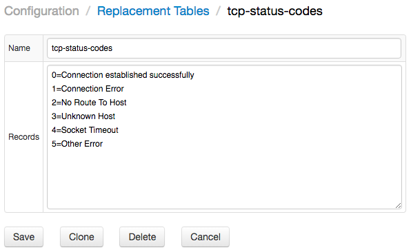

# LOOKUP Function

The `LOOKUP` function translates keys into values using the specified replacement table.

## Replacement tables

Replacement tables contain a collection of `key=value` mappings, specified one per line on the `Configuration: Replacement Tables` page.



## Numeric Keys

If the key argument is numeric, such as in `LOOKUP('table-1', value)`, the number is formatted with a `#.##` pattern to remove the fractional `.0` part from integer values.

* 3.0 -> `3`
* 3.10 -> `3.1`
* 3.14 -> `3.14`
* 3.1415 -> `3.14`

## Example: TCP status codes

### Replacement Table `tcp-status-codes`

```ls
0=Connection established successfully
1=Connection Error
2=No Route To Host
3=Unknown Host
4=Socket Timeout
5=Other Error
```

### Query

```sql
SELECT value AS "code", ISNULL(LOOKUP('tcp-status-codes', value), value) AS "name", COUNT(value)
  FROM "docker.tcp-connect-status"
WHERE datetime > now - 15 * MINUTE
  GROUP BY value
```

## Results

```ls
| code | name                                | COUNT(value) |
|------|-------------------------------------|--------------|
| 0    | Connection established successfully | 852.0        |
| 1    | Connection Error                    | 104.0        |
```

## Example: PI status codes

This query translates numeric values into string codes for PI Tag digital tags.

### Replacement Table `pi-pids`

```ls
...
-188=?188
-189=?189
-190=?190
-191=?191
-192=?192
-193=No Alarm
-194=High Alarm
-195=Low Alarm
-196=Hi Alarm/Ack
-197=Lo Alarm/Ack
-198=NoAlrm/UnAck
-199=Bad Quality
-200=Rate Alarm
-201=Rate Alm/Ack
-202=Dig Alarm
...
```

### Query

```sql
SELECT datetime, metric.label, metric.tags.point_data_type AS "pi tag type",
  value, LOOKUP('pi-pids', value)
FROM "ba:phase.1"
  LIMIT 10
```

### Results

```ls
| datetime             | metric.label | pi tag type | value     | LOOKUP('pi-pids',value) |
|----------------------|--------------|-------------|-----------|-------------------------|
| 2016-11-02T17:28:36Z | BA:PHASE.1   | digital     | -131075.0 | Phase4                  |
| 2016-11-02T17:39:06Z | BA:PHASE.1   | digital     | -131076.0 | Phase5                  |
| 2016-11-02T17:50:06Z | BA:PHASE.1   | digital     | -131077.0 | Phase6                  |
| 2016-11-02T17:55:06Z | BA:PHASE.1   | digital     | -131078.0 | Phase7                  |
| 2016-11-02T18:00:06Z | BA:PHASE.1   | digital     | -131072.0 | Phase1                  |
| 2016-11-02T18:20:06Z | BA:PHASE.1   | digital     | -131073.0 | Phase2                  |
| 2016-11-02T18:27:36Z | BA:PHASE.1   | digital     | -131074.0 | Phase3                  |
| 2016-11-02T18:49:36Z | BA:PHASE.1   | digital     | -131075.0 | Phase4                  |
| 2016-11-02T18:59:06Z | BA:PHASE.1   | digital     | -131076.0 | Phase5                  |
| 2016-11-02T19:09:06Z | BA:PHASE.1   | digital     | -131077.0 | Phase6                  |
```

## Example: Replacement Table from Metric Tag

The query below converts numeric values into string codes using a replacement table specified in the metric tag.

### Query

```sql
SELECT datetime, metric, metric.tags.digital_set, value
  ,LOOKUP('BatchAct', value) AS DIGSTR1
  ,LOOKUP(metric.tags.digital_set, value) AS DIGSTR2
FROM "ba:active.1"
  LIMIT 2
```

### Results

```ls
| datetime             | metric      | metric.tags.digital_set | value  | DIGSTR1  | DIGSTR2  |
|----------------------|-------------|-------------------------|--------|----------|----------|
| 2016-11-02T18:00:06Z | ba:active.1 | BatchAct                | -65536 | Inactive | Inactive |
| 2016-11-02T18:10:06Z | ba:active.1 | BatchAct                | -65537 | Active   | Active   |
```

## Example: Multiple Replacement Tables from Metric Tags

This query converts numeric values into string codes using different replacement tables specified in the metric tag, and are specific for each metric included in the query.

### Query

```sql
SELECT datetime, metric, metric.tags.digital_set, value
  ,LOOKUP(metric.tags.digital_set, value) AS DIGSTR
FROM atsd_series
  WHERE metric IN ('ba:active.1', 'ba:phase.1')
AND datetime > '2016-11-02T18:00:00Z' AND datetime < '2016-11-02T18:30:00Z'
```

### Results

```ls
| datetime             | metric      | metric.tags.digital_set | value   | DIGSTR   |
|----------------------|-------------|-------------------------|---------|----------|
| 2016-11-02T18:00:06Z | ba:phase.1  | Phases                  | -131072 | Phase1   |
| 2016-11-02T18:20:06Z | ba:phase.1  | Phases                  | -131073 | Phase2   |
| 2016-11-02T18:27:36Z | ba:phase.1  | Phases                  | -131074 | Phase3   |
| 2016-11-02T18:00:06Z | ba:active.1 | BatchAct                | -65536  | Inactive |
| 2016-11-02T18:10:06Z | ba:active.1 | BatchAct                | -65537  | Active   |
```

## Example: Single Replacement Table for Multiple Metrics

The query below converts numeric values into string codes using the single replacement table, whose keys are comprised of both the metric tag name (digital_set) name and the value.

```ls
...
BatchAct:-65536=Inactive
BatchAct:-65537=Active
Modes:-196608=Manual
Modes:-196609=Auto
Modes:-196610=Cascade
Modes:-196611=Program
Modes:-196612=Prog-Auto
Phases:-131072=Phase1
Phases:-131073=Phase2
Phases:-131074=Phase3
Phases:-131075=Phase4
Phases:-131076=Phase5
Phases:-131077=Phase6
Phases:-131078=Phase7
Phases:-131079=Phase8
pialarm33:-262144=.
pialarm33:-262145=__ Lolo
...
```

To extract all digital sets from the PI server in the above format, use the following SQL query.

* PI SQL query:

```sql
SELECT CONCAT(digitalset, ':', CAST(code as string), '=', name)
  FROM pids..pids;
```

### Query

```sql
SELECT datetime, value, metric.tags.digital_set
  , value
  , LOOKUP('pi-all', concat(metric.tags.digital_set, ':', value)) AS DIGSTR
FROM atsd_series
  WHERE metric IN ('ba:active.1', 'ba:phase.1')
AND datetime >= '2016-11-02T18:00:00Z' AND datetime < '2016-11-02T18:30:00Z'
```

### Results

```ls
| datetime             | value   | metric.tags.digital_set | value   | DIGSTR   |
|----------------------|---------|-------------------------|---------|----------|
| 2016-11-02T18:00:06Z | -131072 | Phases                  | -131072 | Phase1   |
| 2016-11-02T18:20:06Z | -131073 | Phases                  | -131073 | Phase2   |
| 2016-11-02T18:27:36Z | -131074 | Phases                  | -131074 | Phase3   |
| 2016-11-02T18:00:06Z | -65536  | BatchAct                | -65536  | Inactive |
| 2016-11-02T18:10:06Z | -65537  | BatchAct                | -65537  | Active   |
```
