# Entity Permissions in SQL Queries

## Overview

ATSD implements row-level security by controlling that users can view only records that belong to an entity that they're authorized to access based on [entity permissions](../../administration/user-authorization.md#entity-permissions).

The row-level security is enforced in all types of queries by filtering rows at the time they're read from the database.

## Example

The following example demonstrates how query results for different users are filtered based on the user's effective entity permissions.

### Configuration

| **Username** | **Member Of** | **Allow Entity Group** | Entities |
|---|---|---|---|
| joe.bloggs | users-all | * (all) | * (all) |
| jane.doe | users-aws | srv-aws | nurswg* (5 entities) |
| john.doe | users-nur | srv-nur | awsswg* (3 entities) |


The **'joe.bloggs'** user is a member of the user group that has **'Read: All Entities'** permissions.

The **'jane.doe'** user is a member of the **'users-nur'** user group that is allowed to read data for **'srv-nur'** entity group.

The **'john.doe'** user is a member of the **'users-aws'** user group that is allowed to read data for **'srv-aws'** entity group.

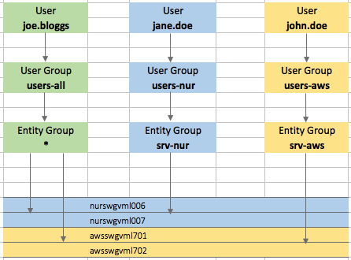

---

### Users

* All users:

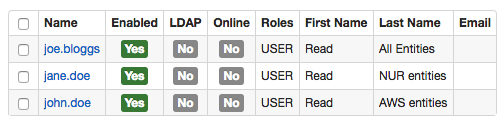

* User 'joe.bloggs':

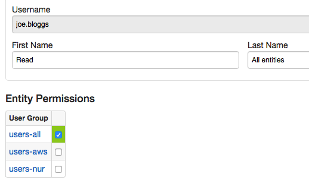

* User 'jane.doe':

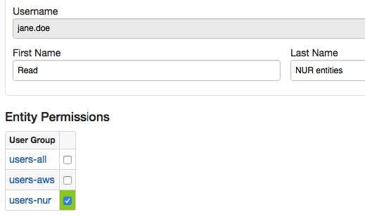

* User 'john.doe':

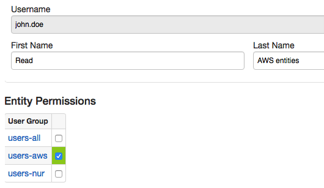

---

### User Groups

* User Group 'users-all':

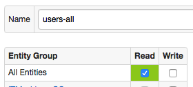

* User Group 'users-nur':

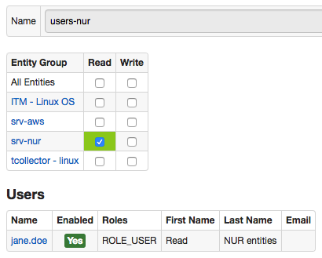

* User Group 'users-aws':

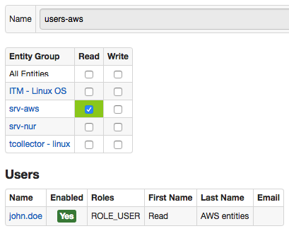

---

### Entity Groups

* Entity Group 'srv-nur':

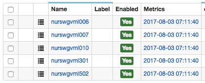

* Entity Group 'srv-aws':

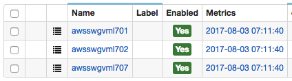

---

### SQL Query

```sql
SELECT entity, avg(value)
  FROM "mpstat.cpu_busy"
WHERE datetime >= current_day
  GROUP BY entity
ORDER BY entity
```

---

### Query Results

* Results for user 'joe.bloggs':

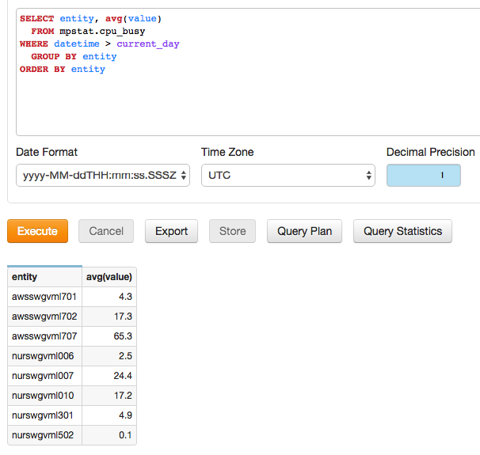

* Results for user 'jane.doe':

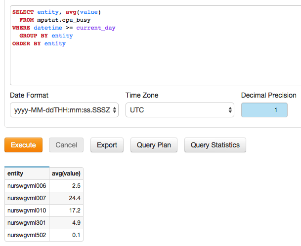

* Results for user 'john.doe':

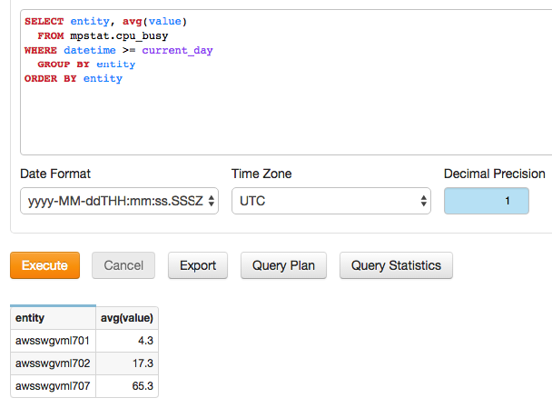
