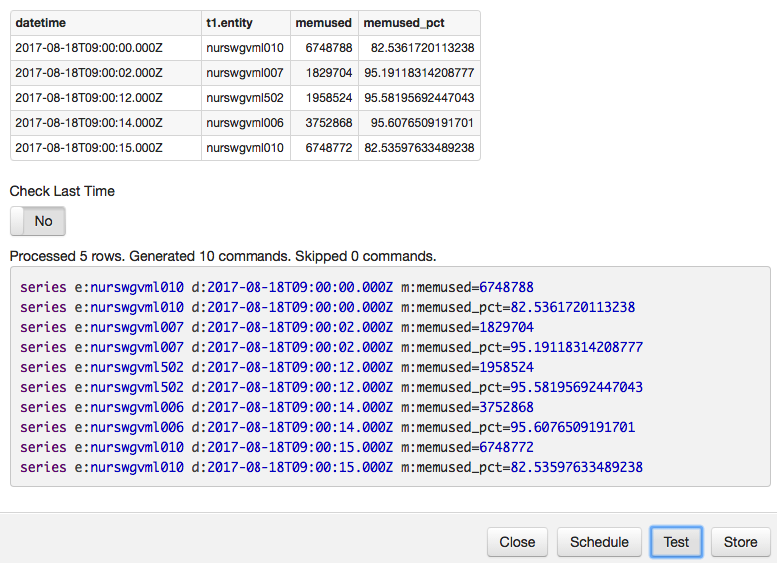
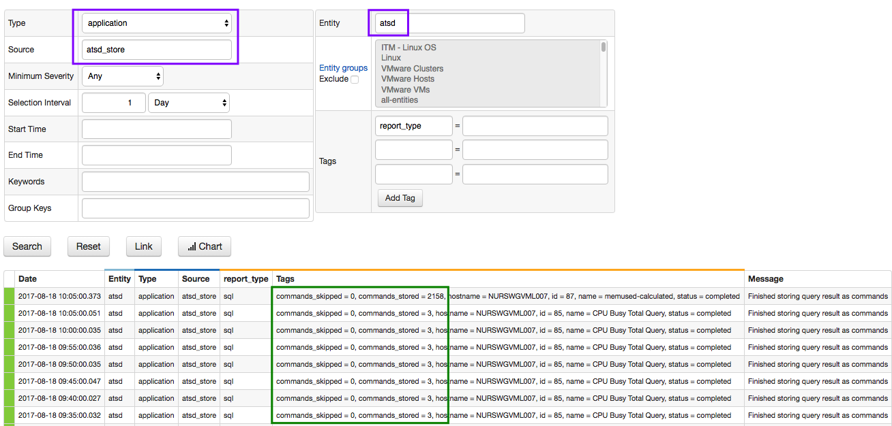

# SQL Scheduled Store

## Overview

The **Store** option in scheduled SQL queries enables writing the results of the query back into the database.

## Use Cases

* Create derived series that are frequently accessed but require expensive processing and calculation from the underlying data.
* Create cleansed series by discarding invalid values and interpolating sample values in missing interval gaps.
* Create normalized series by replacing synonyms, for example by storing data for `tag.country=China` and `tag.country=Republic of China` in one derived series.
* Store temporal aggregations for long-term retention based on detailed data that is subject to pruning after a certain expiration date.
* Implement multi-stage data processing that cannot be programmed using the existing SQL syntax, for example, nested aggregations `AVG(SUM(value))` or moving averages.

### Mapping

Each row in the result set is converted into one or multiple derived series based on column names and data types.

After entity, datetime, and tag columns are mapped based on names, the remaining numeric columns are classified as metric name columns.

```sql
SELECT datetime, 
  'DC-1' AS "entity",  
  AVG(value) AS "temp_daily_avg", 
  PERCENTILE(90, value) AS "temp_daily_perc_90"
  -- mapped to datetime, entity, for metric with name = temp_daily_avg and for metric with name = temp_daily_perc_90
  FROM temperature
WHERE datetime >= CURRENT_MONTH
  GROUP BY PERIOD(1 DAY)
```

Rows containing multiple numeric columns produce a corresponding number of series commands.

```ls
| datetime             | entity | temp_daily_avg | temp_daily_perc_90 |
|----------------------|--------|----------------|--------------------|
| 2017-08-01T00:00:00Z | DC-1   | 21.01          | 27.17              |
| 2017-08-02T00:00:00Z | DC-1   | 22.20          | 28.24              |
```

The result set is converted into series commands and stored in the database:

```ls
series e:dc-1 d:2017-08-01T00:00:00Z m:temp_daily_avg=21.01 m:temp_daily_perc_90=27.17
series e:dc-1 d:2017-08-02T00:00:00Z m:temp_daily_avg=22.20 m:temp_daily_perc_90=28.24
```

### Column Requirements

The columns are mapped to command fields based on column name and data type.
Column aliases can be defined to ensure that the query results meet the following requirements:

#### Required Columns

| **Name** | **Data Type** | **Occurrence** | **Description** |
|---|---|---|---|
| datetime | string | `0-1` | The date of the record in ISO-8601 format (1).|
| time | long | `0-1` | The date of the record in UNIX milliseconds (1). |
| entity | string | `1` | Name of the entity under which the new series will be stored. |
| - any - | numeric | `1-*` | Metric name for the stored series (2). |

* (1) Only one of the date columns, `datetime` or `time`, must be included in the results.
* (2) The column is classified as a 'metric' if it has a numeric datatype and does not match the rules applicable to other column types.

#### Optional Series Tag Columns

| **Name** | **Data Type** | **Occurrence** | **Description** |
|---|---|---|---|
| tags.{name} | string | `0-*` | Series tag for the stored series.<br>Tag name set by discarding `tags.` prefix.<br>Cell value contains tag value.|
| tags | string | `0-*` | Series tags for the stored series, encoded as key=value separated by semi-colon.<br>Cell value contains tag names and values.|

#### Optional Metadata Tag Columns

| **Name** | **Data Type** | **Occurrence** | **Description** |
|---|---|---|---|
| metric.tags.{name} | string | `0-*` | Metric tag for each metric in the row. <br>Tag name set by discarding `metric.tags.` prefix.<br>Cell value contains metric tag value.|
| metric.tags | string | `0-*` | Metric tags for each metric in the row, encoded as `key=value` separated by semi-colon. <br>Cell value contains metric tag names and values.|
| entity.tags.{name} | string | `0-*` | Entity tag for the entity in the row. <br>Tag name set by discarding `entity.tags.` prefix.<br>Cell value contains entity tag value.|
| entity.tags | string | `0-*` | Entity tags for the entity in the row, encoded as `key=value` separated by semi-colon. <br>Cell value contains entity tag names and values.|

#### Optional Metadata Field Columns

| **Name** | **Data Type** | **Occurrence** | **Description** |
|---|---|---|---|
| metric.{field-name} | string | `0-*` | [Metric field](README.MD#metric-columns) for each metric in the row.<br>Field name set by discarding `metric.` prefix.<br>Cell value contains metric field value.|
| entity.{field-name} | string | `0-*` | [Entity field](README.MD#entity-columns) for the entity in the row.<br>Field name set by discarding `entity.` prefix.<br>Cell value contains entity field value.|

* The following metadata fields are read-only and can be not be set: 'metric.name', 'metric.lastInsertTime', 'entity. groups':

### Table Names

The table prefix included in the fully qualified column names is ignored when classifying the columns.

The name of the column is resolved as `entity` in both cases below:

```sql
SELECT t1.entity ... FROM "my-table" t1
SELECT entity ... FROM "my-table"
```

### Metadata Commands

Columns starting with 'entity.tags.', 'metric.tags.', or 'metric.{field-name}' prefixes generate [`entity`](../../network/entity.md) and [`metric`](../../network/metric.md) metadata commands.


```sql
SELECT datetime, 
  'dc-1' AS "entity",  
  'SVL' as "entity.tags.location", 
  'Celcius' AS "metric.units", 
  AVG(value) AS "temp_daily_avg"
  -- mapped to datetime, entity, entity.tag with name = location, metric field units, for metric with name = temp_daily_avg
  FROM temperature
WHERE datetime >= CURRENT_MONTH
  GROUP BY PERIOD(1 DAY)
```

```ls
| datetime             | entity | entity.tags.location | metric.units | temp_daily_perc_90 |
|----------------------|--------|----------------------|--------------|--------------------|
| 2017-08-01T00:00:00Z | DC-1   | SVL                  | Celcius      | 27.17              |
| 2017-08-02T00:00:00Z | DC-1   | SVL                  | Celcius      | 28.24              |
```

Produced commands:

```ls
entity e:dc-1 t:location=SVL
metric m:temperature_daily_perc_90 u:Celcius
series e:dc-1 d:2017-08-01T00:00:00Z m:temp_daily_perc_90=27.17
series e:dc-1 d:2017-08-02T00:00:00Z m:temp_daily_perc_90=28.24
```

### Duplicates

Since a query can create series commands for dates that were already inserted, the **Check Last Time** option provides a way to control how duplicates are handled.

If **Check Last Time** is enabled, the series command is inserted if its datetime is greater than the timestamp of the previously stored values for the given series key.

### Validation

To test that a query complies with [requirements](#column-requirements), execute the query in the SQL console and click on the **Store** button. 

Click **Test** to review the produced commands and resolve any errors.



Click **Store** to load the new derived series in the database.

Click **Schedule** to created a scheduled SQL job to create and store new records for derived series continously.

### Monitoring

The results of scheduled SQL jobs with the **Store** option can be monitored by processing messages with `type=Application`, `source=atsd_export` and `report_type=sql`.


