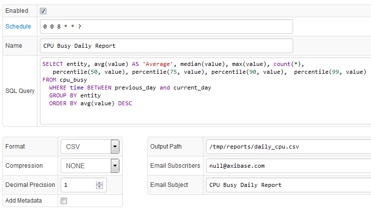

# SQL Scheduler

## Overview

SQL Scheduler allows for SQL query results to be distributed to email subscribers or stored on a local file system in CSV, Excel, or JSON format.



## Query

The scheduler can execute a SELECT query as described in the [overview](README.md).

## Authorization

The SQL queries are executed with administrative permissions and no records are excluded from the result set unlike adhoc queries, which are filtered based on the user's [entity read permissions](../../administration/user-authorization.md#entity-permissions).

## Schedule

The scheduling frequency is controlled with the `Schedule` field containing a `cron` expression that determines when the task should be executed.

> The `cron` expression is evaluated based on the timezone of the server where the database is running. The timezone is displayed on the **Admin: System Information** page.

Fields in a cron expression have the following order:

* seconds
* minutes
* hours
* day-of-month
* month
* day-of-week
* year **(optional)**

For example, `0 0 8 * * ? *` means that the query will be executed at 08:00:00 every day.


_*Either '0' or '7' can be used for Sunday in the day-of-week field._

cron Expression Examples:

**Expression** | **Description**
:---|:---
`0/10 * * * * ?` | Every 10 seconds.
`0 0/15 * * * ?` | Every 15 minutes.
`0 * * * * ?` | Every minute.
`0 0 0 * * ?` | Every day at 0:00.
`0 5,35 * * * ?` | Every hour at 5th and 35th minute.

## Formats

* CSV
* JSON
* Excel (xlsx)

CSV files can be optionally archived with zip or gzip compression.

### Sample Reports

* [sql-report.csv](examples/sql-report.csv)
* [sql-report.json](examples/sql-report.json)
* [sql-report.xlsx](examples/sql-report.xlsx)

## Decimal Precision

To round numeric values, set decimal precision to the desired number of fractional digits.
`0` means that no fractional digits will be displayed.
`-1` means that no rounding will be applied and numbers will be displayed in their native representation.

## Export Options

The report file can be stored in a file on the server or sent to email subscribers.

### File System

Specify absolute path including the file name on the server to which the report will be stored.
If the parent directory in the specified path doesn't exist, it will be automatically created.
File name should match the file format. For example, if the format is EXCEL, Output Path should end with ".xlsx".

Output Path may contain date placeholders so that files or their parent directories are grouped by day or month.

Example: `/opt/report/daily/${yyyy-MM-dd}.csv`

An expression like `/opt/report/daily/${yyyy-MM-dd}.csv` creates the following directory `/opt/report/daily/2016-06-10.csv` when executed.

* yyyy - 4-digit year
* yy - 2-digit year
* MM - 2-digit numeric month
* dd - day of month
* HH - hour of the day in 24-hour format
* ss - seconds
* SSS - milliseconds

### Email

To distribute report files via email specify message subject and one or multiple email addresses, separated by comma or space.

In case of an error, the server will still send an email if email delivery is enabled, including query error text in the message body.

## Versioning

Selecting versioning columns (version_tatus, version_source, version_time) is currently not supported.

## Metadata

The exported files can optionally include metadata fields about the report.
The metadata section is located in the header and is prepended with the hash symbol `#` and includes the following fields in "name,value" format

|**Name**|**Description**|
|:---|:---|
|publisher| Name of the reporting product (ATSD) and its URL|
|created| Date when the report was produced in ISO 8601 format|
|title | Report name, such as "CPU Busy Daily Report" |
|command | Query statement, possible on multiple lines |

In addition, the metadata header contains a list of column names in the result set with their respective data types.

```
#name,entity,Average,...
#datatype,string,double,...
```

### Specifications

* Axibase Time Series Database [Ontology](atsd.jsonld) in jsonld format according to [RFC6350](https://tools.ietf.org/html/rfc6350)
* W3C Recommendation [Metadata Vocabulary for Tabular Data](https://www.w3.org/TR/tabular-metadata/)

### Metadata in CSV Format

Since results produced by the task must be included in one file, it is not possible to incorporate metadata in JSON format into a CSV file.
Instead, when enabled, metadata is included in the output file as part of the header with the hash symbol (`#`) used as a comment symbol.

```
#publisher,Axibase Time Series Database,https://nur.axibase.com
#created,2016-06-12T15:56:39.106Z
#title,SQL Query
#comment,"SELECT entity, avg(value) AS 'Average', median(value), max(value), count(*)
#FROM cpu_busy
#  WHERE time BETWEEN previous_day and current_day
#  GROUP BY entity
#  ORDER BY avg(value) DESC"
#name,entity,Average,median(value),max(value),count(*)
#datatype,string,double,double,double,double
entity,Average,median(value),max(value),count(*)
nurswgvml006,18.4,4.0,100.0,5385.0
```

### Metadata in Excel Format

Same as in CSV format.

### Metadata in JSON Format

Metadata is specified according to W3C Recommendation [Metadata Vocabulary for Tabular Data](https://www.w3.org/TR/tabular-metadata/)

Table schema object provides the following information about the columns in the result set:

* index, starts with 1
* name
* label (alias)
* datatype
* table name (metric name)
* type as specified in [ontology](atsd.jsonld)
* description

```json
{
	"metadata": {
		"@context": ["http://www.w3.org/ns/csvw", {
			"atsd": "http://www.axibase.com/schemas/2017/07/atsd.jsonld"
		}],
		"dc:created": {
			"@value": "2017-07-04T17:08:39.745Z",
			"@type": "xsd:date"
		},
		"dc:publisher": {
			"schema:name": "Axibase Time-Series Database",
			"schema:url": {
				"@id": "https://nur.axibase.com"
			}
		},
		"dc:title": "SQL Query",
		"rdfs:comment": "SELECT entity, datetime, avg(value) AS 'Average' FROM cpu_busy  WHERE datetime > current_minute  GROUP BY entity, period(1 minute) ORDER BY avg(value) DESC",
		"@type": "Table",
		"url": "sql.csv",
		"tableSchema": {
			"columns": [{
				"columnIndex": 1,
				"name": "entity",
				"titles": "entity",
				"datatype": "string",
				"table": "cpu_busy",
				"propertyUrl": "atsd:entity"
			}, {
				"columnIndex": 2,
				"name": "datetime",
				"titles": "datetime",
				"datatype": "xsd:dateTimeStamp",
				"table": "cpu_busy",
				"propertyUrl": "atsd:datetime",
				"dc:description": "Sample time in ISO8601 format"
			}, {
				"columnIndex": 3,
				"name": "avg(value)",
				"titles": "Average",
				"datatype": "double",
				"table": "cpu_busy",
				"propertyUrl": "atsd:avg"
			}]
		}
	},
	"data": [
		["nurswgvml007", "2017-07-04T17:08:00.000Z", 11.756666666666664],
		["nurswgvml006", "2017-07-04T17:08:00.000Z", 3.3499999999999996],
		["nurswgvml502", "2017-07-04T17:08:00.000Z", 2.9966666666666666],
		["nurswgvml010", "2017-07-04T17:08:00.000Z", 0.375],
		["nurswgvml301", "2017-07-04T17:08:00.000Z", 0.0]
	]
}
```
