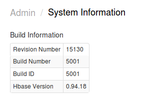
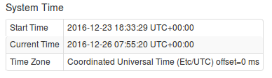
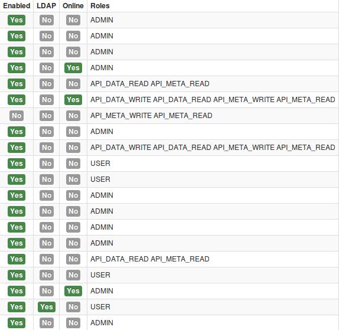
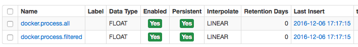
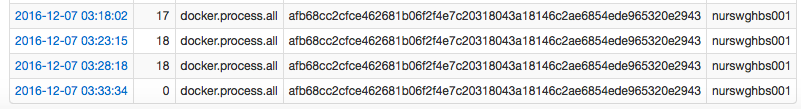
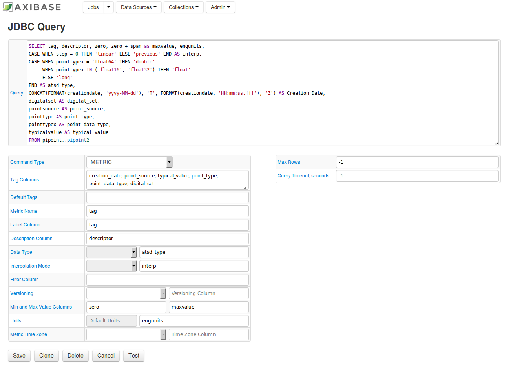

Weekly Change Log: December 5-11, 2016
======================================

### ATSD

| Issue| Category    | Type    | Subject                         |
|------|-------------|---------|---------------------------------|
| 3698 | admin       | Bug     | Increased default XmX value size to 1G. | 
| 3690 | security    | Feature | Updated role/membership/permissions settings in ATSD. When changes are made to a user's account, active sessions are automatically invalidated. |
| 3688 | sql         | Bug     | In the `GROUP BY` clause updated status occurrences over the last 15 minutes to output integers from 0 to 5. | 
| 3679 | email       | Bug     | Updated the email notification template to hide metric statistics if the count of the collected metric is equal to 0. | 
| 3678 | UI          | Bug     | Placed the Name and Label fields on separate lines in the metric form to account for long metric names. | 
| 3675 | sql         | Bug     | Added the capability to replace numeric null or `NAN` with a specified `ISNULL` integer.|  
| 3662 | csv         | Bug     | Fixed schema-based parser from HBS. |
| 3650 | UI          | Feature | Consolidated administrative into one interface menu. |
| 3646 | UI          | Bug     | Updated error number displayed from 500 to 400 on the `/sql/queries/info` page. | 
| 3642 | api-rest    | Bug     | Enabled entities to be accessed from the Metrics tab. | 
| 3631 | sql         | Bug     | Implemented string interpolation capability in the PI server between a number and NaN values. | 
| 3552 | rule engine | Feature | Added documentation to the coalesce function. | 
| 3516 | sql         | Bug     | Allowed for the `IS NULL` operator to be used as a metric.label. | 
| 3515 | sql         | Bug     | Allowed for the `IS NULL` operator to be applied to any metric tag. | 
| 3463 | sql         | Bug     | Updated the `WITH INTERPOLATE` clause in regards to text regularization in multi join queries. |

### Collector

| Issue| Category    | Type    | Subject                         |
|------|-------------|---------|---------------------------------|
| 3664 | docker      | Feature | Added Docker container metrics. |  
| 3559 | jdbc        | Support | Implemented `METRIC` and `ENTITY` commands and added several user interface features in the JDBC job. | 

### Issue 3650
--------------

The administrative interface in ATSD has been simplified by consolidating multiple pages into one view:

1. **Build Information**

   

   The section provides information about the installed ATSD version (Revision Number), as well as the HBase compatibility version. The ATSD revision number is an always 
   incrementing counter, meaning it doesn't adhere to semantic versioning. Each change to the ATSD code will increment the revision number. Note that the revision number of the ATSD 
   HBase jar file deployed on the HBase region server in the `/hbase/lib` directory is incremented separately from the ATSD revision number. When upgrading a distributed version of ATSD, 
   follow [these steps](https://github.com/axibase/atsd-docs/blob/master/installation/cloudera.md#updating-atsd). If you're installing an ATSD version with a higher revision number and
   if the atsd-hbase.*.jar version is the same, skip the region server deployment stage altogether and upgrade just ATSD itself, without restarting your region servers.

2. **JVM System Properties**

   

   JVM system properties contains detailed settings for the Java Virtual Machine including JMX, IO, User, and Operating System settings

3. **JVM Environment Variables**

   

   This section provides a list of environment variables for the user, under which the ATSD java process is running.

4. **System Time**

   

   The section displays Current and Start times, as well as the applicable Time Zone.

### Issue 3690
--------------

In previous versions of ATSD, the user's role, group membership, and entity permissions were cached while the user's session was active. If the user's authorization was changed by an 
administrator, it would not apply until the user's active sessions would timeout or until the user re-logins into the application. We updated ATSD so that the user's 
active sessions are invalided instantly if the authorization is changed by an administrator. As a result, the administrator doesn't have to manually request the user to logout in order to 
apply any new settings. In addition, the administrator is now able to view which users are online.

### Issue 3664
--------------

In Collector, the following metrics were added for each active container. These metrics are collected only when the Docker command `TOP` is enabled. 

If the container was running in a prior iteration, and is not running in the next iteration, 0 will be sent for both all and filtered metrics.

### Issue 3559
--------------

`METRIC` and `ENTITY` commands have been implemented in the JDBC job to allow you to configure collected metrics and entities in ATSD. 

Additionally, some user interface improvements were recently made to the JDBC configuration page:

* Tooltips were added to help describe form fields.
* The number of iterated rows now does not exceed 1000 in a test run, even if the JDBC driver does not support setting the `maxRows` parameter.
* Unified number formatting: unnecessary zeroes in the fractional part of floating-point numbers are not shown.
* Metric names are generated in lower-case, just as they will be saved in ATSD.

As a result, PI tags can be retrieved using the JDBC job, and a [tutorial](https://github.com/axibase/axibase-collector-docs/blob/master/jobs/examples/pi/README.md) 
is provided showing you how to configure the task.

