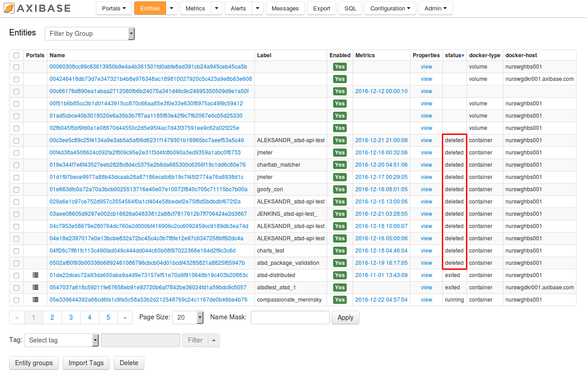

Weekly Change Log: December 12-18, 2016
=======================================

### ATSD

| Issue    | Category        | Type            | Subject                                                   |
|----------|-----------------|-----------------|-----------------------------------------------------------|
| 3710     | install         | Feature         | Added support for an embedded collector account with All Entities: read/write permission.                                      |
| 3704     | sql             | Bug             | Fixed 50% percentile division error where percentile was specified in denominator.                              |
| 3702     | sql             | Bug             | Modified syntax error message in case an ungrouped column is included in a `SELECT` expression.                          |
| 3701     | sql             | Feature         | Optimized processing of partitioning queries using the Last Insert table.                        |
| 3325     | sql             | Bug             | Allowed for columns other than `value` and `*` in the `COUNT` function.                                  |

### Collector

| Issue    | Category        | Type            | Subject                                                   |       
|----------|-----------------|-----------------|-----------------------------------------------------------|
| 3717     | docker          | Feature         | Set container label from environment variable `CONTAINER_NAME` for Mesos compatibility. |
| 3716     | docker          | Bug             | Fixed malformed label for images without a parent image. |
| 3700     | docker          | Bug             | Replaced textarea with an Item List containing name expressions of processes to be excluded from the `top` process collection and count. |
| 3699     | docker          | Bug             | Eliminated duplicate container names when setting volume labels.      |
| 3692     | UI              | Bug             | Raised an error when the job is executed manually and the storage driver is not 'successful' at that time. |
| 3685     | docker          | Feature         | Added a setting to remove deleted records from ATSD after a period of time. Containers can be removed after a certain number of days, images/volumes/networks can removed instantly. |
| 3684     | UI              | Bug             | Added Enable/Disable/Run buttons on the job list page to change status or run multiple jobs at a time using check boxes.                             |


### Issue 3685
--------------

Recently added to the [`docker`](https://github.com/axibase/axibase-collector-docs/blob/master/jobs/docker.md#docker-job) job in Collector is the ability to remove deleted records in ATSD for objects that no longer exist in Docker itself.


This capability is useful to purge ATSD of containers that no longer exist in Docker, for instance containers that existed only for a few minutes during image build stage, or containers
that executed short-term tasks and were removed with the `docker rm` command. Containers with a `deleted` status will initially be retained in ATSD for the specified time interval (for
example 50 days in the above image). The status of these containers is marked as `deleted`, as shown in the image below.



By default such records with the status `deleted` are not actually removed from ATSD, potentially leaving unnecessary records in ATSD. To delete containers after a certain number of days, enter in a positive integer.

* `Retain deleted container records, days` : containers with a `deleted` status will initially be retained in ATSD for the specified time interval. The status of these containers is marked as `deleted`. After the interval has passed, the containers will be permanently removed from ATSD.

To remove deleted image/volume/network records, enable the `Retain deleted image/volume/network records` checkbox.

* `Remove deleted image/volume/network records` : removes images/volumes/networks with a `deleted` status from ATSD.

The deletion occurs at the same time as the property check interval. All deletions are logged to collector file.

### Issue 3701
--------------

In this issue, we took a look at optimizing [partitioning queries](https://github.com/axibase/atsd-docs/tree/master/api/sql#partitioning), leveraging the fact that we can narrow the start and end date for a scan based on the last times in the Last
Insert Table. Let's take the below query as an example.

```sql
SELECT tags.city, tags.state, value
  FROM cdc.all_deaths
WHERE entity = 'mr8w-325u' AND tags.city IS NOT NULL
  AND tags.region = '2'
WITH ROW_NUMBER(tags ORDER BY datetime desc) <= 1
  ORDER BY value DESC
```

Since the timespan is not defined in the `WHERE` clause, previously we would not apply any date filter to scanned records.
To optimize the query we now perform a lookup of the minimum insert time for the specified metric, entity, and series tags.
Since the minimum insert time in the above example is `1972-05-27T00:00:00Z`, we can now use it to apply time filter within the scan. A condition like `ROW_NUMBER(tags ORDER BY datetime desc) <= 1` means we
only need the last value for each combination of tags. We can therefore skip values with a timestamp less than the minimum last insert time.

Check out our article on [SQL queries for U.S. death statistics](https://github.com/axibase/atsd-use-cases/blob/master/USMortality/README.md).

### Issue 3717
--------------

While Axibase Collector gathers container properties and statistics using full Docker identifiers, it sends container names as entity labels into ATSD. This makes it possible to refer
to human-readable container names in graphs and alerts. There are however several orchestration frameworks which use container names to store their own identifiers, for
instance [Mesos](http://mesos.apache.org/):

* Mesos Container ID:

```json
"Id": "02cb3257b06ef11adc1b2633db55c94e2646f84e7b84cc665c28d710dc2f986c"
```

* Mesos Container Name:

```json
"Name": "/mesos-cd2d0996-558b-4a49-88a0-79c41aeb098a-S2.0a36b7d9-5dfc-4963-b8ac-0e7656103782"
```

In this case neither container identifier nor container name are user-friendly or human-readable. To handle these kinds of scenarios, we added a small bit of heuristics to inherit the container
label from the `CONTAINER_NAME` environment variable which is set by Mesos.

As a result, the below container will have a label `ref-api-front` instead of `mesos-cd2d0996-558b-4a49-88a0-79c41aeb098a-S2.0a36b7d9-5dfc-4963-b8ac-0e7656103782`.

Docker `inspect` snippet for a Mesos-managed container:

```json
"Env": [
           "JAVA_OPTS=-Xmx512m",
           "MARATHON_APP_VERSION=2016-11-18T10:55:00.823Z",
           "HOST=axinode12",
           "SPRING_PROFILES_ACTIVE=unstable",
           "MARATHON_APP_RESOURCE_CPUS=0.1",
           "SERVICE_NAME=ref-api",
           "MARATHON_APP_RESOURCE_GPUS=0",
           "SPRING_CLOUD_CONSUL_CONFIG_PROFILESEPARATOR=:",
           "TZ=GMT",
           "CONTAINER_NAME=ref-api-front",
           "SPRING_CLOUD_CONSUL_ENABLED=true",
           "SPRING_APPLICATION_NAME=ref-api-front",
           "WLS_SUFFIX=_rf",
           "SPRING_CLOUD_CONSUL_CONFIG_PREFIX=config/ref-api",
           "MARATHON_APP_DOCKER_IMAGE=docker.corp.axibase.com/ref-api-front:2.0.3",
           "WAS_SUFFIX=_rf",
           "SPRING_CLOUD_CONSUL_CONFIG_DEFAULTCONTEXT=commons",
           "MESOS_TASK_ID=ref-api-front.76d43a20-ad8d-13e6-a98e-bb1ee0814583",
           "LOGSTASH_PORT=5959",
           "WS_SUFFIX=_rf",
           "PORT=18745",
           "SERVICE_HOST=${HOST}",
           "MARATHON_APP_RESOURCE_MEM=512.0",
           "PORTS=18745",
           "SPRING_CLOUD_CONSUL_HOST=${HOST}",
           "MARATHON_APP_RESOURCE_DISK=0.0",
           "MARATHON_APP_LABELS=",
           "PORT_8080=18745",
           "MARATHON_APP_ID=/ref/api/api-front",
           "PORT0=18745",
           "MESOS_SANDBOX=/mnt/mesos/sandbox",
           "MESOS_CONTAINER_NAME=mesos-bvnd0996-567b-4a49-97a0-79c41aeb034a-S2.0a36b7d9-5dfc-4963-b8ac-0e7656103782",
           "PATH=/usr/local/sbin:/usr/local/bin:/usr/sbin:/usr/bin:/sbin:/bin",
           "HOME=/root",
           "JAVA_HOME=/usr/lib/jvm/java-8-oracle"
       ]
```
