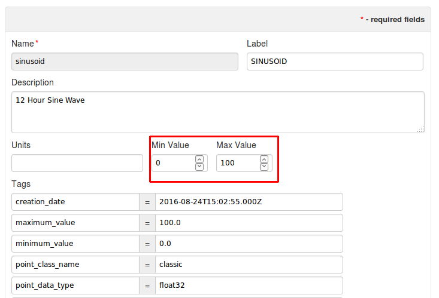
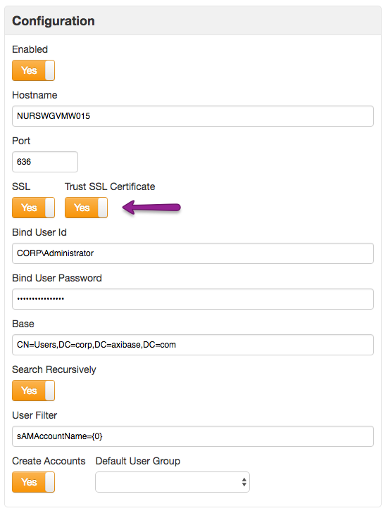
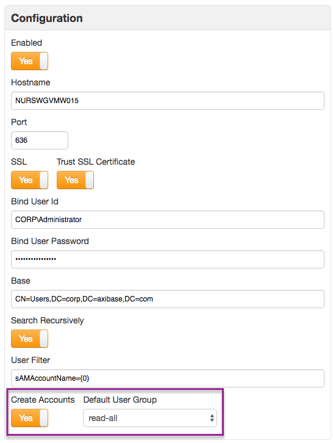
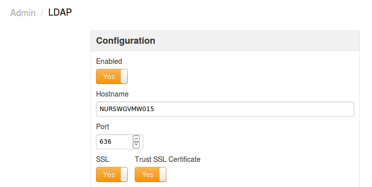
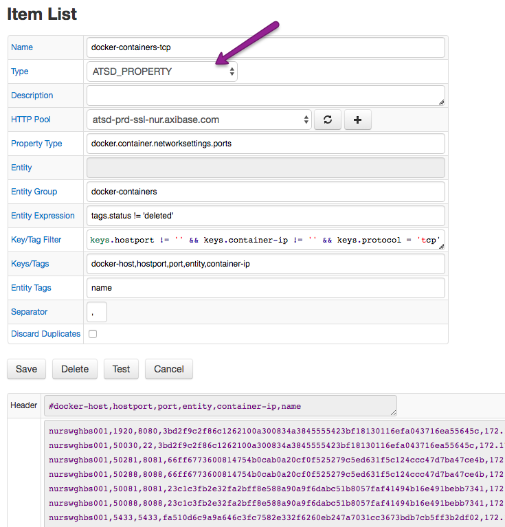

Weekly Change Log: November 28-December 4, 2016
===============================================

### ATSD

| Issue     | Category        | Type     | Subject                                                                    |
|-----------|-----------------|----------|----------------------------------------------------------------------------| 
| [3677](#issue-3677)      | sql             | Bug      | Fixed date_format result to be used in comparison. | 
| [3674](#issue-3674)      | sql             | Bug      | Fixed slow query time for queries with table aliases. | 
| [3673](#issue-3673)      | sql             | Bug      | Updated the `PERIOD` function by adding the `WEEK` interval type. | 
| 3671      | metric          | Bug      | When Min Value and Max Value are specified together for an Invalid Action type, the message 'NO ACTION' will be returned. | 
| [3670](#issue-3670)      | sql             | Bug      | Updated `ROW_MEMORY_THRESHOLD OPTION` to provide results in different modes. | 
| [3665](#issue-3665)      | sql             | Bug      | Added error message for excess tag combinations for metrics/entities specified in a query. | 
| 3660      | jdbc            | Bug      | Allowed for typing connection string parameters in dbvis preferences in the JDBC driver. | 
| 3651      | api-rest        | Bug      | Added response message for message-stat queries. | 
| 3647      | core            | Bug      | Fixed error log download issue for high rate logging instances. | 
| [3645](#issue-3645)      | rule engine     | Feature  | Updated email alert template. | 
| 3640      | api-rest        | Bug      | Updated NPE on alert-history-entity query. | 
| 3618      | api-rest        | Bug      | Fixed incorrect status code for invalid entityExpression. | 
| 3617      | UI              | Bug      | Corrected issue on Export Data page, where Start Date and End Date fields sometimes did not allow inserting the "(" symbol. | 
| [3615](#issue-3615)      | api-network     | Feature  | Added the new fields `minValue` and `maxValue` to the Metric class. | 
| [3601](#issue-3601)      | sql             | Bug      | Optimized execution time for queries with arithmetic expressions. |
| [3600](#issue-3600)      | sql             | Bug      | Fixed different results of aggregation functions with and without the `LIMIT` clause. | 
| [3592](#issue-3592)      | security        | Feature  | Added Trust SSL Certificate field to LDAP configuration form. | 
| [3583](#issue-3583)      | security        | Feature  | Added 'Create Accounts' integration feature to LDAP. | 
| 3582      | security        | Feature  | Enabled copying user attributes from ATSD into LDAP. | 
| 3570      | api-network     | Bug      | Corrected failure to insert metric command.   | 
| 3560      | core            | Feature  | For Metrics added a 'Units' field with tooltips. The fieldis exposed in the UI, meta API, network API, SQL field, and mvel model in the rule engine. |
| [3470](#issue-3470)      | sql             | Feature  | Added a `text` column in the `SELECT` expression and the `WHERE` clause. | 
| [3465](#issue-3465)      | api-rest        | Feature  | Added `addMeta` series and property methods in Data API. | 
| [3438](#issue-3438)      | security        | Feature  | Modified Enterprise Edition to support LDAP authentication. | 
| [3309](#issue-3309)      | graphana        | Support  | Installed Grafana 3.x with ATSD as the data source. | 

### Collector

| Issue     | Category        | Type     | Subject                                                                    |
|-----------|-----------------|----------|----------------------------------------------------------------------------|
| 3663      | jdbc            | Feature  | Added tooltips for MESSAGE type: message column, type, source, and severity. | 
| 3655      | json            | Bug      | Applied metric prefixes in the JSON job. | 
| [3644](#issue-3644)      | collection      | Feature  | Implemented New Item List type to load data from property records in ATSD. | 
| 3638      | docker          | Bug      | Fixed Collector in Docker startup issues. | 
| 3621      | docker          | Bug      | Added checker into Docker job to synchronize entities in Docker and ATSD. | 
| 3405      | docker          | Bug      | Performed troubleshooting for missing Docker statistics. |

### Charts

| Issue     | Category        | Type     | Subject                                                                    |
|-----------|-----------------|----------|----------------------------------------------------------------------------|
| 3523      | property        | Bug      | Set format-number to false by default to let users enable it explicitly at the widget or column level. | 

### Issue 3673
--------------

We fixed the [PERIOD](https://github.com/axibase/atsd-docs/tree/master/api/sql#period) function by adding the `WEEK` interval type. 
The list of interval types supported by `PERIOD` now includes:

* YEAR
* QUARTER
* MONTH
* WEEK
* DAY
* HOUR
* MINUTE
* SECOND
* MILLISECOND

The `WEEK` interval type, along with `DAY`, `MONTH`, `QUARTER`, and `YEAR` are aligned to the server calendar by default.
In particular, the `WEEK` period, when calendar-aligned, starts on the first Monday in the initial year in the specified timespan, and is incremented forward.
For example, the first Monday in 2016 was January 4th and the 2-week periods were started on that date. 

```sql
SELECT date_format(time, 'yyyy-MM-dd EEEEE') as 'date', sum(value) 
  FROM dmv.instances
WHERE tags.city = 'New York'
  AND datetime >= '2016-09-01T00:00:00Z'
GROUP BY PERIOD(2 WEEK)
```

```ls
| date              | sum(value) | 
|-------------------|------------| 
| 2016-09-12 Monday | 1971       | 
| 2016-09-26 Monday | 987        |
```

> Note that empty periods and periods with a start date outside of the requested timespan are NOT included in the result set.

As an alternative to a `CALENDAR` alignment, specify `START_TIME` as the second argument to the `PERIOD` function in order to align periods to the beginning of the timespan.

```sql
SELECT date_format(time, 'yyyy-MM-dd EEEEE') as 'date', sum(value) 
  FROM dmv.instances
WHERE tags.city = 'New York'
  AND datetime >= '2016-09-01T00:00:00Z'
GROUP BY PERIOD(2 WEEK, START_TIME)
```

```ls
| date              | sum(value) | 
|-------------------|------------| 
| 2016-09-01 Monday | 1567       | 
| 2016-09-14 Monday | 1450       |
```

### Issue 3670
--------------

The `ROW_MEMORY_THRESHOLD` option allows in-memory processing of result sets. It should not affect the returned records in any way. The issue provided a fix for a query that produced 
different results in two modes: in-memory and temporary table.

### Issue 3665
--------------

The query executor was changed to raise an error if too many tag combinations are located for one of the metric and entities specified in the query. The limit is 1000. If the limit is 
exceeded, the following error message is returned to the client so that the user can refactor the query and add conditions to the `WHERE` clause to reduce the number of series. 
Previously, an error was not raised and the result set was truncated behind the scenes, leading to unexpected results.

```
IllegalStateException: Too many tags combinations for metric 'df.disk_used' and entity 'nurswghbs001'. Limit: 1000.
```

### Issue 3645
--------------

We cleaned-up email alert template by removing rows from alert details that are not relevant if window count = 1.

### Issue 3615
--------------

Continuing the extension of the ATSD schema, we added the new fields `minValue` and `maxValue` to the Metric class so that commonly used metadata about metrics can be described with 
fields, as opposed to tags because fields provide validation, dictionaries, and ease-of-use for users when editing metrics.


 
### Issue 3601
--------------

We added a fix so that queries with arithmetic expressions execute nearly as fast as queries without expressions:

```sql
select avg(value+0) from mpstat.cpu_busy
```

```sql
select avg(value) from mpstat.cpu_busy
```

### Issue 3592
--------------

The Trust SSL Certificate setting, when enabled, allows encrypted connections to LDAP servers with self-signed SSL certificates.



### Issue 3583
--------------

The new LDAP integration feature, 'Create Accounts', makes it possible to self-register user accounts in ATSD if the new user account exists in LDAP and the user was able to successfully
authenticate. The new account settings, such as username, email, and first/last name, are inherited from LDAP attributes.

If the 'Default User Group' is specified, the new self-registered users are automatically added to this group and inherit its permissions.



### Issue 3470
--------------

A new [`text` column](https://github.com/axibase/atsd-docs/blob/master/api/sql/examples/select-text-value.md) was made available in the `SELECT` expression and the `WHERE` clause, so 
that string annotations can be displayed in the result set along with numeric values. The `text` column can be selected in a simple query or in a `JOIN` query.

```sql
SELECT entity, datetime, value, text
  FROM atsd_series
WHERE metric IN ('temperature', 'status') AND datetime >= '2016-10-13T08:00:00Z'
```

```ls
| entity   | datetime             | value | text                           |
|----------|----------------------|-------|--------------------------------|
| sensor-1 | 2016-10-13T08:00:00Z | 20.3  | null                           |
| sensor-1 | 2016-10-13T08:15:00Z | 24.4  | Provisional                    |
| sensor-1 | 2016-10-13T10:30:00Z | NaN   | Shutdown by adm-user, RFC-5434 |
```

### Issue 3465
--------------

The new parameter `addMeta` was added to [series](https://github.com/axibase/atsd-docs/blob/master/api/data/series/query.md) and property methods
so that clients can retrieve entity and metric fields and tags in one request, saving an extra round-trip. Another advantage is that the `addMeta` parameter doesn't require the user to 
have a Meta API READ role.

Request:

```json
[{
  "startDate": "previous_minute",
  "endDate":   "now",
  "entity": "nurswgvml007",
  "metric": "cpu_busy",
  "addMeta": true
}]
```

Response:

```json
[
  "entity":"nurswgvml007","metric":"cpu_busy","tags":{},"type":"HISTORY","aggregate":{"type":"DETAIL"},
  "meta":{"metric":{"name":"cpu_busy","enabled":true,"dataType":"FLOAT","counter":false,"label":"CPU Busy %","persistent":true,"tags":{"source":"iostat","table":"System"},"timePrecision":"MILLISECONDS","retentionDays":0,"minValue":0.0,"maxValue":100.0,"invalidAction":"TRANSFORM","versioned":false,"interpolate":"LINEAR","timeZone":"US/Eastern"},
  "entity":{"name":"nurswgvml007","enabled":true,"timeZone":"PST","tags":{"alias":"007","app":"ATSD","environment":"prod","ip":"10.102.0.6","loc_area":"dc1","loc_code":"nur,nur","os":"Linux"},"interpolate":"LINEAR","label":"NURswgvml007"}},
  "data":[{"d":"2016-12-28T15:57:04.000Z","v":6},{"d":"2016-12-28T15:57:20.000Z","v":5.1},{"d":"2016-12-28T15:57:36.000Z","v":5},{"d":"2016-12-28T15:57:52.000Z","v":3.06}]}]
```

### Issue 3438
--------------

The Enterprise Edition now supports LDAP authentication to simplify and centralize credentials management in large organizations:



### Issue 3309
--------------

[https://github.com/axibase/grafana-data-source](https://github.com/axibase/grafana-data-source)

### Issue 3644
--------------

A new Item List type was implemented to load data from property records in ATSD. This allows automating monitoring and data collection jobs, for example, to TCP-check open ports for a 
list of containers retrieved by the Docker job. 



### Issue 3677
--------------

```sql
SELECT date_format(time, 'MMM'),
  LOOKUP('us-region', tags.region) AS 'region', 
  sum(value) as 'pneumonia_influenza_deaths'
FROM cdc.pneumonia_and_influenza_deaths
  WHERE entity = 'mr8w-325u' and tags.city IS NOT NULL
  AND tags.region = '3'
  AND date_format(time, 'MMM') = 'Jan'
GROUP BY tags.region, date_format(time, 'MMM')
  OPTION (ROW_MEMORY_THRESHOLD 500000)
```

### Issue 3674
--------------

```sql
SELECT count(t1.value)
  FROM cdc.all_deaths t1
WHERE t1.entity = 'mr8w-325u'
  AND t1.tags.city = 'Baton Rouge'
```

### Issue 3600
--------------

```sql
SELECT COUNT(*) FROM 'docker.cpu.avg.usage.total.percent' 
  WHERE datetime BETWEEN '2016-11-06T00:00:00Z' AND '2016-11-07T00:00:00Z' 
```