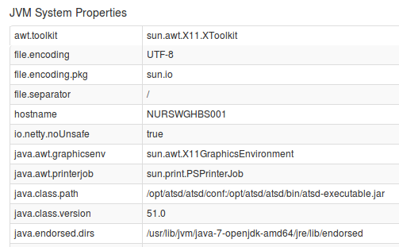
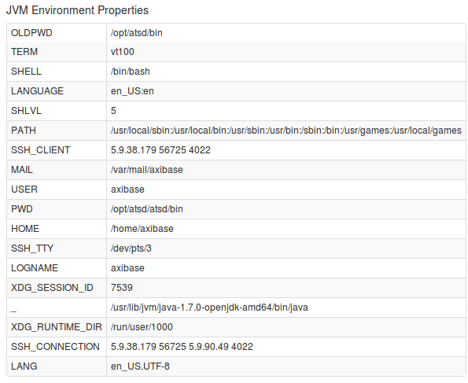
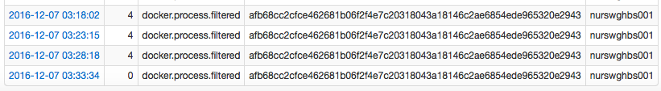
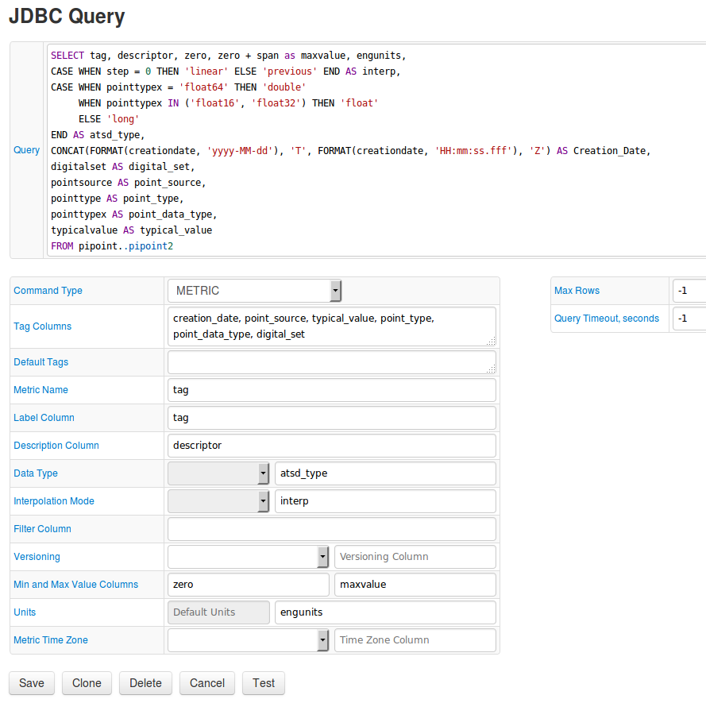

Weekly Change Log: December 5-11, 2016
======================================

### ATSD

| Issue| Category    | Type    | Subject                         |
|------|-------------|---------|---------------------------------|
| 3698 | admin       | Support     | Increased the default maximum Java heap value from 512Mb to 1G. This change is required to accommodate increased requirements for in-memory processing by the SQL engine. |
| [3690](#issue-3690) | security    | Feature | Modified how role/membership/permission changes are applied. When changes are made to a user's account, current active sessions are now automatically invalidated. The user cannot continue using sessions with previously cached ACLs. |
| [3688](#issue-3688) | sql         | Feature     | Added support for `GROUP BY value` to calculate unique occurrences of the `value` over the specified timespan. This could be useful for metrics that measure discrete characteristics, such as status codes, error codes, digital states etc. |
| 3679 | email       | Feature     | Cleaned up the email notification template to hide irrelevant statistics if the sample in the window is less than 1. |
| 3678 | UI          | Bug     | Placed the Name and Label fields on separate lines in the metric and entity forms to account for long names. |
| [3675](#issue-3675) | sql         | Feature     | Added the capability to replace numeric `NAN` with another integer with the `ISNULL` function.|  
| 3662 | csv         | Support     | Identified an issue with schema-based CSV parsers. A schema-based CSV parser will not work if ATSD is launched under Java 8+.|
| [3650](#issue-3650) | UI          | Feature | Consolidated multiple pages under the Admin menu into one page. |
| 3646 | UI          | Bug     | Return 4xx error number instead of 500 on the `/sql/queries/info` page if the query is no longer found by id, which occurs when the server is restarted, or the query plan is evicted from cache. |
| 3642 | api-rest    | Bug     | Not all entities for the metric are visible on the Entities page. |
| [3631](#issue-3631) | sql         | Bug     | `NaN` numbers and `null` strings interpolated consistently (using the `PREVIOUS` function), similar to the PI server. |
| 3552 | rule engine | Feature | Implemented the `coalesce` function in the rule engine to substitute missing tags, for example `coalesce([entity.label, entity.tags.name])`. |
| [3516](#issue-3516) | sql         | Feature     | `IS NULL` operator supports `metric.label`. |
| [3515](#issue-3515) | sql         | Feature     | `IS NULL` operator supports metric tags. |
| [3463](#issue-3463) | sql         | Bug     | `WITH INTERPOLATE` correctly interpolates the `text` column in JOIN queries. |

### Collector

| Issue| Category    | Type    | Subject                         |
|------|-------------|---------|---------------------------------|
| [3664](#issue-3664) | docker      | Feature | Added new Docker container metrics for process count monitoring: `docker.process.all` and `docker.process.filtered`. |  
| [3559](#issue-3559) | jdbc        | Feature | Extended JDBC job so that PI server PIPoint metadata can be offloaded into ATSD. |

## ATSD

### Issue 3690
--------------

In previous versions of ATSD, the user's role, group membership, and entity permissions were cached while the user's session was active. If the user's authorization was changed by an
administrator, it would not apply until the user's active sessions would timeout or until the user re-logged into the application. We updated ATSD so that the user's
active sessions are invalided instantly if the authorization is changed by an administrator. As a result, the administrator doesn't have to manually request the user to logout in order to
apply any new settings. In addition, the administrator is now able to view which users are online.


### Issue 3688
--------------

```sql
SELECT value AS 'code', ISNULL(LOOKUP('tcp-status-codes', value), value) AS 'name', COUNT(value)
  FROM 'docker.tcp-connect-status'
WHERE datetime > now - 15 * MINUTE
  GROUP BY value
```

### Issue 3675
--------------

```sql
SELECT ISNULL(value, -1)
FROM test_is_null
```

### Issue 3650
--------------

The administrative interface in ATSD has been simplified by consolidating multiple pages into one view:

1. **Build Information**

   

   The section provides information about the installed ATSD version (Revision Number), as well as the HBase compatibility version. The ATSD revision number is an always
   incrementing counter, meaning it doesn't adhere to semantic versioning. Each change to the ATSD code will increment the revision number. Note that the revision number of the ATSD
   HBase jar file deployed on the HBase region server in the `/hbase/lib` directory is incremented separately from the ATSD revision number. When upgrading a distributed version of ATSD,
   follow [these steps](../../installation/cloudera.md#updating-atsd). If you're installing an ATSD version with a higher revision number and
   if the atsd-hbase.*.jar version is the same, skip the region server deployment stage altogether and upgrade just ATSD itself, without restarting your region servers.

2. **JVM System Properties**

   

   JVM system properties contains detailed settings for the Java Virtual Machine including JMX, IO, User, and Operating System settings.

3. **JVM Environment Variables**

   

   This section provides a list of environment variables for the user, under which the ATSD java process is running.

4. **System Time**

   

   The section displays Current and Start times, as well as the applicable Time Zone.

### Issue 3631
--------------

```sql
SELECT datetime, value FROM 'interpTest'
WHERE datetime BETWEEN '2016-11-22T17:50:00Z' AND '2016-11-22T17:55:00Z'
WITH INTERPOLATE(15 SECOND, LINEAR, OUTER, EXTEND)
```

### Issue 3516
--------------

```sql
SELECT metric.label
FROM "cpu.busy"
WHERE metric.label IS NULL
LIMIT 3
```

### Issue 3515
--------------

```sql
SELECT tags FROM disk_used
WHERE tags IS NOT NULL and datetime > now -1*minute
```

### Issue 3463
--------------

```sql
SELECT t1.datetime, t1.entity, t1.value, t2.value, t3.value, t4.value, t5.value, t5.text, t6.text
  FROM 'SV6.PACK:R01' t1
  JOIN 'SV6.PACK:R03' t2
  JOIN 'SV6.PACK:R04' t3
  JOIN 'SV6.Elapsed_Time' t4
  JOIN 'SV7.Unit_BatchID' t5
  JOIN 'SV7.Unit_Procedure' t6
WHERE t1.datetime >= '2016-10-04T02:00:00Z' AND t2.datetime <= '2016-10-04T02:10:00Z'
WITH INTERPOLATE(60 SECOND, AUTO, OUTER, EXTEND, START_TIME)
```

## Collector

### Issue 3664
--------------

In Collector, the following metrics were added for each active container. These metrics are collected only when the Docker command `TOP` is enabled.


If the container was running in a prior iteration, and is not running in the next iteration, 0 will be sent for both all and filtered metrics.




### Issue 3559
--------------

`METRIC` and `ENTITY` commands have been implemented in the JDBC job to allow you to configure collected metrics and entities in ATSD.



Additionally, some user interface improvements were recently made to the JDBC configuration page:

* Tooltips were added to help describe form fields.
* The number of iterated rows now does not exceed 1000 in a test run, even if the JDBC driver does not support setting the `maxRows` parameter.
* Unified number formatting: unnecessary zeroes in the fractional part of floating-point numbers are not shown.
* Metric names are generated in lower-case, just as they will be saved in ATSD.


As a result, PI tags can be retrieved using the JDBC job, and a [tutorial](https://github.com/axibase/axibase-collector/blob/master/jobs/examples/pi/README.md) is provided showing you how to configure the task.

#### PI Server Tag Information


#### ATSD Metric Information


