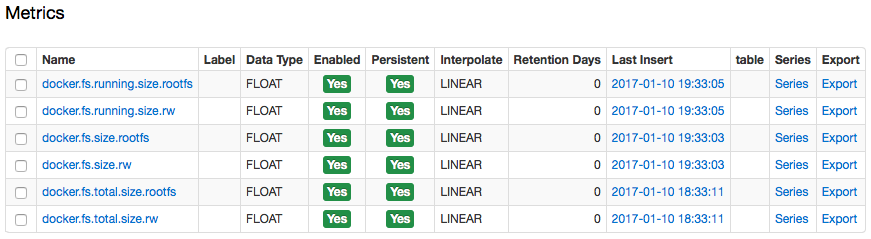

Weekly Change Log: January 09 - January 15, 2017
================================================

### ATSD

| Issue         | Category        | Type | Subject                                                                             |
|---------------|-----------------|---------|-------------------------------------------------------------------------------------|
| [3773](#issue-3773) | sql             | Bug     | Implemented rules for numeric precedence in queries against the [`atsd_series`](/api/sql/examples/select-atsd_series.md) table. If the query requests several metrics with different datatypes, no precision loss will occur. |
| 3770 | api-rest        | Bug     | Removed versioning tags from [`exactMatch`](/api/data/series/query.md#series-filter-fields) comparison to prevent empty result sets when querying data for versioned metrics. |
| [3769](#issue-3769) | sql             | Feature     | Extended the [`LOOKUP`](/api/sql#lookup) function to accept series, entity, and metric tags as parameters. |
| [3768](#issue-3768) | sql             | Feature | Extended the [`CONCAT`](/api/sql#string-functions) function to accept numeric arguments. |
| [3767](#issue-3767) | sql             | Feature | Extended the [`CAST`](/api/sql#cast) function to convert numbers to strings. |
| 3764 | sql             | Bug     | Fixed NullPointException error when data was requested with the [series query](/api/data/series/query.md) method for a newly created metric without any data. |
| [3763](#issue-3763) | sql             | Bug     | Updated the [`SELECT 1`](/api/sql#validation-query) validation query implementation to return exactly one row. |
| [3480](#issue-3480) | api-rest        | Feature | Added support for the [`text`](/api/data/series/query.md#value-object) field in the [series query](/api/data/series/query.md) method. The `text` field allows annotating numeric samples with text.|

### Collector

| Issue         | Category        | Type | Subject                                                                             |
|---------------|-----------------|---------|--------------------------------------------------|
| [3755](#issue-3755) | docker          | Feature | Added [container size metrics](https://github.com/axibase/axibase-collector/blob/master/jobs/docker/volume-size.md#container-size-metrics) for Docker containers. |
| 3752 | docker          | Bug     | Fixed issues with mis-matched volume labels by removing old records from the embedded database. |
| 3734 | docker          | Bug     | Fixed issue with stopped container status not being instantly sent into ATSD. |
| 3733 | docker          | Bug     | Eliminated table locks in the embedded database, which resulted in the collection of all statistics being stopped. |

### Charts

| Issue         | Category        | Type | Subject                                                                             |
|---------------|-----------------|---------|-------------------------------------------------------------------------------------|
| [3481](#issue-3481) | widget-settings | Feature | Implemented a JavaScript replacement for the freemarker `getSeries` method. |
| [3078](#issue-3078) | widget-settings | Feature | Added support for new series settings [`exact-match`](https://axibase.com/products/axibase-time-series-database/visualization/widgets/configuring-the-widgets/) and [`interpolate-extend`](https://axibase.com/products/axibase-time-series-database/visualization/widgets/configuring-the-widgets/). |
| [2928](#issue-2928) | widget-settings | Feature | Changed setting name from `interpolate` to [`fill-value`](https://axibase.com/products/axibase-time-series-database/visualization/widgets/time-chart/) to prevent collision.|

## ATSD

### Issue 3773
--------------

If the value column in an `atsd_series` query returns numbers for metrics with different data types, the prevailing data type is determined based on the following [rules](/api/sql#numeric-precedence):

1. If all data types are integers (short, integer, long), the prevailing integer type is returned.
2. If all data types are decimals (float, double, decimal), the prevailing decimal type is returned.
3. If the data types contain both integers and decimals, the decimal type is returned.

The following sample `atsd_series` query will return the `value` column set to the **decimal** data type based on rule `#3` above.

```sql
SELECT datetime, entity, metric, value
 FROM atsd_series
WHERE metric IN ('tst-metric-short',
                'tst-metric-integer',
                'tst-metric-long',
                'tst-metric-float',
                'tst-metric-double',
                'tst-metric-decimal')
```                

### Issue 3769
--------------

Extended the [`LOOKUP`](/api/sql#lookup) function so that it can accept series, metric, and entity tags as parameters.

```sql
SELECT datetime, value, metric, metric.tags.digital_set
  ,LOOKUP('BatchAct', value) AS VAL
  ,LOOKUP(metric.tags.digital_set, value) AS VALTAG
FROM 'ba:active.1'
  LIMIT 10
```

```ls
| datetime                 | value  | metric      | metric.tags.digital_set | VAL      | VALTAG   |
|--------------------------|--------|-------------|-------------------------|----------|----------|
| 2016-11-02T18:00:06.000Z | -65536 | ba:active.1 | BatchAct                | Inactive | Inactive |
| 2016-11-02T18:10:06.000Z | -65537 | ba:active.1 | BatchAct                | Active   | Active   |
```

### Issue 3768
--------------

Extended the [`CONCAT`](/api/sql#string-functions) function to accept numeric arguments by implicitly converting them into strings using a `#.##` pattern.  As a result, applying the [`CAST`](/api/sql#cast) function to numbers is no longer required.

```sql
SELECT datetime, value, metric
  ,CONCAT('code:', value)
  ,CONCAT('code:', CAST(value as string))
FROM 'ba:active.1'
  LIMIT 10
```

### Issue 3767
--------------

The [`CAST`](/api/sql#cast) function can now convert both a string into a number, as well as a number into a string. `CAST`-ing numbers to strings is required to pass it as an argument into a string function. Applying `CAST` to a string returns a string for a numeric value formatted with a `#.##` pattern.

```sql
SELECT datetime, value, metric
  ,CAST(value as string)
FROM 'ba:active.1'
  LIMIT 10
```

### Issue 3763
--------------

Previously, the [`SELECT 1`](/api/sql#validation-query) validation query didn't return any rows except the header.

```ls
| 1 |
|---|
```

The `SELECT 1` query has been updated to return both the header as well as one row containing all the corresponding columns included in the `SELECT` expression.

```ls
| 1 |
|---|
| 1 |
```

### Issue 3480
--------------

Support was added for the text field (named `x`) in Data API methods for series [query](/api/data/series/query.md#value-object) and [insert](/api/data/series/insert.md#value-object) methods. The text field can be used to store an annotation along the numeric sample, as well as annotation without the numeric value itself.

```json
[{
    "entity": "sensor-01",
    "metric": "status",
    "data": [
        { "d": "2016-10-14T08:15:00Z", "v": null, "x": "Shutdown, RFC 3453" }
    ]
}]
```

## Collector

### Issue 3755
--------------

The following aggregate [metrics](https://github.com/axibase/axibase-collector/blob/master/jobs/docker/volume-size.md) for Docker container sizes were added:

* `docker.fs.total.size.rw`: the total size of all the files for all containers, in bytes.
* `docker.fs.total.size.rootfs` - the size of the files which have been created or changed for all containers.
* `docker.fs.running.size.rw` - the total size of all the files for all running containers, in bytes.
* `docker.fs.running.size.rootfs` - the size of the files which have been created or changed for running containers.

The following metrics are collected at the docker-host level.

https://apps.axibase.com/chartlab/81932cd6

The metrics are collected at 'Container Size Interval' for running containers and at 'Property Refresh Interval' for all containers.



## Charts

### Issue 3481
--------------

New chart functions `getTags()` and `getSeries()` provide a way to load series tags from the server as an alternative to using Freemarker functions and to specifying tag names in the configuration manually.

```javascript
# Option 1: Specify tags manually
list disks = sda, sda1, sda2, sda3, sda4, sda5

# Option 2: Use Freemarker function
list disks = ${getTags("collectd.disk.disk_io_time.io_time", entity, "instance", 1)?sort?join(", ")}  

# Option 3: a) Use Chart function getTags to retrieve tag values
var disks = getTags("disk_used", "mount_point", "nurswgvml007")

# Option 3: b) Use Chart function getSeries to retrieve series objects
var connectors = getSeries('jmx.tomcat.errorcount', 'nurswgvml010')
                  .filter( (series) => series.tags.type == 'GlobalRequestProcessor' )
                  .map( (series) => series.tags.name )
endvar
```

The requests are performed by the browser in synchronous mode. The `getSeries` function retrieves series objects as specified in the [`/api/v1/metrics/{metric}/series`](/api/meta/metric/series.md) method.

`getTags()` syntax:

```javascript
getTags( metric, tagName [, entity, [ , minInsertDate [ , maxInsertDate [ , url ] ] ] ] )
```

`getTags()` example: https://apps.axibase.com/chartlab/5010c220/2

```javascript
getSeries( metric, [, entity, [ , minInsertDate [ , maxInsertDate [ , url ] ] ] ] )
```

`getSeries` example: https://apps.axibase.com/chartlab/bc586a41

### Issue 3078
--------------

Added new series query settings [`exact-match`](https://axibase.com/products/axibase-time-series-database/visualization/widgets/configuring-the-widgets/) and [`interpolate-extend`](https://axibase.com/products/axibase-time-series-database/visualization/widgets/configuring-the-widgets/).

The `exact-match` setting selects series with exactly the same `tags` as requested, with the default set to `false`.

The `interpolate-extend` setting adds missing periods at the beginning and the end of a selection interval, with the default also being `false`.

https://apps.axibase.com/chartlab/dada4561

### Issue 2928
--------------

To prevent naming collision, the `interpolate` setting was renamed to [`fill-value`](https://axibase.com/products/axibase-time-series-database/visualization/widgets/time-chart/), which is an interpolation mode applied to computed series in case the values are irregularly spaced.
If set to true, the missing samples are filled with interpolated values. When `fill-value` is set to the `interpolate` keyword, the missing value is linearly interpolated from the
previous and preceding values.

https://apps.axibase.com/chartlab/e377b59a/3/
