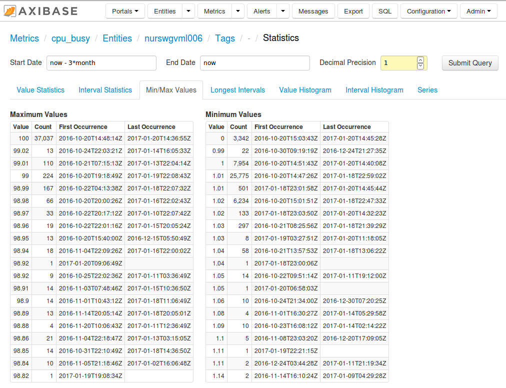
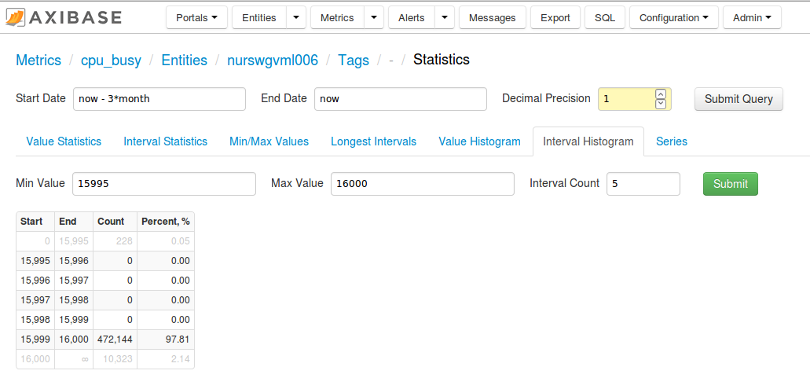
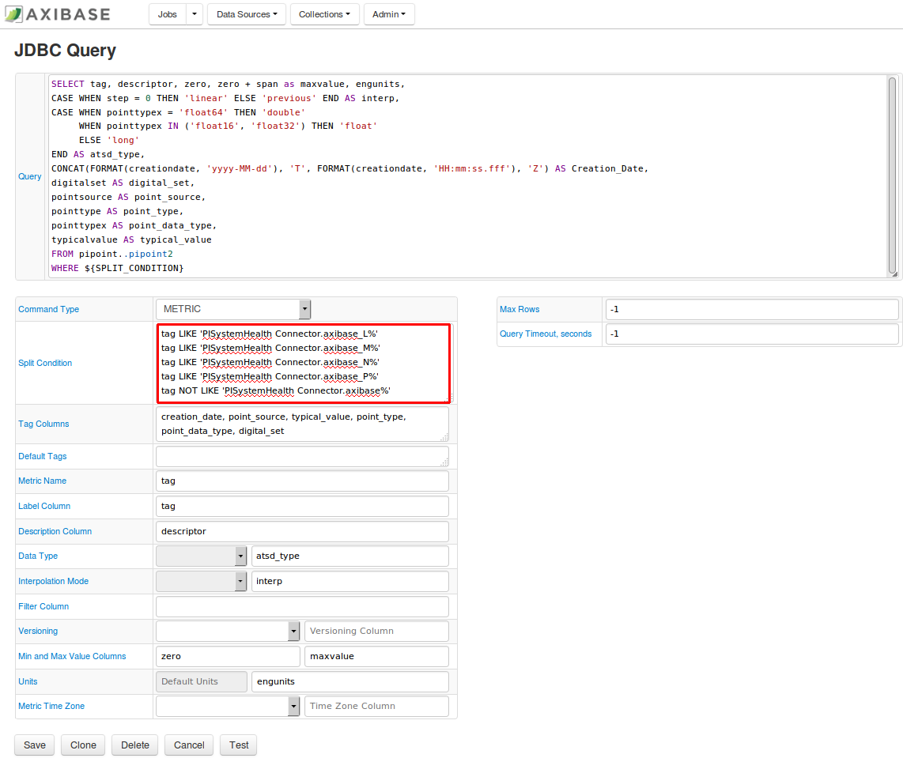
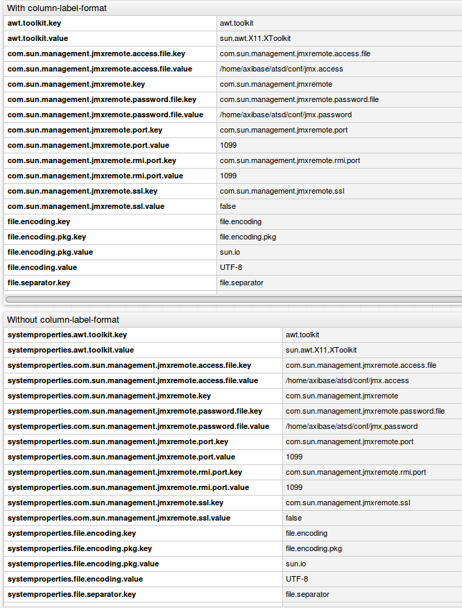
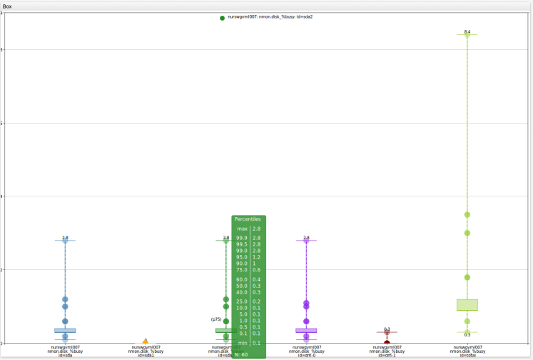

Weekly Change Log: January 16 - January 22, 2017
================================================

### ATSD

| Issue| Category        | Type    | Subject                                                                             |
|------|-----------------|---------|-------------------------------------------------------------------------------------|
| [3797](#issue-3797) | sql             | Feature | Implemented support for the [`ROW_NUMBER`](/api/sql/examples/partition-row-number.md#partition---row-number) condition after the `GROUP BY` clause. | 
| [3796](#issue-3696) | api-network     | Feature | Added support for the [`append`](/api/network/series.md#text-append) flag to concatenate text values for the same timestamp. | 
| [3795](#issue-3795) | sql             | Feature     | Implemented support for entity tags in the [`GROUP BY`](/api/sql#grouping) clause. |
| 3786 | statistics      | Bug     | Added the [`LIMIT 100`](/api/sql#limiting) clause for pre-defined SQL query on the [series statistics](#issue-3680) page. |
| 3783 | sql             | Bug     | Removed extra comma if all columns contain `null` (empty string). | 
| 3781 | jdbc            | Bug     | Fixed empty row issue for the JDBC Driver. | 
| 3753 | jdbc            | Bug     | Corrected error in handling metadata when creating a ResultSet. |  
| [3691](#issue-3691) | rule engine     | Feature | Added functions to convert string date to a date object or to epoch time. | 
| [3680](#issue-3680) | statistics      | Feature | Created a page to show series characteristics, such as value and interval statistics and histograms. | 

### Collector

| Issue| Category        | Type    | Subject                                                                             |
|------|-----------------|---------|-------------------------------------------------------------------------------------|
| [3784](#issue-3784)| jdbc            | Feature | Added the [`${SPLIT_CONDITION}`](https://github.com/axibase/axibase-collector-docs/blob/master/jobs/jdbc.md#job-configuration) placeholder support in the JDBC job to allow fetching large result sets in multiple iterations. |
| 3656 | socrata         | Bug     | Refactored the Socrata job so that a dataset with more than 100,000 rows or more than 100Mb can be processed without an OutOfMemory error. |

### Charts

| Issue| Category        | Type    | Subject                                                                             |
|------|-----------------|---------|-------------------------------------------------------------------------------------|
| [2528](#issue-2528) | property        | Feature | Implemented support for the `column-label-format` setting to transform column headers. |
| [1926](#issue-1926) | box             | Feature | Added mouse-over tooltips for box charts. | 

## ATSD

### Issue 3797
--------------

Support was added to the [`ROW_NUMBER`](/api/sql/examples/partition-row-number.md#partition---row-number) function after the [`GROUP BY`](/api/sql#grouping) clause for [`SELECT`](/api/sql#syntax) statements.

Now you can specify the `ROW_NUMBER` condition in two parts of a `SELECT` statement: before or after the `GROUP BY` clause. Generally, a `SELECT` statement may contain two `ROW_NUMBER` 
conditions. If the `ROW_NUMBER` condition is placed before the `GROUP BY` clause, this condition is applied before grouping. If the `ROW_NUMBER` condition is placed after the `GROUP BY` 
clause, this condition is applied after grouping.

Additionally, this new support allows for syntax such as `ROW_NUMBER(entity, tags ORDER BY period(15 minute))`. Previously, we could not use `order by period(...)` in the `ROW_NUMBER` 
function. Ordering by period can only be used after the `GROUP BY` clause and the period must be the same as specified in the `GROUP BY` clause.

```sql
SELECT  entity, tags.*, datetime, avg(value), count(value), first(value), last(value)
 FROM disk_used
WHERE datetime >= '2017-01-09T00:00:00Z' AND datetime < '2017-01-09T02:00:00Z'
 -- group by series (entity+tags) and 15-minute period
 GROUP BY entity, tags, period(15 minute)
 -- retain only 2 periods for each series (entity+tags)
WITH ROW_NUMBER(entity, tags ORDER BY period(15 minute)) <= 2
```

```ls
| entity        | tags.file_system                 | tags.mount_point  | datetime                  | avg(value)         | count(value)  | first(value)  | last(value) | 
|---------------|----------------------------------|-------------------|---------------------------|--------------------|---------------|---------------|-------------| 
| nurswghbs001  | /dev/md1                         | /boot             | 2017-01-09T00:00:00.000Z  | 70592              | 120           | 70592         | 70592       | 
| nurswghbs001  | /dev/md1                         | /boot             | 2017-01-09T00:15:00.000Z  | 70592              | 120           | 70592         | 70592       | 
| nurswghbs001  | /dev/md2                         | /                 | 2017-01-09T00:00:00.000Z  | 745502299.2000003  | 120           | 745471936     | 745409920   | 
```

```sql
SELECT entity, tags, MAX(value) -  MIN(value) AS 'Diff'
 FROM disk_used
WHERE datetime >= current_day
 -- fetch last 100 records for each series
 WITH ROW_NUMBER(entity, tags ORDER BY time DESC) <= 100
GROUP BY entity, tags
 HAVING MAX(value) - MIN(value) > 0
 -- fetch top 3 series for each entity
 WITH ROW_NUMBER(entity ORDER BY MAX(value) -  MIN(value) DESC) <= 3
ORDER BY Diff DESC
```

```ls
| entity        | tags                                                           | Diff   | 
|---------------|----------------------------------------------------------------|--------| 
| nurswgvml006  | file_system=/dev/sdc1;mount_point=/media/datadrive             | 104408 | 
| nurswgvml007  | file_system=/dev/mapper/vg_nurswgvml007-lv_root;mount_point=/  | 71924  | 
| nurswgvml010  | file_system=/dev/sda1;mount_point=/                            | 280    | 
| nurswgvml006  | file_system=/dev/mapper/vg_nurswgvml006-lv_root;mount_point=/  | 180    | 
| nurswgvml502  | file_system=/dev/sda1;mount_point=/                            | 140    | 
| nurswgvml301  | file_system=/dev/sda1;mount_point=/                            | 44     | 
| nurswgvml010  | file_system=/dev/sdb1;mount_point=/app                         | 20     | 
```

### Issue 3796
--------------

The [`append`](/api/network/series.md#text-append) flag applies to text values specified with the `x:` field.

If the append flag is set to true, ATSD checks the previous text value for the same timestamp. If the previous value is found, the new value is appended at the end using `;\n` (semi-colon followed by line feed) as a separator.

In order to prevent duplicate values, the database checks the existing value for duplicates by splitting the stored value into a string array and discarding the new value if it is equal to one of the elements in the array.

```ls
series d:2017-01-20T08:00:00Z e:sensor-1 x:status="Shutdown by adm-user, RFC-5434"
series d:2017-01-20T08:00:00Z e:sensor-1 x:status="Restart" a:true
```

The new value will be equal to:

```ls
Shutdown by adm-user, RFC-5434;
Restart
```

### Issue 3795
--------------

Previously, entity tags were not supported in the `GROUP BY` clause. Now it's possible to group rows by entity tag, for example `GROUP BY entity.tags.{tag-name}`. 

```sql
SELECT entity.tags.app, count(value) 
  FROM disk_used
WHERE entity IN ('nurswgvml007', 'nurswgvml006')
  AND tags.mount_point = '/'
  AND datetime > now - 5*minute
GROUP BY entity.tags.app
```

```ls
| entity.tags.app  | count(value) | 
|------------------|--------------| 
| ATSD             | 20           | 
| Hadoop/HBASE     | 20           | 
```

### Issue 3691
--------------

Implemented useful [date functions](/rule-engine/expression.md#time-functions) in the rule engine to convert an ISO8601 date string into a numeric epoch time or into a [Joda-time](http://joda-time.sourceforge.net/apidocs/org/joda/time/DateTime.html) date object. These functions can be used in rule expressions.

```javascript
/**
  Return true if difference between event time and start time (ISO) retrieved 
  from property record is greater than 5 minutes
*/
timestamp - milliseconds(property('docker.container::startedAt')) >  5*60000
```

```javascript
/**
  Return true if the specified date is a working day
*/
property('config::deleted')).dayOfWeek().get() < 6
```

### Issue 3680
--------------

The series list now inludes a 'Statistics' link to characterize the selected series. 

The following characteristics are available.

* Value Statistics: provides summary statistics for values of the time series for the specified time interval. There are three tables included within this tab: **Timespan**, **Value Statistics**, and **Value
  Percentiles**. **Timespan** provides the dates for the the first and last value of the time series and their respective values. **Value Statistics** provides the Count (total number of samples), NaN count (number of Not-a-Number samples), as well as the Average, Standard Deviation, and Sum of all values. **Value Percentiles** provides a list of the maximum and minimum values of the 
  series, with the corresponding percentages of observations which fall beneath the specific listed value (ie 75% of all values in this series fall below 7.1).
    
  

* Interval Statistics: provides time duration statistics for values included in the specific time interval. All values are presented in two forms: as milliseconds and in a human readable 
  format (ie, 1d 2h 3m 4s). Two tables are included in under this tab: **Interval Statistics, ms** and **Interval Percentiles, ms**. The **Interval Statistics** table provides a concise 
  summary of the time characteristics of the series, including the Count (number of intervals between the samples), the average interval time, the total time range for the series (difference betweeb last and first value), among
  several other points. The **Interval Percentiles, ms** table provides a list of the maximum and minimum time intervals of the series, with the corresponding percentages of 
  observations which fall beneath the specific listed value (ie 99.9% of all time intervals in this series fall under 18 seconds). 
  
  

* Min/Max Values: provides the 20 maximum and minimum values of the series. Included are the value, count, and first and last occurrences of these values. 

  

* Longest Intervals: provides the maximum 20 time intervals between time series samples. Provided in milliseconds and in human readable format. 

  

* Value Histogram: provides a breakdown of the distribution of the values within the specified series. You need to specify the **Min Value**, **Max Value**, and **Interval Count** fields, 
  and then press the 'Submit' button. 
 
  

* Interval Histogram: provides a breakdown of the distribution of the values within the specified series. You need to specify the **Min Value**, **Max Value**, and **Interval Count** 
  fields, and then press the 'Submit' button. 

  

* Series: provides links to the Metric and Entity labels. Additionally, allows the user to export the series data, navigate to the SQL console, and to view a Chart Lab graph showing the 
  distribution of the data. 

  
  
## Collector

### Issue 3784
--------------

If a SQL query returns millions of rows, it may be useful to split it into multiple queries. This can be accomplished by including `${SPLIT_CONDITION}` in the query text and specifying multiple split conditions, one per line.

```sql
SELECT tag, descriptor, zero, zero + span as maxvalue, engunits,
CASE WHEN step = 0 THEN 'linear' ELSE 'previous' END AS interp, 
CASE WHEN pointtypex = 'float64' THEN 'double'
     WHEN pointtypex IN ('float16', 'float32') THEN 'float'
     ELSE 'long'
END AS atsd_type
FROM pipoint..pipoint2
WHERE ${SPLIT_CONDITION}
```

Split Conditions:

```sql
tag LIKE 'AB%'
tag LIKE 'AC%'
tag LIKE 'DA%'
NOT (tag LIKE 'AB%' OR tag LIKE 'AC%' OR tag LIKE 'DA%')
```

This will cause 4 queries to be executed, with first query results being filtered with `tag LIKE 'AB%'` condition:

```sql
SELECT tag, descriptor, zero, zero + span as maxvalue, engunits,
CASE WHEN step = 0 THEN 'linear' ELSE 'previous' END AS interp, 
CASE WHEN pointtypex = 'float64' THEN 'double'
     WHEN pointtypex IN ('float16', 'float32') THEN 'float'
     ELSE 'long'
END AS atsd_type
FROM pipoint..pipoint2
WHERE tag LIKE 'AB%'
```

The last condition is typically constructred to select all remaining rows other than those fetched with previous conditions.



## Charts

### Issue 2528
--------------

In order to reduce rename/transform multiple similar column headers with one setting, support was added to the `column-label-format` setting for property and table widgets. For example, in 
order to remove a common prefix from a column label, add the following code snippet to your configuration:  

```javascript
column-label-format = value.replace(/^systemproperties./, "")
```

https://apps.axibase.com/chartlab/1ee27e2e/4/



### Issue 1926
--------------

Now upon a mouse over for box charts, metric names are displayed at the top of the box and the distribution of the series (minimum, maximum, count, and value percentiles) is displayed next to its respective series.

https://apps.axibase.com/chartlab/46e8b4ec




 
