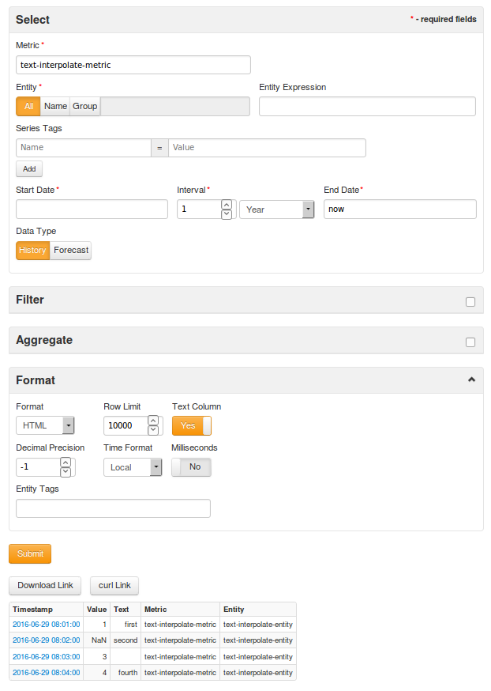
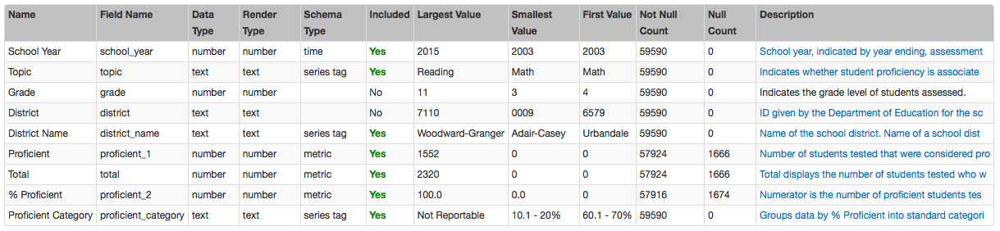
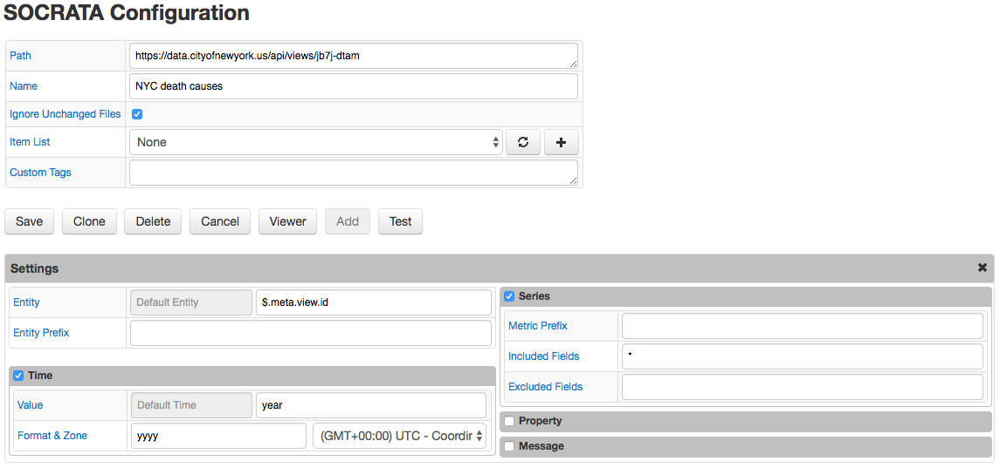

Weekly Change Log: January 23 - January 29, 2017
================================================

### ATSD

| Issue| Category    | Type    | Subject                                                                              |
|------|-------------|---------|--------------------------------------------------------------------------------------| 
| 3831 | api-rest    | Bug     | Updated [`GET`](/api/meta/entity/get.md#entity-get) series request to return up to 1000 series per search. Added message `Warning! Max row limit reached (1000)` when the threshold is reached. |
| 3825 | sql         | Bug     | Removed unnecessary extra row when the [`VALUE INTERPOLATION`](/api/sql/examples/interpolate-extend.md#interpolate-with-extend) function was specified in a period expression. | 
| 3816 | UI          | Bug     | Updated the Interval tab on the [Series Statistics](/tree/collector-changes/changelogs/2017_03#issue-3680) page for ordering interval times. We now exclude intervals between the median minus std. deviation and the median plus std. deviation. | 
| 3813 | UI          | Bug     | Fixed issue when searched series were not found on the Series Statistics page. | 
| 3808 | metric      | Bug     | Corrected bug where incorrect `NaN` counts were showing on Series Statistics page. | 
| [3742](#issue-3742) | UI          | Feature | Added a `Text Column` button to the UI Export form. | 

### Collector

| Issue| Category    | Type    | Subject                                                                              |
|------|-------------|---------|--------------------------------------------------------------------------------------|
| 3823 | socrata     | Bug     | Added a Message tab to display progress when downloading data. | 
| 3821 | socrata     | Bug     | Under the `Custom Tags` setting, added 'Add Row Number' field - an extra metric with the name `{prefix}row_number` added to series commands in case the data row doesn't contain any numeric columns. |
| 3820 | docker      | Bug     | Fixed volume without path issue by setting the tag destination manually when the volume is mounted with a container. |
| 3819 | docker      | Bug     | Updated volume label to be based off of the naming of the container label. | 
| [3818](#issue-3818) | socrata     | Feature | In `Test` mode, added a table displaying columns from the meta section. | 
| 3812 | socrata     | Bug     | Hid `http` pool from the configuration tab. Now, only the metric path will be displayed. | 
| 3811 | socrata     | Bug     | Fixed auto-complete field bug. | 
| 3810 | socrata     | Bug     | Updated settings so that if a field is specified in 'Custom Tags' but is not specified in 'Included Fields', it will not be sent as a metric.| 
| 3804 | socrata     | Bug     | Excluded `null` values from custom tags or any other fields in commands for both JSON and Socrata jobs. | 
| 3803 | socrata     | Bug     | Fixed issue where time fields were being stored as metrics. | 
| 3802 | socrata     | Bug     | Corrected issues with counter commands sending misleading, inaccurate information. | 
| 3801 | socrata     | Bug     | Fixed request error caused by trailing slashes by adding `rows.json` command instead of `/rows.json` if a url ends with a forward slash. | 
| 3799 | socrata     | Bug     | Stabilized form jitter issue, which is when parts of a form are initially visible and then hidden after the form is loaded, for both JSON and Socrata jobs. | 
| 3798 | socrata     | Bug     | Updated time parser for JSON and Socrata jobs to accept the `yyyyw` time format. | 
| 3793 | socrata     | Bug     | Added the following heuristics to the Socrata job. Set the field with type equal to `calendar_date` as the `Time` field. If the field name ends with `_year_week`, contains only numeric values, and each value has 6 digits, then the Time field will be set with the `yyyyw` format. If the data type is numeric, and all values and their sums are integers, then the metric datatype is set as long. | 
| [3772](#issue-3772) | Socrata     | Feature | Created new Socrata job to query [Socrata](https://socrata.com/) data. |

## ATSD

### Issue 3742
--------------

A `Text Column` button was added to the user interface export form. By enabling this button, a text column will be displayed for data exported in CSV and HTML formats.        

## Collector

### Issue 3818
--------------

Columns which were added include (along with their sources):

* Name: from `meta.name`
* Field Name: from `meta.fieldNameData`
* Data Type: from `meta.dataTypeName`
* Render Type: from `meta.renderTypeName`
* Schema Type: should classify how this column is processed in our commands, e.g. Metric, Series Tag, Time, Property Type, etc.
* Included: should be `Yes` or `No` based on the Excluded/Included field rules.
* Largest Value: from `meta.cachedContents.largest`
* Smallest Value: from `meta.cachedContents.smallest`
* First Value: from `meta.cachedContents.top[0]['item']`
* Not Null Count: from `meta.cachedContents.not_null`
* Null Count: from `meta.cachedContents.null`
* Description: from `meta.description`

### Issue 3772
--------------

In order to more efficiently handle Socrata data, we created a new Socrata job. Previously, a Socrata format was provided in the JSON job. This format has now been removed.
 
The basic structure of the new Socrata job is similar to the Socrata format from the JSON job. There were, however, some new features implemented. Changes were made in general to the 
user interface in Collector, in the form of changing several tooltips and removing some fields. Additionally, when the Name field is empty on an unsaved `job-socrata-query` page, if 
the user clicks the `Add` button, the Name will be set to the dataset name.

After creating the new Socrata job, JSON jobs with the Socrata format are converted to Socrata jobs using SQL scripts.

