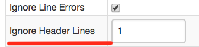
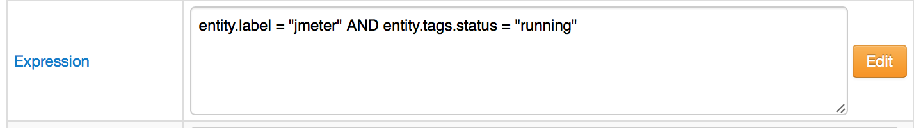
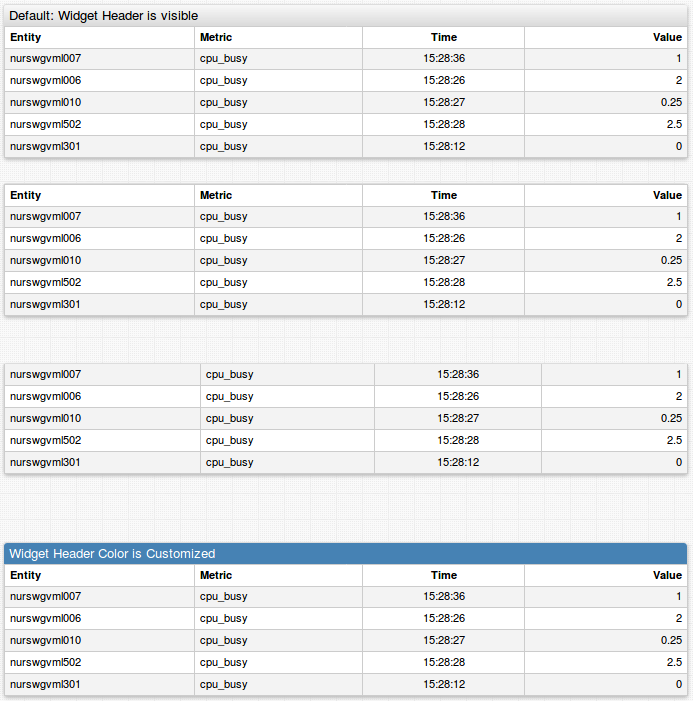

Weekly Change Log: February 13 - February 19, 2017
==================================================

### ATSD

| Issue| Category        | Type    | Subject                                                                              |
|------|-----------------|---------|--------------------------------------------------------------------------------------| 
| 3925 | api-rest        | Bug     | Added column alias to metadata with [metadataFormat=`COMMENTS`](/api/sql/api.md#parameters) and outputFormat=`csv`.                                                       |
| [3919](#issue-3919) | csv        | Feature | Added ability to ignore header lines in [CSV Parser](/parsers/csv/README.md).                                                                  |
| 3898 | rule engine     | Bug     | Fixed incorrect errors highlighting in `Columns` values.                                                      |
| [3889](#issue-3889) | rule engine     | Bug     | Fixed `entity.label` recognition in [`Expression`](/rule-engine/expression.md) field.                                                                 |

### Collector

| Issue| Category        | Type    | Subject                                                                              |
|------|-----------------|---------|--------------------------------------------------------------------------------------| 
| 3895 | socrata         | Bug     | Implemented several heuristics to ease configuring fields in Socrata jobs.                 |
| 3891 | docker          | Bug     | Fixed missing `entity` command for new container when lifecycle event monitoring is disabled.   |

### Charts

| Issue| Category        | Type    | Subject                                                                              |
|------|-----------------|---------|--------------------------------------------------------------------------------------| 
| [3921](#issue-3921) | widget-settings | Bug     | Added `escape()` method to `list` and `var` arrays to escape commas in elements.         |
| 3917 | widget-settings | Bug     | Added escaping of comma and backslash in settings which contain list.                 |
| [3897](#issue-3897) | table      | Feature | Added `auto-height` setting.                                                                |
| [3896](#issue-3896) | table      | Feature | Added a setting to hide table header.                                                   |
| [3791](#issue-3791) | table      | Bug     | Fixed slider focusing behaviour after `update-interval`.                |

## ATSD

### Issue 3919
--------------

We added an option to ignore header lines in ATSD CSV Parse. It allows to parse complicated CSV files with headers. 
You may find [an example parser](https://github.com/axibase/atsd-use-cases/blob/master/OrovilleDam/resources/cdec.water.ca.gov-shef-parser.xml) 
for a dataset from the California Department of Water Resources in our [article](https://github.com/axibase/atsd-use-cases/blob/master/OrovilleDam/README.md)

### Issue 3889
--------------

`entity.label` expression is now supported:

 

## Charts

### Issue 3921
--------------

Added `escape()` method to `list` and `var` arrays, so it can be used as `@{arrayName.escape()}`. This method escapes commas and backslashes in each element in array and then joins all elements in string dividing it by comma.

https://apps.axibase.com/chartlab/ff94d98d/2/

### Issue 3897
--------------

https://apps.axibase.com/chartlab/e02b8303/4

https://apps.axibase.com/chartlab/e02b8303/5

https://apps.axibase.com/chartlab/e02b8303/6

### Issue 3896
--------------

The widget header can be hidden by the following command: `table-header-style = display: none`

https://apps.axibase.com/chartlab/e02b8303/3/

### Issue 3791
--------------

The slider focus doesn't jump to the first column after updating anymore.

https://apps.axibase.com/chartlab/0094035b

