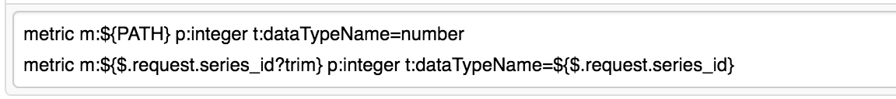
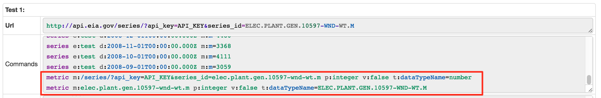
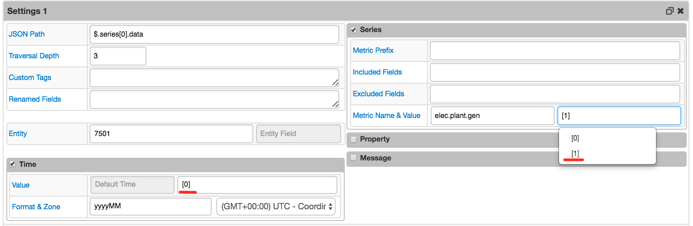
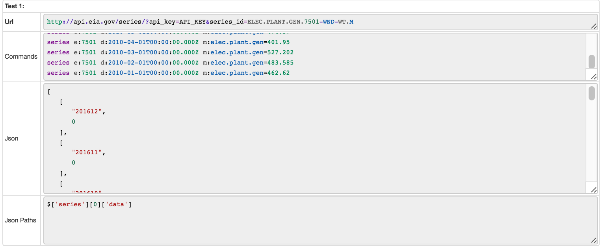
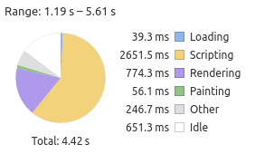
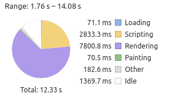

Weekly Change Log: February 20 - February 26, 2017
==================================================

### ATSD

| Issue| Category    | Type    | Subject                                                                              |
|------|-------------|---------|--------------------------------------------------------------------------------------|
| 3951 | sql         | Feature | Granted permissions to USER role to cancel the user's own query.                             |
| 3942 | core        | Bug     | Fixed PermGen Error by setting MaxPermGen in start script.                                   |
| [3938](#issue-3938) | admin       | Bug     | Added PermGen memory usage metrics.                                     |
| 3934 | admin       | Support | Set MaxPermGen to 128mb in start-atsd scripts.                           |
| 3929 | api-rest    | Bug     | Fixed double/float datatype cast rounding error in `DELTA` and `COUNTER` aggregators. |

### Collector

| Issue| Category    | Type    | Subject                                                                              |
|------|-------------|---------|--------------------------------------------------------------------------------------|
| [3936](#issue-3936) | json        | Feature | Added a text area for custom user commands.                                    |
| 3928 | data-source | Feature | Added the separate Protocol field to data source configuration page. |
| [3926](#issue-3926) | json        | Feature | Provided an ability to extract Time, Metric Name & Value fields by index from an array. |
| 3771 | docker      | Bug     | Fixed database locks in Docker Data Reader.                                        |

### Charts

| Issue| Category    | Type    | Subject                                                                              |
|------|-------------|---------|--------------------------------------------------------------------------------------|
| [3958](#issue-3958) | core   | Bug | Improved performance of legend rendering.                                    |


## ATSD

### Issue 3938
--------------

The new metrics `jvm_permgen_max`, `jvm_permgen_used`, `jvm_permgen_used_percent` have been introduced to collect PermGen memory usage statistics.
The values can also be seen in atsd.log:

```
2017-02-27 10:32:10,327;INFO;reaperScheduler-1;c.a.t.s.m.GarbageCollectionPoller;Memory Pool="Code Cache" type="Non-heap memory": 9 mb, Memory Pool="PS Eden Space" type="Heap memory": 484 mb, Memory Pool="PS Survivor Space" type="Heap memory": 9 mb, Memory Pool="PS Old Gen" type="Heap memory": 103 mb, Memory Pool="PS Perm Gen" type="Non-heap memory": 63 mb
```

## Collector

### Issue 3936
--------------

Custom network commands specified in `Raw Commands` textarea can be executed.


The following [placeholders](https://github.com/axibase/axibase-collector/blob/master/docs/jobs/json.md#placeholders) together with [string functions](https://github.com/axibase/axibase-collector/blob/master/docs/jobs/placeholders.md#string-functions) are supported:
* ITEM
* PATH
* FILE
* DIRECTORY
* [JSON Path expressions](https://github.com/jayway/JsonPath#operators)





### Issue 3926
--------------

Fields accessed by the array index have been added to dropdown menu.




## Charts

### Issue 3958
--------------

Rendering time of a [chart with about 300 legend units](https://apps.axibase.com/chartlab/259e3907)

| Before | After |
|--------|-------|
| |  |
