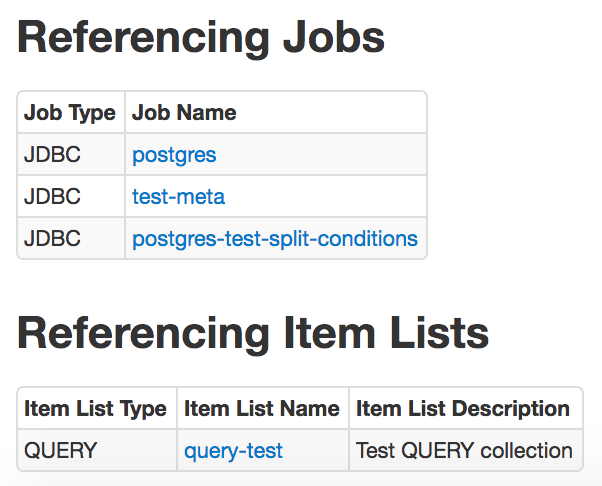
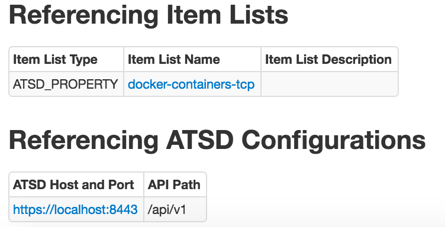
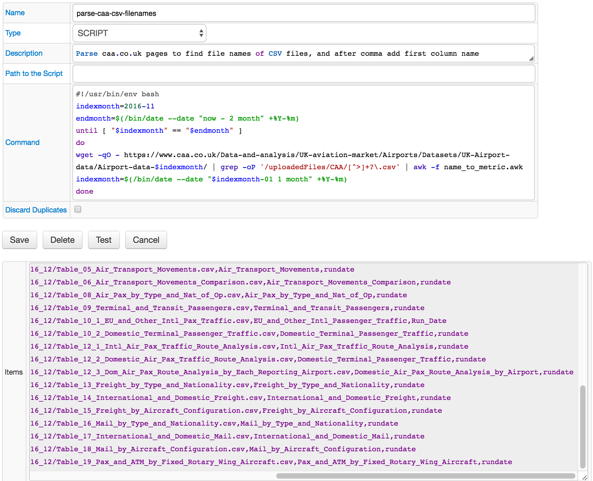
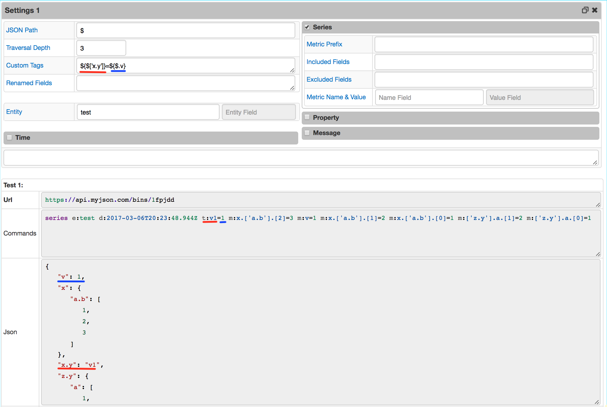
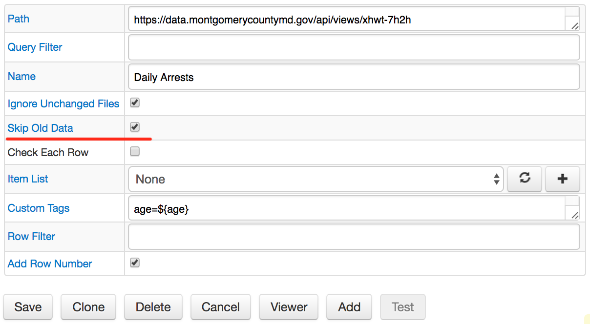
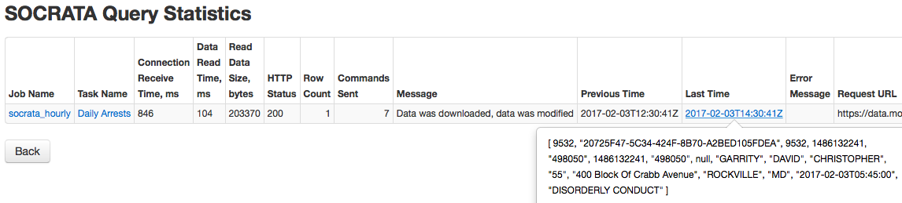
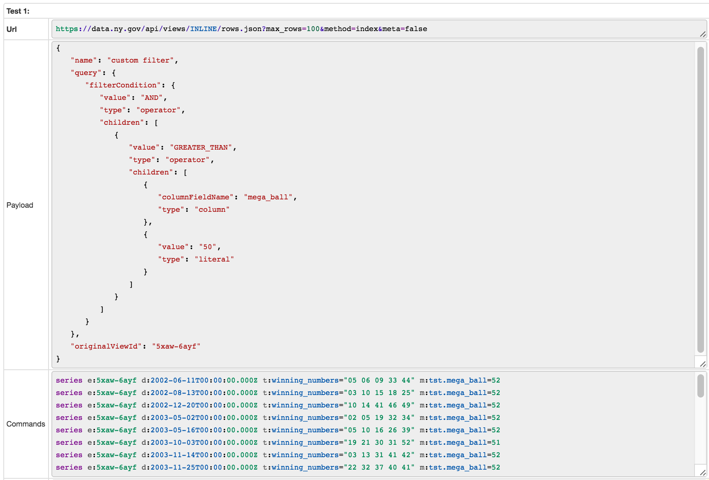

Weekly Change Log: February 27 - March 5, 2017
==============================================

### ATSD

| Issue| Category        | Type    | Subject                                                                              |
|------|-----------------|---------|--------------------------------------------------------------------------------------|
| [3940](#issue-3940) | client          | Feature | Added the `sendCommands` method to [Python API client](https://github.com/axibase/atsd-api-python).                                                                |
| 3918 | api-rest        | Bug     | Removed the `last` parameter in [series](/api/data/series/query.md) query. Use [`limit=1`](/api/data/series/query.md#control-filter-fields) instead.                                            |

### Collector

| Issue| Category        | Type    | Subject                                                                              |
|------|-----------------|---------|--------------------------------------------------------------------------------------|  
| [3977](#issue-3977) | UI              | Feature | Introduced referencing configurations tables for HTTP Pools, [Database Configurations](https://github.com/axibase/axibase-collector-docs/blob/master/jobs/jdbc-data-source.md), [Replacement Tables](https://github.com/axibase/axibase-collector-docs/blob/master/collections.md#replacement-tables) |
| [3976](#issue-3976) | collection      | Feature | Allowed to write script right on the Item List configuration page.                        |
| 3974 | http-pool       | Bug     | Fixed removing HTTP Pools.                                 |
| 3969 | json            | Bug     | Fixed inability of including a field into the list of `Included Fields` if it is already specified in `Metric Name & Value` field.     |
| 3967 | collection      | Bug     | Improved performance and stability of Item Lists by checking existence of scripts folder and caching items.           |
| 3949 | json            | Bug     | Fixed including `Entity` field as metric.                                             |
| 3933 | json            | Bug     | Fixed field specification inconsistency in `Custom Tags` field.                                                   |
| [3932](#issue-3932) | json            | Feature | Allowed to use [JSON Path](https://github.com/jayway/JsonPath#operators) expressions in `Custom Tags` field.                          |
| 3829 | scheduler       | Bug     | Disabled `Run` buttons for already running jobs.                                 |
| [3817-a](#issue-3817-a) | socrata         | Feature | Added an ability to skip resending of already processed data.                         |
| [3817-b](#issue-3817-b) | socrata         | Feature | Added the `Query Filter` field.                         |

### Charts

| Issue| Category        | Type    | Subject                                                                              |
|------|-----------------|---------|--------------------------------------------------------------------------------------| 
| 3970 | treemap         | Bug     | Fixed `display = false` behaviour.                                                         |
| 3964 | table           | Bug     | Now a relevant alert value computed in `alert-expression` is available in `hide-columns` function.                                      |
| [3961](#issue-3961) | treemap         | Feature | Added the `mode` setting.                                                                     |
| 3960 | time-chart      | Bug     | Fixed legend visibility if multiple series are requested by entity or entity groups with wildcards.                                 | 
| [3959](#issue-3959) | api             | Feature | Changed the behaviour of `last` setting to satisfy the ATSD API changes.                              |
| [3941](#issue-3941) | widget-settings | Feature | Implemented functions to retrieve entity and metric tags in `threshold` and other calculations. |
| 3927 | core            | Bug     | Fixed order of widget content geometry calculation.                                |

## ATSD

### Issue 3940
--------------

An example of using the new `sendCommands` method:

```python
import atsd_client
from atsd_client.services import CommandsService
conn = atsd_client.connect()
commandsService = CommandsService(conn)
commands_to_send = ["metric m:stat.step p:integer",
                    "series e:process m:stat.step=0 x:stat.step=initial"]
commandsService.send_commands(commands_to_send)

```

## Collector

### Issue 3977
--------------

The tables with subjects that depend on the given configuration are introduced for Databases, HTTP Pools, Replacement Tables.
For the database configuration, the jobs, and the item lists are shown.



For the HTTP pool, the referencing task configurations, item lists and ATSD configurations are shown.



For the Replacement table, the referencing task configurations are shown.


### Issue 3976
--------------
The old `Command` field containing path to the executable script has been renamed to `Path to the script`. 
The new `Command` field allows to type the commands returning the Item List elements, one per line. 
The commands from the text area are executed as if they were an executable file located in the default scripts directory (`$AXIBASE_COLLECTOR_HOME/conf/scripts`).
You must provide the setting `script.text.execute.allow=true` in `$AXIBASE_COLLECTOR_HOME/conf/server.properties` file in order to use this feature.



### Issue 3932
--------------



### Issue 3817-a
--------------

The new checkbox `Skip Old Data` has been introduced. If it is on, the last data row is stored in Collector. When the task is executed next time, only new rows are sent to ATSD as series.




### Issue 3817-b
--------------

The new field `Query Filter` has been introduced to allow to pass a filter expression as part of the request.




## Charts

### Issue 3961
--------------

The new settings introduced in Treemap configurations:

| Setting | Description | Available options |
|------|-------------|-------------------|
| mode | Layout mode to control high rectangles are positioned. |– `default` <BR> – `row` (align rectangles as rows) <BR> – `column` (align rectangles as columns) <BR> – `auto` (switch between row and column modes depending on widget size)


https://apps.axibase.com/chartlab/fc68bae4/7/


### Issue 3959
--------------

Now the config setting `last = true` sets `"limit": 1` in request, as `last` query parameter is going to be deprecated.

https://apps.axibase.com/chartlab/25551747

### Issue 3941
--------------

Functions `meta()`, `entityTag()`, and `metricTag()`, which compute some value, are now available in settings,  

```
meta(`alias`) - return `meta`, loaded for series with such `alias`
meta() - return `meta`, loaded for current series
entityTag(`alias`, `field-name`) - return `meta.entity[field-name]`, loaded for series with such `alias`
entityTag(`field-name`) - return `meta.entity[field-name]`, loaded for current series
metricTag(`alias`, `field-name`) - return `meta.metric[field-name]`, loaded for series with such `alias`
metricTag(`field-name`) - return `meta.metric[field-name]`, loaded for current series
```

The settings which can use the new functions:
- series-value (in [column])
- value
- display
- enabled
- alert-expression
- size (Treemap)
- color
- node-value (Graph)
- link-value (Graph)
- link-alert-expression (Graph)
- node-alert-expression (Graph)

https://apps.axibase.com/chartlab/2b15e6f9

https://apps.axibase.com/chartlab/c4c1f7b8

https://apps.axibase.com/chartlab/c9bd5eb5
