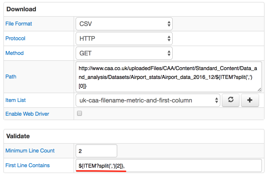

Weekly Change Log: March 6 - March 12, 2017
==================================================

### ATSD

| Issue| Category    | Type    | Subject                                                                              |
|------|-------------|---------|--------------------------------------------------------------------------------------|
| 3978 | portal | Bug | Display all assigned portals on Entity Group page. | 

### Collector

| Issue| Category    | Type    | Subject                                                                              |
|------|-------------|---------|--------------------------------------------------------------------------------------|
| 3972 | json | Bug | Replaced non-printable or control characters to underscores in generated entities. |
| 3931 | json | Bug | Provided an ability to address fields with dots in name by quoting the field name. |
| 3828 | admin | Bug | Provided an ability to control logging atsd-api-java requests and responses via logback configuration. |
| [3827](#issue-3827) | file | Feature | Added support for [placeholders](https://github.com/axibase/axibase-collector-docs/blob/master/jobs/placeholders.md#overview) in `First Line Contains` field. |
| 3990 | collection | Bug | Removed stderr output from SCRIPT Item List`s items. |

### Charts

| Issue| Category    | Type    | Subject                                                                              |
|------|-------------|---------|--------------------------------------------------------------------------------------|
| [3956](#issue-3956) | data-loading | Bug | Fixed series with tags with comma-separated value, now such series are processed separately. |
| [3975](#issue-3975) | widget-settings | Feature | Added the `tag-expression` setting to filter series by tag values. |

### Collector

### Issue 3827
--------------

### Charts

### Issue 3956
--------------

https://apps.axibase.com/chartlab/558ba4c1

### Issue 3975
--------------

| Setting | Description |
|---------|-------------|
| tag-expression | Applies server-side filter to series based on series tags. |

https://apps.axibase.com/chartlab/906238e2/4/
