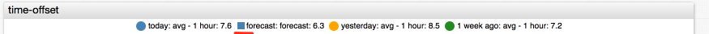

Weekly Change Log: March 13 - March 19, 2017
==================================================

### ATSD

| Issue| Category    | Type    | Subject                                                                              |
|------|-------------|---------|--------------------------------------------------------------------------------------|
| 4021 | sql | Bug | [`CASE`](../../api/sql#case) expression can be used without specifying the table. |
| 3981 | sql | Feature | Add support for [`CASE`](../../api/sql#case) expression in aggregation functions. |
| 3837 | sql | Feature | Add support for constant strings and numbers in the [`SELECT`](../../api/sql#select-expression) expression. |
| 4007 | sql | Bug | Fix referencing error if series tag doesn't exist. |
| [3658](#issue-3658) | sql | Feature | Add support for referencing all metric fields (label, units, etc.) |
| 4017 | sql | Bug | Fix [`CONCAT`](../../api/sql#string-functions) function with constant string arguments. |
| [3907](#issue-3907) | applications | Feature | Implement ATSD query_runner in Redash. |
| 4010 | core | Bug | Prevent HBase filters from entering an infinite loop if metric id overflows. |
| 3950 | sql | Bug | `SUM` function fails to accept arguments. |
| 3913 | sql | Feature | Add support [`CASE`](../../api/sql#case) expression as part of another expression. |
| 3888 | sql | Bug | Add support for entity fields (label, timeZone) in the `WHERE` clause. |
| 3881 | sql | Bug | Fixed NullPointerException in queries with aggregation of metrics with decimal datatype. |
| 3842 | sql | Feature | Add support for column alias in [`CAST`](../../api/sql#cast) and [ROW_NUMBER](../../api/sql#row_number-syntax) functions. |
| 3838 | sql | Bug | Add support for column alias in `ORDER BY` clause |
| 3963 | client | Bug | Replace `last` with `cache` parameter in series query method within the Java API client. |

### Collector

| Issue| Category    | Type    | Subject                                                                              |
|------|-------------|---------|--------------------------------------------------------------------------------------|
| [4001](#issue-4001) | jdbc | Feature | Substitute Replacement Tables with LOOKUP function and Item Lists. |
| 3992 | socrata | Bug | Apply encoding to JSON output. |
| 4004 | socrata | Bug | Handle optional request parameters in the URL wizard. |

### Charts

| Issue| Category    | Type    | Subject                                                                              |
|------|-------------|---------|--------------------------------------------------------------------------------------|
| [4006](#issue-4006) | widget-settings | Feature | Add fixed-fraction formatter. |
| [3997](#issue-3997) | time-chart | Bug | Change legend style for forecast series. |


### ATSD

### Issue 3658
--------------

```sql
SELECT metric,
    metric.dataType,
    metric.description,
    metric.enabled,
    metric.filter,
    metric.id,
    metric.interpolate,
    metric.invalidValueAction,
    metric.label,
    metric.lastInsertTime
FROM df.disk_used
LIMIT 1
```

| metric | metric.dataType | metric.description | metric.enabled | metric.filter | metric.id | metric.interpolate | metric.invalidValueAction | metric.label | metric.lastInsertTime |
|---|---|---|---|---|---|---|---|---|---|
| df.disk_used | FLOAT | null | true | tags.file_system != 'none' | 35 | LINEAR | NONE | null | null |

```sql
SELECT metric,
    metric.maxValue,
    metric.minValue,
    metric.name,
    metric.persistent,
    metric.retentionIntervalDays,
    metric.tags,
    metric.timePrecision,
    metric.timeZone,
    metric.units,
    metric.versioning
FROM df.disk_used
LIMIT 1
```

| metric | metric.maxValue | metric.minValue | metric.name | metric.persistent | metric.retentionIntervalDays | metric.tags | metric.timePrecision | metric.timeZone | metric.units | metric.versioning |
|---|---|---|---|---|---|---|---|---|---|---|
| df.disk_used | null | null | df.disk_used | true | 0 | null | MILLISECONDS | null | null | false |

### Issue 3907
--------------

See the [guide](https://redash.io/help/data-sources/axibase_tsd.html) on how to integrate Redash with ATSD.


### Collector

### Issue 4001
--------------

Replacement tables are deprecated. Similar functionality is provided by the `LOOKUP` function.


### Charts

### Issue 4006
--------------

| Setting | Description |
|---------|-------------|
| format = fixed(n) | Format numbers with the specified number of digits in the fraction portion of a number.<br>Default: 0 fractional digits. |

https://apps.axibase.com/chartlab/b510b820

### Issue 3997
--------------



https://apps.axibase.com/chartlab/075941a0/2/
