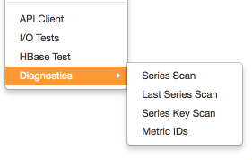
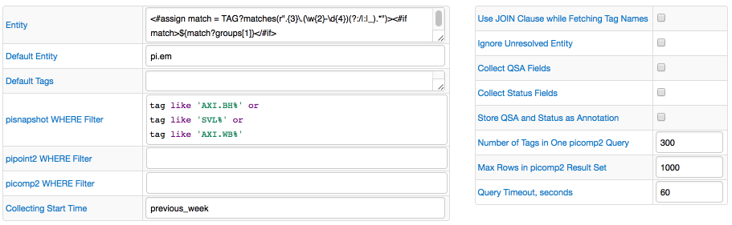
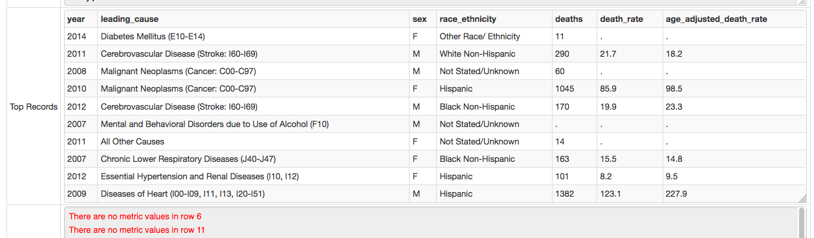

Weekly Change Log: March 20 - March 26, 2017
==================================================

### ATSD

| Issue| Category    | Type    | Subject                                                                              |
|------|-------------|---------|--------------------------------------------------------------------------------------|
| 4037 | sql | Bug | Ignore entities with pending delete action |
| [3915](#issue-3915) | api-rest | Feature | Add support for `tag expression` to filter returned series by a complex or negative condition |
| 4005 | sql | Bug | Fix KryoSerializer ArrayIndexOutOfBoundsException error |
| 4008 | sql | Feature | Develop a custom serializer for external sorting |
| 3924 | UI | Bug | Add syntax highlight to config files in the [Configuration Files Editor](/administration/editing-configuration-files.md) |
| 3852 | sql | Bug | Support [column alias](/api/sql/examples/alias-column.md) for columns based on CASE expression |
| 4034 | sql | Bug | Support multiple [LIKE expressions](/api/sql#like-expression) combined with OR operator |
| 4030 | sql | Bug | Support metric [LIKE expression](/api/sql#like-expression) in atsd_series query |
| [4029](#issue-4029) | UI | Feature | Add Admin links for Diagnostics pages |
| 4027 | sql | Bug | Give access to tags and metric attributes in queries with [JOIN](/api/sql#joins) clause|
| 4003 | csv | Bug | Apply 1GB limit on CSV files uploaded using [API](/api/data/ext/csv-upload.md) |
| 4028 | sql | Bug | Fix ordering by columns with possible null values |
| 4024 | sql | Bug | Fix ordering by tags with absent values |
| 4002 | sql | Bug | Implement grouping by text column |
| 3945 | sql | Bug | Fix tags grouping in queries with [JOIN](/api/sql#joins) clause |
| [3882](#issue-3882) | sql | Feature | Add support for metric attributes in SQL queries |
| 3855 | sql | Bug | Fix grouping by entity.label field |
| 4013 | sql | Bug | Allow using `tags.*` expression in the SELECT clause  |
| 4014 | sql | Bug | Support using `datetime BETWEEN ... AND ...` condition together with other conditions in WHERE clause |

### Collector

| Issue| Category    | Type    | Subject                                                                              |
|------|-------------|---------|--------------------------------------------------------------------------------------|
| 3989 | json | Bug | Unescape HTML-escaped values in textarea with syntax highlight |
| [3682](#issue-3682) | pi | Feature | Release the PI job |
| [3996](#issue-3996) | socrata | Feature | Display top-10 rows in tabular format in Test mode |
| 4026 | core | Bug | Add support for [ISO8601 date format](/end-time-syntax.md#specific-time) in time expressions |
| 4019 | docker | Bug | Do not interrupt the job if there is no free ATSD connection in pool |
| 4025 | core | Bug | Skip numeric value in series command if metric value is NaN and text value is specified |


### ATSD

### Issue 3915
--------------
[Documentation](/api/data/series/query.md)

URI
```elm
POST https://atsd_host:8443/api/v1/series/query
```
Payload

```json
[{
  "startDate": "2017-02-13T08:00:00Z",
  "endDate":   "2017-02-13T09:00:00Z",
  "entity": "nurswgvml007",
  "metric": "disk_used",
  "tagExpression": "tags.file_system NOT LIKE '*your-backup*'",
  "limit": 1
}]
```
Response
```json
[{"entity":"nurswgvml007","metric":"disk_used","tags":{"file_system":"/dev/mapper/vg_nurswgvml007-lv_root","mount_point":"/"},"type":"HISTORY","aggregate":{"type":"DETAIL"},"data":[{"d":"2017-02-13T08:59:53.000Z","v":9242420.0}]}]
```

### Issue 4029
--------------



### Issue 3882
--------------
[List of predefined columns](/api/sql/README.md#predefined-columns)

### Collector

### Issue 3682
--------------


### Issue 3996
--------------
