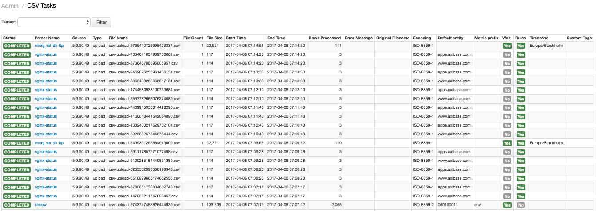
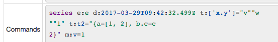

Weekly Change Log: March 26 - April 2, 2017
==================================================

### ATSD

| Issue| Category    | Type    | Subject                                                                              |
|------|-------------|---------|--------------------------------------------------------------------------------------|
| 4052 | sql | Bug | Return human-readable errors as the result for queries with unsupported syntax. |
| [4050](#issue-4050) | sql | Feature | Add the [`date_parse`](/api/sql/README.md#date-parsing-functions) function to parse datetime string into Unix milliseconds. |
| 4039 | sql | Bug | Improve scan performance for queries with no entity specified in the WHERE clause. |
| [4032](#issue-4032) | sql | Feature | Add support for [`LEAD`](/api/sql/README.md#lead) and [`LAG`](/api/sql/README.md#lag) functions in the SELECT expression. |
| 4031 | UI | Bug | Add syntax highlighting to the `Data Entry` text area. |
| 4020 | sql | Feature | Support implicit cast to number in function arguments and WHERE clauses. |
| 3998 | email | Bug | Add context info to error messages on email send error. |
| [3993](#issue-3993) | sql | Feature | Add the [`CORREL`](/api/sql#correl) function to calculate the Pearson correlation |
| [3991](#issue-3991) | sql | Feature | Extend the `BETWEEN` operator to work with custom string arguments |
| 3939 | sql | Bug | Fix error with missing result rows in `JOIN USING ENTITY` query after inserting new series. |
| 3935 | sql | Bug | Improve performance of queries with several [`JOIN USING ENTITY`](/api/sql#join-with-using-entity) clauses. |
| 3856 | sql | Bug | Support implicit conversion to number in the `LAST` and `FIRST` functions |
| [2911](#issue-2911) | UI | Feature | Show user-specified parameters on the `Admin / CSV Tasks` page. |

### Collector

| Issue| Category    | Type    | Subject                                                                              |
|------|-------------|---------|--------------------------------------------------------------------------------------|
| 4048 | jdbc | Bug | Allow job import without specified datasource. |
| 4046 | jdbc | Bug | Consolidate series commands with same time and different metrics into one. |
| 4045 | file | Bug | Fix NullPointerException in case of FTP connection timeout. |
| [4041](#issue-4041) | data-source | Feature | Add the `PI OLEDB Enterprise` datasource. |
| [4012](#issue-4012) | json | Feature | Add syntax highlighting to the `Custom Commands` text area and improve the ATSD network commands highlighting. |
| 3987 | socrata | Bug | Add heuristics to automatically classify and ignore fields in Socrata data sources. |
| 3973 | collection | Feature | Add the `URL` Item List type. |


### Charts

| Issue| Category    | Type    | Subject                                                                              |
|------|-------------|---------|--------------------------------------------------------------------------------------|
| [3850](#issue-3850) | widget-settings | Bug | Fixed `end-time` to not increment month if it has less days than current. |


## ATSD

### Issue 4050
--------------

The `date_parse` function parses the datetime string into Unix milliseconds.

```
date_parse(string datetime[, string time_format[, string time_zone]])
```

* The default time_format is ISO 8601: `yyyy-MM-dd'T'HH:mm:ss.SSSZZ`.
* The default time_zone is the server time zone.

```java
/* Parse date using the default ISO 8601 format.*/
date_parse("2017-03-31T12:36:03.283Z")

/* Parse date using the ISO 8601 format, without milliseconds */
date_parse("2017-03-31T12:36:03Z", "yyyy-MM-dd'T'HH:mm:ssZZ")

/* Parse date using the server time zone. */
date_parse("31.03.2017 12:36:03.283", "dd.MM.yyyy HH:mm:ss.SSS")

/* Parse date using the offset specified in the datetime string. */
date_parse("31.03.2017 12:36:03.283 -08:00", "dd.MM.yyyy HH:mm:ss.SSS ZZ")

/* Parse date using the time zone specified in the datetime string. */
date_parse("31.03.2017 12:36:03.283 Europe/Berlin", "dd.MM.yyyy HH:mm:ss.SSS ZZZ")

/* Parse date using the time zone provided as the third argument. */
date_parse("31.01.2017 12:36:03.283", "dd.MM.yyyy HH:mm:ss.SSS", "Europe/Berlin")

/* Parse date using the UTC offset provided as the third argument. */
date_parse("31.01.2017 12:36:03.283", "dd.MM.yyyy HH:mm:ss.SSS", "+01:00")

/* If the time zone (offset) is specified in the datetime string,
it should be exactly the same as provided by the third argument. */
date_parse("31.01.2017 12:36:03.283 Europe/Berlin", "dd.MM.yyyy HH:mm:ss.SSS ZZZ", "Europe/Berlin")
```

### Issue 4032
--------------
```sql
SELECT date_format(datetime, 'yyyy') AS 'Date',
  SUM(value) AS 'Current Period',
  LAG(SUM(value)) AS 'Previous Period',
  SUM(value)-LAG(SUM(value)) AS 'Change',
  round(100*(SUM(value)/LAG(SUM(value))-1),1) AS 'Change, %'
FROM 'cc.cases-by-primary-type'
  WHERE tags.etype = 'OUTAGE'
GROUP BY entity, tags.etype, period(1 year)
```

| Date | Current Period | Previous Period | Change | Change, % |
|------|----------------|-----------------|--------|-----------|
| 2001 | 654            | null            | null   | null      |
| 2002 | 650            | 654             | -4     | -0.6      |
| 2003 | 590            | 650             | -60    | -9.2      |


### Issue 3993
--------------

```sql
SELECT tu.entity,
  CORREL(tu.value, ts.value) AS 'CORR-user-sys',
  CORREL(tu.value, tw.value) AS 'CORR-user-iowait',
  CORREL(ts.value, tw.value) AS 'CORR-sys-iowait',
  stddev(tu.value),
  stddev(ts.value),
  stddev(tw.value)
FROM mpstat.cpu_user tu JOIN mpstat.cpu_system ts JOIN mpstat.cpu_iowait tw
WHERE tu.datetime >= NOW - 5 * MINUTE
GROUP BY tu.entity
```

| tu.entity    | CORR-user-sys | CORR-user-iowait | CORR-sys-iowait | stddev(tu.value) | stddev(ts.value) | stddev(tw.value) |
|--------------|---------------|------------------|-----------------|------------------|------------------|------------------|
| nurswgvml007 | 0.92          | NaN              | NaN             | 7.64             | 2.50             | 0.00             |
| nurswgvml006 | -0.13         | 0.10             | 0.27            | 7.26             | 0.60             | 2.57             |
| nurswgvml010 | 0.76          | -0.09            | 0.03            | 7.42             | 0.44             | 1.10             |
| nurswgvml502 | 0.59          | -0.14            | -0.08           | 0.53             | 0.53             | 0.59             |
| nurswgvml301 | -0.17         | -0.11            | -0.17           | 0.32             | 0.42             | 0.64             |

### Issue 3991
--------------

```sql
SELECT t1.datetime, t1.tags, 
  t1.value as 'wind power', 
  t2.value as 'sun power', 
  t1.value + t2.value as total
FROM wind_power_production t1 JOIN "solar_cell_production_(estimated)" t2
WHERE t1.tags.name LIKE 'DK*st'
  AND t1.datetime >= '2016-06-01T00:00:00.000Z'
  AND date_format(t1.time, 'HH') between '09' and '17'
LIMIT 10
```


| t1.datetime | t1.tags | wind power | sun power | total | 
|-------------|---------|------------|-----------|-------|
| 2016-12-13T09:00:00.000Z | name=DK-West | 443.4 | 3 | 446.4 |
| 2016-12-13T09:00:00.000Z | name=DK-East | 123.5 | 2 | 125.5 |
| 2016-12-13T10:00:00.000Z | name=DK-West | 441.1 | 10 | 451.1 |
| 2016-12-13T10:00:00.000Z | name=DK-East | 116.6 | 5 | 121.6 |
| 2016-12-13T11:00:00.000Z | name=DK-West | 456.6 | 18 | 474.6 |
| 2016-12-13T11:00:00.000Z | name=DK-East | 104.1 | 7 | 111.1 |
| 2016-12-13T12:00:00.000Z | name=DK-West | 440.5 | 24 | 464.5 |
| 2016-12-13T12:00:00.000Z | name=DK-East | 64.7 | 6 | 70.7 |
| 2016-12-13T13:00:00.000Z | name=DK-West | 402.4 | 21 | 423.4 |
| 2016-12-13T13:00:00.000Z | name=DK-East | 65.6 | 5 | 70.6 |

### Issue 3991
--------------



## Collector

### Issue 4041
--------------


### Issue 4012
--------------

| Before | After |
|--------|-------|
| |  |

## Charts

### Issue 3850
--------------

http://apps.axibase.com/chartlab/55840d5c/2/