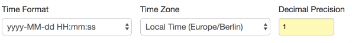

Weekly Change Log: April 25 - April 30, 2017
==================================================

### ATSD

| Issue| Category    | Type    | Subject                                                             |
|------|-------------|---------|---------------------------------------------------------------------|
| [4085a](#issue-4085a) | UI | Feature | Add date formatting options in the SQL console. |
| 4085b | UI | Feature | Implement client-side number and date formatting in the SQL console to avoid reloading the resultset. |
| 4148 | UI | Bug | Fix formatting errors in the SQL console related to datetime columns misqualified as numeric. |
| 4137 | UI | Bug | Fix parsing of non-numeric values in the SQL console. |
| 4114 | UI | Bug | Add a prefix to custom query names stored in local storage by the Admin: API Client.  |
| 4119 | api-rest | Bug | Optimize [series query](../../api/data/series/query.md) with `limit = 1` and `entity = "*"`. |
| [4134](#issue-4134) | portal | Feature | Add boilerplate charg configuration code new portals. |
| 4120 | sql | Bug | Speed up queries with `PREVIOUS` interpolation. |
| 4069 | sql | Bug | Fix interpolation issues in queries with overlapping periods. |

### Charts

| Issue| Category    | Type    | Subject                                                             |
|------|-------------|---------|---------------------------------------------------------------------|
| 4126 | box | Feature | Add 'Last' to the tooltip in box chart |
| 4122 | widget-settings | Bug | Remove colon suffix in labels when `add-meta` is used and `legend-last-value = false` |

## ATSD

### Issue 4085a
--------------

### Issue 4134
--------------

