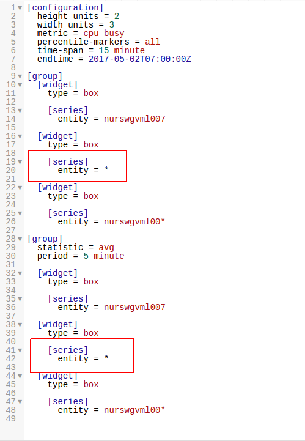

Weekly Change Log: May 01, 2017 - May 07, 2017
==================================================
### ATSD

| Issue| Category    | Type    | Subject                                                             |
|------|-------------|---------|----------------------
| 4149 | sql | Bug | Fixed a self-join exception that occurred when using `metrics()` function |
| 4131 | Test | Bug | Fixed an error caused by not accounting for Daylight Savings Time when using command `GROUP BY period`|
| 4130 | sql | Bug | Fixed an aggregation error for SQL Queries, which resulted in incorrect aggregation and display of results|
| 4112 | sql | Bug | Fixed a return error, where `isnull` function failed to return conditional data, even when conditions were met.|
| 4105 | sql | Bug | Fixed a grouping error when considering a time series and using `where` and `between` sub-queries|
| 4097 | UI | Bug | Fixed a problem caused by running parallel SQL queries, terminating one long-running query would terminate both. |

### Collector

| Issue| Category    | Type    | Subject                                                             |
|------|-------------|---------|----------------------
| 4154 | docker | Bug | Fixed an `async` exception that occurred while in `sleep` mode  |
| 4151 | docker | Bug | Fixed error caused by temporary system crash, resulting in a data gap upon restart. |

### Charts

| Issue| Category    | Type    | Subject                                                             |
|------|-------------|---------|----------------------
| [4153](#Issue-4153) | box | Bug | Fixed an auto-scaling error when using the [Box Widget](https://axibase.com/products/axibase-time-series-database/visualization/widgets/box-chart-widget/#tab-id-1) that resulted in incorrect display |
| 4124 | refactoring | Bug | Series-label optimization |

### Issue 4153

Application of `statistic` command yielded incorrect displays for the highlighted regions.

Entries that displayed erroneously are marked for clarity.