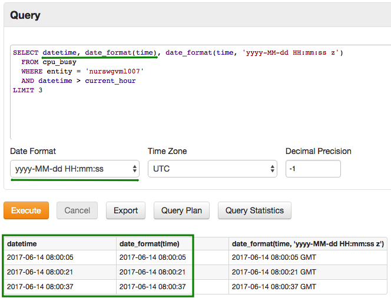
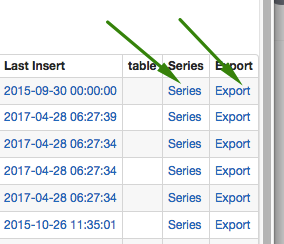
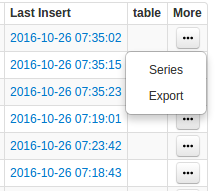

Weekly Change Log: May 08, 2017 - May 14, 2017
==================================================

### ATSD

| Issue| Category    | Type    | Subject              |
|------|-------------|---------|----------------------|
| 4183 | sql | Bug | Fixed an NullPointerException caused by empty output path in scheduled SQL queries. |
| 4176 | UI | Bug | Fixed a paging issue on Entities page. |
| 4174 | csv | Support | Ensure compatibility of schema-based browsers with Java 8. |
| 4172 | rule engine | Bug | Fixed broken rendering of the Alerts History detail page. |
| [4166](Issue-4166) | UI | Feature | Apply user-defined time format to datetime columns on the SQL console. |
| 4165 | UI | Feature | Extend SQL syntax highlighter with extended ATSD keywords. |
| 4159 | UI | Bug | Removed an unneeded sorting option on the System Information page. |
| 4156 | sql | Bug | Ensure email delivery in case of file write errors in scheduled SQL queries. |
| [4146](#Issue-4146) | sql | Feature | Modified [`GROUP BY PERIOD`](https://github.com/axibase/atsd/tree/master/api/sql#grouping) processing to include all samples within the period. |
| [4140](#Issue-4140) | UI | Feature | Replace named links with drop-down menus in record tables. |
| [3838](#Issue-3838) | sql | Feature | Add support for column aliases in the `ORDER BY` clause. |

### ATSD

#### Issue 4166

```sql
SELECT datetime, date_format(time), date_format(time, 'yyyy-MM-dd HH:mm:ss z')
  FROM mpstat.cpu_busy
  WHERE entity = 'nurswgvml007'
  AND datetime > current_hour
LIMIT 3
```



#### Issue 4146

```sql
SELECT datetime, avg(value), count(value)
  FROM mpstat.cpu_busy
WHERE datetime >= '2017-05-01T00:05:00Z' AND datetime < '2017-05-02T00:00:00Z'
  GROUP BY PERIOD(1 HOUR)
```

The period starting at '2017-05-01T00:00:00Z' is now included even though it starts earlier than the selection interval start time '2017-05-01T00:05:00Z'.

```ls
| datetime             | avg(value) | count(value) | 
|----------------------|------------|--------------| 
| 2017-05-01T00:00:00Z | 1          | 1            | <-- included
| 2017-05-01T01:00:00Z | 3          | 3            | 
| 2017-05-01T02:00:00Z | 5          | 1            | 
```

#### Issue 4140



These links have been compressed to a dropdown menu, as shown below:



