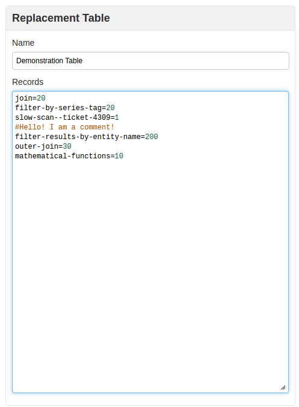
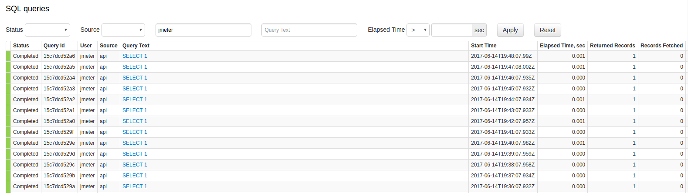
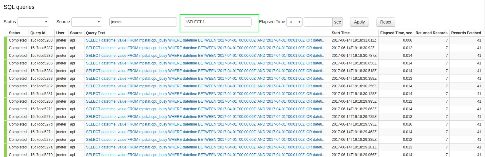

Weekly Change Log: May 15, 2017 - May 21, 2017
==================================================
### ATSD
| Issue| Category    | Type    | Subject              |
|------|-------------|---------|----------------------|
| 4207 | core | Bug | Add missing `HOST` tags to all internal ATSD metrics.|
| 4205 | UI | Bug | Refresh replacement table cache when it's modified. The cache is used in SQL queries to replace field values similar to a lookup table or a dictionary.|
| 4202 | csv | Bug | Consolidate error log events when parsing CSV files for simplified troubleshooting. |
| [4196](#issue-4196) | api-network | Feature | Enable support for gzip compression in [/api/v1/command](https://github.com/axibase/atsd/blob/master/api/data/ext/command.md) method. |
| 4191 | UI | Bug | Clone button in the scheduled SQL configuration fails to redirect to the new configuration. |
| 4189 | sql | Bug | Fix [`LIKE`](https://github.com/axibase/atsd/tree/master/api/sql#where-clause) comparator when comparing tags using wildcards. |
| [4184](#issue-4184) | core | Feature | Add support for comments (hash symbol) in replacement tables. |
| 4182 | sql | Bug |Fix parsing error when [`CAST`](https://github.com/axibase/atsd/tree/master/api/sql/#cast) function is used within [`ISNULL`](https://github.com/axibase/atsd/blob/master/api/sql/README.md/#isnull) function with a string argument: `CAST(ISNULL(LOOKUP('tab-1', entity), '0') AS NUMBER)`.|
| [4179](#issue-4179) | sql | Feature | Add an option to exclude queries from the SQL query statistics page using `!` as the negation symbol. |
| 4178 | export | Bug | Fixed a bug with email notifications when Output Path was not specified. |
| 4175 | sql | Bug | Incorrect period start calculated for YEAR period and END_TIME alignment.  |
| 4169 | rule engine | Bug | Fix FileNotFoundException when /tmp/atsd/alert.log was removed by the operating system. |
| 4161 | sql | Bug | Apply syntax highlighting prior to displaying the result set in the SQL console. |
| 4132 | collectd | Feature | Force [`collectd`](https://github.com/axibase/atsd-collectd-plugin) to use a short hostname instead of a Fully Qualified Domain Name when FQDN is `localhost`.  |
| 4115 | UI | Bug | Fix localization issue with submit buttons without the value attribute. |

#### ATSD

##### Issue 4196

Sample curl command:

```
 curl -X POST --data-binary @command.txt.gz http://server-name:8088/api/v1/command --header "Content-Encoding:gzip" --header "Content-Type:text/plain;charset=UTF-8"
```

##### Issue 4184



##### Issue 4179

In SQL Console > Query Statistics



Using an exclamation point in the Query Text search bar will hide results that include the
indicated text, in this case `!SELECT 1` hides results which include `SELECT 1` in the
query text, as shown below:


