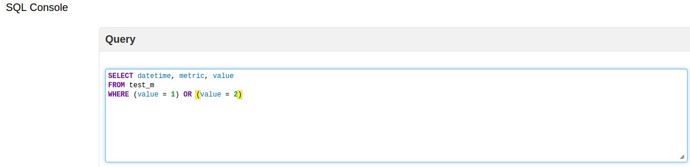
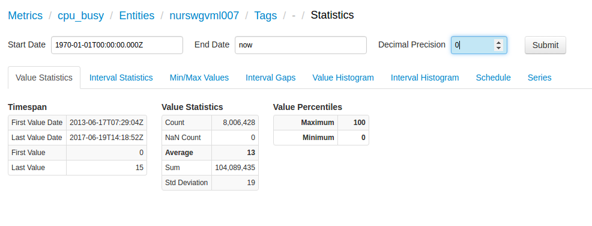
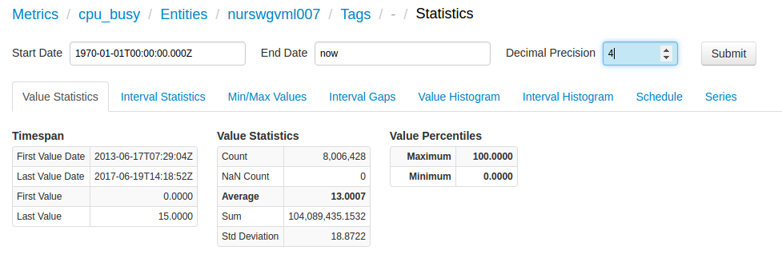

Weekly Change Log: May 22, 2017 - May 28, 2017
==================================================
### ATSD

| Issue| Category    | Type    | Subject              |
|------|-------------|---------|----------------------|
| 4222 | export | Bug | Optimization of export query execution |
| 4219 | UI | Bug | Optimization of page-rendering in [SQL Console](https://github.com/axibase/atsd/tree/master/api/sql) |
| 4216 | core | Bug | Corrected an Out of Memory error with the ATSD engine by the defining the internal processing limit |
| 4214 | api-rest | Feature | Enable support for gzip compression in [/api/v1/command](https://github.com/axibase/atsd/blob/master/api/data/ext/command.md) method for JSON content. |
| 4212 | data-in| Bug| Repaired a bug which caused a NumberFormatException, instead of triggering an error message instance upon the discovery of incorrectly-inputted data |
| 4211 | sql | Bug | Repaired a bug which caused incorrect parsing of date data in the [SQL Console](https://github.com/axibase/atsd/tree/master/api/sql) resulting in an IllegalArgumentException for valid time dependant queries. |
| 4208 | data-in| Bug | Fixed a bug with resource-clearing if disconnect on error mode is off |
| [4195](#issue_4195) | sql | Bug | Fixed an exception error produced by redundant notation in query. |
| 4181 | sql | Bug | Fixed an interpolation error which incorrectly interpreted time data from before 1970. |
| 4152 | sql | Bug | Fixed bug in [`WHERE`](https://github.com/axibase/atsd/tree/master/api/sql#where-clause) expressions that failed to correctly interpret multiple conditions when using the [`METRIC LIKE`](https://github.com/axibase/atsd/tree/master/api/sql#metrics) command |
| 4133 | test | Feature | Error-message instances added in [`SQL Console`](https://github.com/axibase/atsd/tree/master/api/sql). |
| [3834](#issue_3834) |UI | Feature| Client-side data configuration enabled without the need to reload and reprocess data. |

### ATSD

#### Issue 4195 

Bracket notation is unneeded here and would trigger an ExceptionError, the presence of bracket notation now has no effect on how the data is interpreted.

#### Issue 3834

Modifying these fields no longer requires preforming the query a second time.

