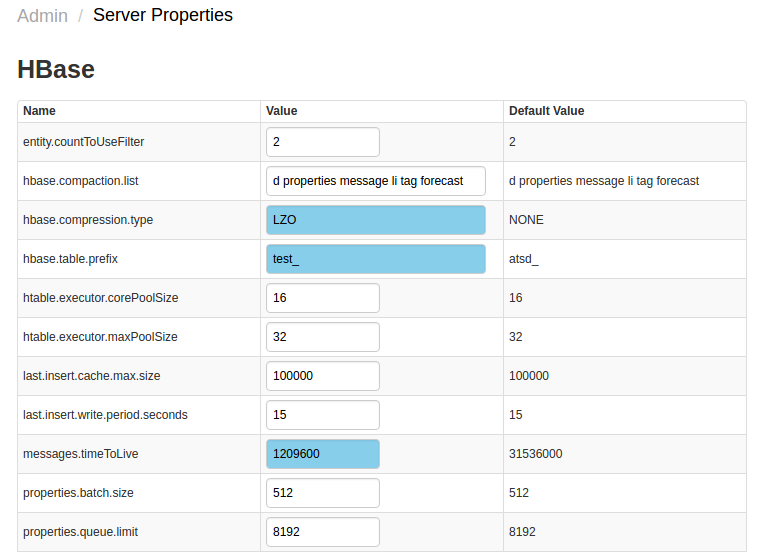
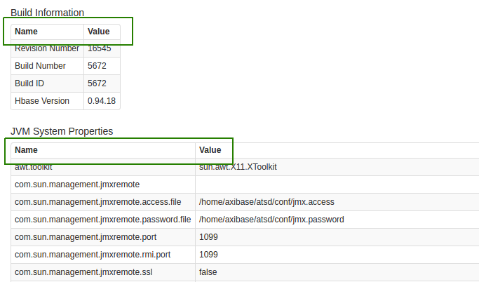
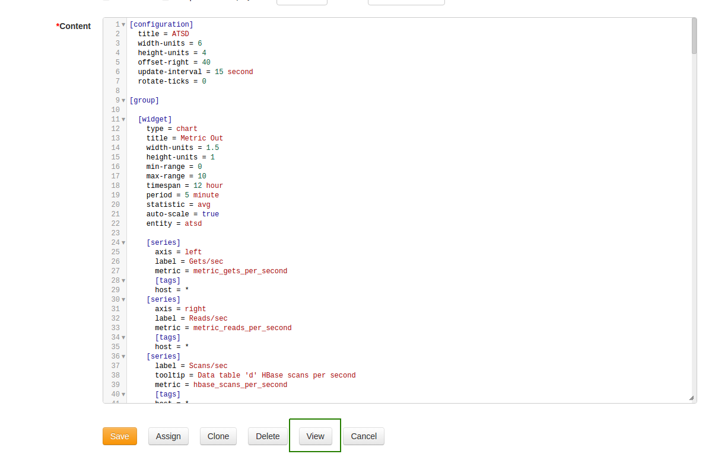
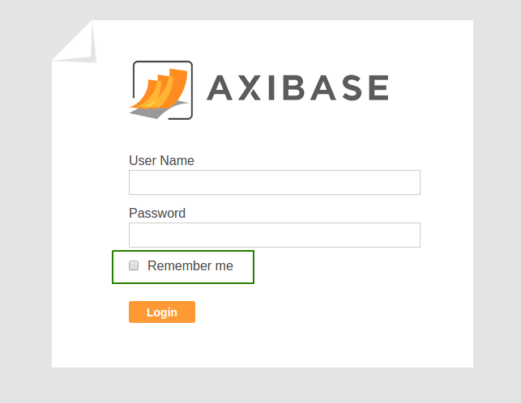
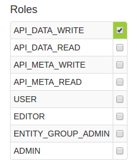
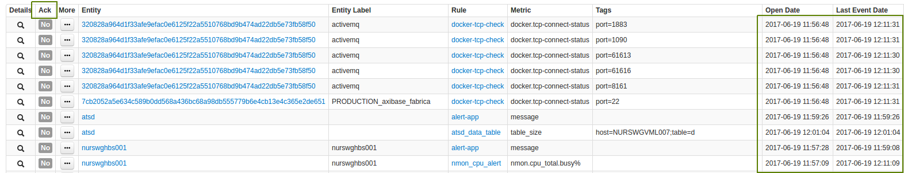
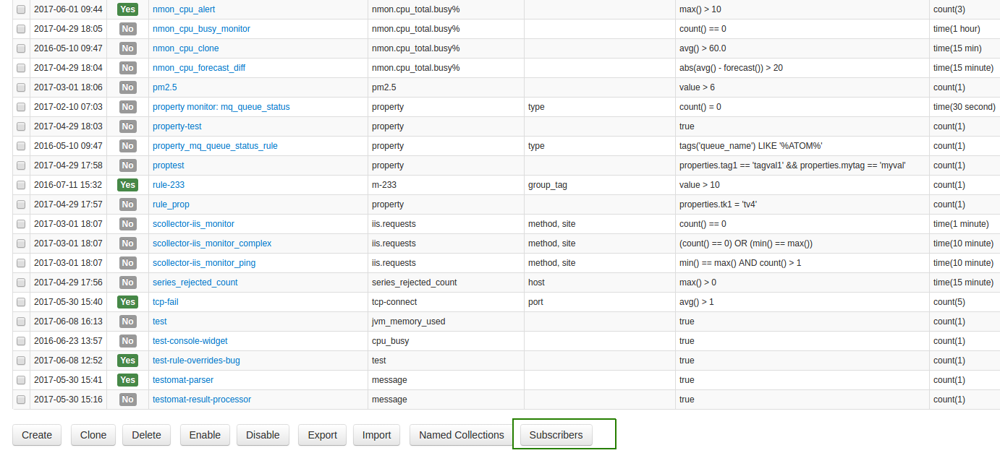

Weekly Change Log: May 29, 2017 - June 04, 2017
==================================================
### ATSD

| Issue| Category    | Type    | Subject              |
|------|-------------|---------|----------------------|
| 4236 | sql | Bug | Resolved UnhandledExceptionError when using [`JOIN`](https://github.com/axibase/atsd/tree/master/api/sql#joins)  and [`INTERPOLATE(DETAIL)`](https://github.com/axibase/atsd/tree/master/api/sql#interpolation) functions together. |
| 4224 | sql | Bug | Fixed a bug which rendered time and date information as a measure of milliseconds when concatenated with the [`CONCAT`](https://github.com/axibase/atsd/tree/master/api/sql#string-functions) function.|
| 4199 | admin | Bug | Fixed a bug which failed to update `HOSTNAME` and server URL during refresh |
| [4163](#issue-4163) | UI | Feature | Several enhancements to the ATSD User Interface |
| [4144](#issue-4144) | rule engine | Feature | Configuration > Rules, features added to enhance usability.|
| 4107 | UI | Bug | Layout of several pages refactored to newest standards |
| 3900 | UI | Bug | Fixed MessageStats API bug to parse JSON data when given an unexpected field. |

### ATSD

#### Issue 4163

1. Admin > Server Properties, modified to display differences between actual and default 
property values: 

2. Admin > System Information, table headers added to user interface:

3. Configuration > Portals, `VIEW` button allows for real-time viewing of 
Portal during configuration, even if certain `[GROUP]` clusters are missing
entities:

4. 'Remember Me' feature added for instances of nur.axibase.com to preserve
login information between sessions:

5. Admin > Users, syntax simplified for User Roles, `ROLE_` prefix removed:

6. Metric, unneeded columns removed from the main page, still shown on 
individual entity page.

7. Alerts, second precision added to date column, `ACKNOWLEDGE` column shortened to
`ACK`:

8. Messages, Millisecond precision added to date column.

#### Issue 4144

Configuration > Rules

Subscribers button allows the user to audit email subscribers, configurations, and rules 
without exporting data and reviewing .xml file. 

