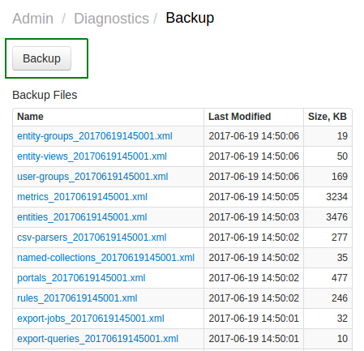
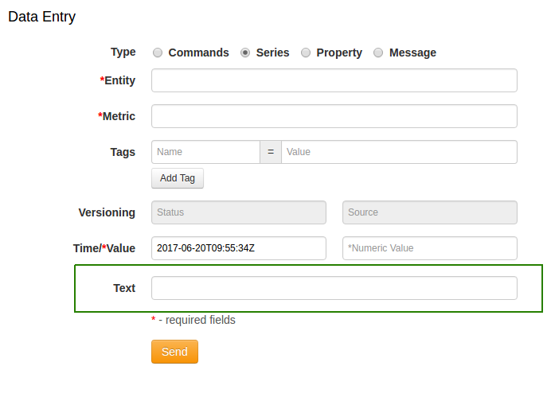

Weekly Change Log: June 05, 2017 - June 11, 2017
==================================================
### ATSD

| Issue| Category    | Type    | Subject              |
|------|-------------|---------|----------------------|
| 4264 |rule editor | Bug | Unable to set schedule in the Rule Editor. |
| 4256 | statistics | Bug | Invalid interval gap displayed on series statistics page. |
| 4249 | core | Bug | Prevent deletions of column families on restart, if the column family is not described in new schema. |
| [4243](#issue-4243) | admin | Feature | Add new object types to backup: Replacement Tables, Named Collections, Users, User Groups, Entities. |
| 4237 | UI | Bug | Modify standard tooltips to bootstrap tooltips. |
| 4233 | sql | Bug | [`CONCAT`](https://github.com/axibase/atsd/tree/master/api/sql#string-functions) function fails when one of the arguments is an ISO-8601 date. |
| 4225 | sql | Feature | Allow [`datetime`](https://github.com/axibase/atsd/tree/master/api/sql#predefined-columns) column without table qualifier in JOIN queries. |
| 4221 | sql | Bug | `ISNULL(t1.datetime, t2.datetime)` function returns time in milliseconds for string data types. |
| 4217 | sql | Bug | Incorrect `INNER`-mode interpolation with multiple interval conditions. |
| 4203 | rule engine | Feature | Replace custom logger in Rule Engine with logback appenders. |
| 4157 | sql | Bug | Incorrect result from [`OUTER JOIN USING ENTITY`](https://github.com/axibase/atsd/blob/master/api/sql/examples/outer-join-with-aggregation.md) clause. |
| 4089 | sql | Feature | [`JOIN`](https://github.com/axibase/atsd/tree/master/api/sql#joins) clause is now supported against the reserved [`atsd_series`](https://github.com/axibase/atsd/tree/master/api/sql#atsd_series-table) table. |
| 4084 | api-network | Bug | OoM Error on a large number of commands sent to [`/api/v1/command`](https://github.com/axibase/atsd/blob/master/api/data/ext/command.md) API method. |
| 3556 | UI | Feature | Add Text field to Data Entry form. |

### ATSD

#### Issue 4243

Admin > Diagnostics > Backup, daily .xml backups made for the following object types:

* Replacement Tables
* Named Collections
* Users
* User Groups (with membership)
* Entities (with entity tags, and non-default settings)

#### Issue 3556

Text field added to Metrics > Data Entry form.

