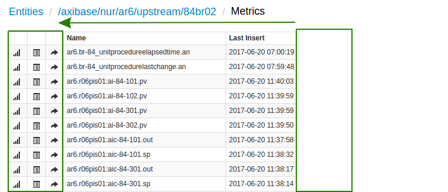
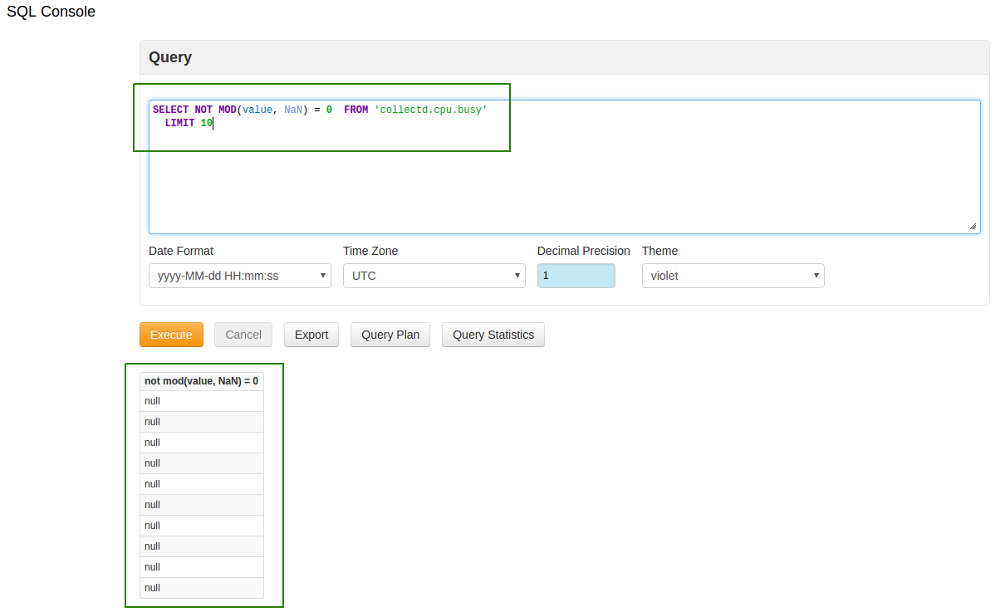
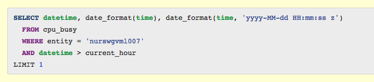
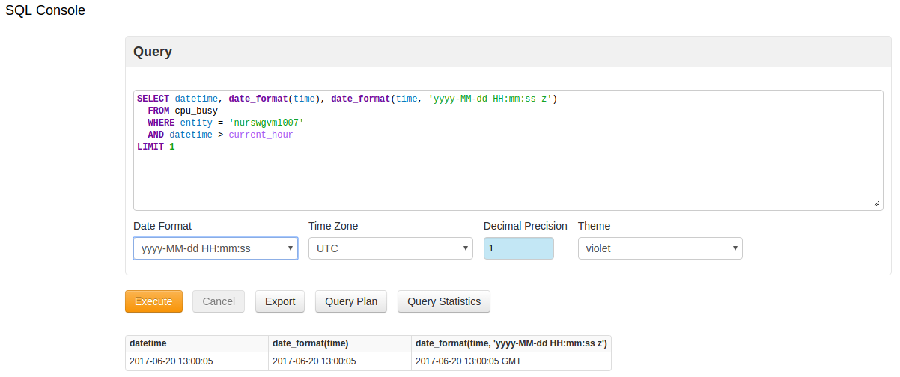

Weekly Change Log: June 12, 2017 - June 18, 2017
==================================================
### ATSD

| Issue| Category    | Type    | Subject              |
|------|-------------|---------|----------------------|
| 4287 | UI | Bug | Additional syntax highlighting for SQL keywords |
| 4282 | UI | Bug | Statistics does not generate a valid SQL query |
| 4279 | UI | Bug | Repaired broken menu path in compact version of ATSD |
| 4275 | security | Bug | Loophole that allowed a deleted user to remain logged in closed.|
| [4273](#Issue-4273) | UI | Bug | User Interface changed for more efficient use |
| 4268 | core | Support | Java 8 validation added |
| 4262 | UI | Bug | Support for EndTime expressions added to Rule/Test Lab |
| 4260 | sql | Bug | Corrected [`ROUND`](https://github.com/axibase/atsd/tree/master/api/sql#mathematical-functions) error with [`NaN`](https://github.com/axibase/atsd/tree/master/api/sql#not-a-number-nan) values|
| 4258 | sql | Bug | Fixed an error that occurred when using non-overlapping datetime filters from different metrics |
| [4247](#Issue-4247) | sql | Feature | [`NaN`](https://github.com/axibase/atsd/tree/master/api/sql#not-a-number-nan) comparison logic changed |
| 4231 | sql | Bug | Fixed an error that occurred when trying to compare [`DATE_FORMAT`](https://github.com/axibase/atsd/tree/master/api/sql#date-formatting-functions) with date string |
| 4223 | core | Bug | TimeSeriesDaoImpl debug logging causing an event storm |
| 4192 | client | Feature | Enable support for gzip compression in [ATSD Java API](https://github.com/axibase/atsd-api-java). |
| [4187](#Issue-4187) | UI | Feature | SQL syntax display enhanced to highlight keywords |
| 4185 | export | Bug | NullPointException on empty output path in scheduled queries repaired |
| [4166](#Issue-4166) | UI | Feature | Apply user-defined 'Time Format' to [`DATE_FORMAT`](https://github.com/axibase/atsd/tree/master/api/sql#date-formatting-functions) functions |
| 4129 | sql | Bug | Zero period allowed in [`PERIOD`](https://github.com/axibase/atsd/tree/master/api/sql#period) and [`INTERPOLATE`](https://github.com/axibase/atsd/tree/master/api/sql#interpolation) |
| 4121 | sql | Bug | [`ORDER BY`](https://github.com/axibase/atsd/tree/master/api/sql#ordering) command revised to exclude columns that have not been grouped with the [`GROUP BY`](https://github.com/axibase/atsd/tree/master/api/sql#grouping) command |
| 4076 | UI | Bug | Repaired active tab highlighting in Admin > Query Statistics |
| 3838 | sql | Feature | SQL: column alias in ORDER BY clause ****|

### ATSD

#### Issue 4273

#### Issue 4247

SQL Console will interact with [`NaN`](https://github.com/axibase/atsd/tree/master/api/sql#not-a-number-nan) values the same way as if it were a [`NULL`](https://github.com/axibase/atsd/tree/master/api/sql#null) value.

#### Issue 4187

#### Issue 4166

User-applied date format function modifies the output of the SQL query.

