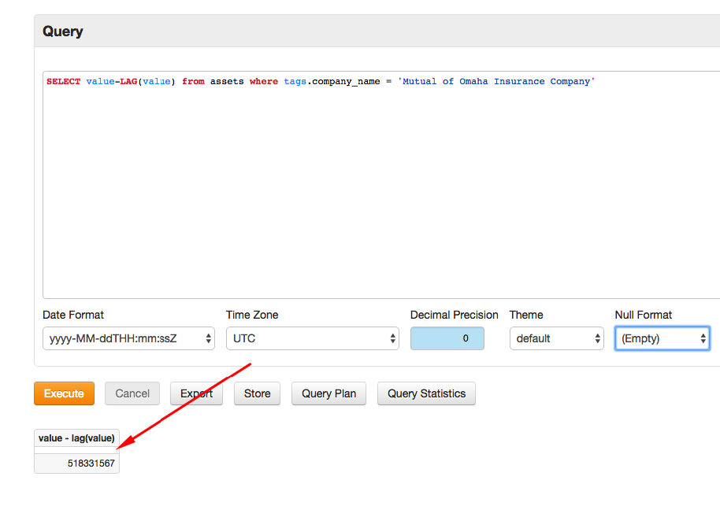
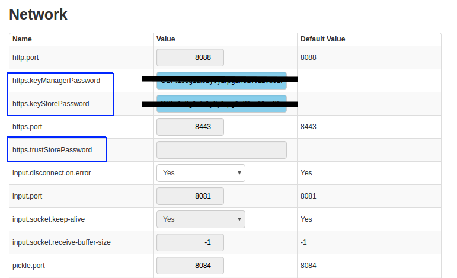

Weekly Change Log: June 26, 2017 - July 02, 2017
==================================================

### ATSD 

| Issue| Category    | Type    | Subject              |
|------|-------------|---------|----------------------|
| 4335 | sql | Feature | Optimized metadata queries with a `FALSE` condition |
| 4331 | UI | Feature | User-selected Text Direction feature enabled |
| 4327 | search | Feature | [Synonym Search](https://github.com/axibase/atsd/blob/master/search/synonyms.md) enabled |
| 4315 | jdbc | Feature | ATSD integration into MatLab |
| 4313 | export | Bug | Resolved an export compatability issue between ATSD and IBM SPSS |
| 4312 | sql | Bug | Bug repaired which raised a NullPointerException when exporting [`NULL`](https://github.com/axibase/atsd/tree/master/api/sql#null) value columns from [SQL Console](https://github.com/axibase/atsd/tree/master/api/sql#overview) |
| [4296](#Issue-4296) | UI | Bug | Multiple enhancements |
| [4293](#Issue-4293) | UI | Bug | Server Properties tooltips added |
| 4240 | collectd | Bug | Collectd: multiple nodes |

### ATSD

##### Issue 4296

###### 1.1 Row Height with [`NULL`](https://github.com/axibase/atsd/tree/master/api/sql#null) Values in Resultset

Support enabled for queries which return [`NULL`](https://github.com/axibase/atsd/tree/master/api/sql#null) values in the resultset to
prevent line height collapse.

###### 1.2 `LIMIT` Row Enabled in Resultset

In Query Statistics, `LIMIT` row displays request parameter limits to queried data. (e.g. `setMaxRows`)

##### Issue 4293

###### 1.1 [https.keyManagerPassword](https://github.com/axibase/atsd/blob/master/installation/ssl-certificate.md)

###### 1.2 [https.keyStorePassword](https://github.com/axibase/atsd/blob/master/installation/ssl-certificate.md)

###### 1.3 [https.trustStorePassword](https://github.com/axibase/atsd/blob/master/installation/ssl-certificate.md)

