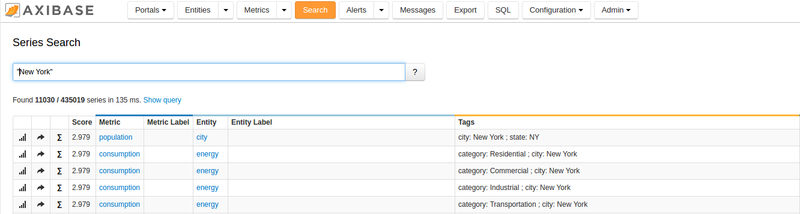
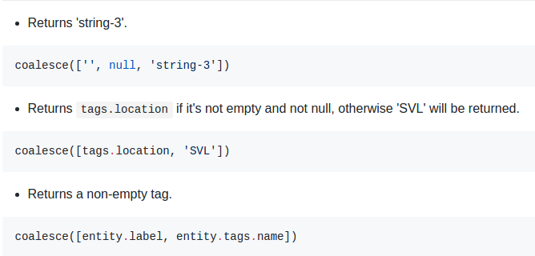

Weekly Change Log: July 03, 2017 - July 09, 2017
==================================================

### ATSD
 
| Issue| Category    | Type    | Subject              |
|------|-------------|---------|----------------------|
| 4352 | SQL| Bug | Standardized the list of columns for wildcard ([*](https://github.com/axibase/atsd/blob/master/api/data/series/examples/query-tags-wildcard-expression.md)) [`SELECT`](https://github.com/axibase/atsd/tree/master/api/sql#select-expression) expressions |
| 4350 | SQL| Bug | Metadata titles field modified to exclude table names from column labels |
| 4347 | Search| Feature | Database re-indexing can be scheduled to occur during off-peak hours. |
| 4346 | JDBC | Bug | Updates applied to enhance [JDBC driver](https://github.com/axibase/atsd-jdbc#jdbc-driver) compatibility.  |
| 4344 | SQL | Bug | Output format standardized for [SQL Console](https://github.com/axibase/atsd/tree/master/api/sql#overview), when exporting as .csv |
| 4343 | JDBC | Feature | getColumnName method from [JDBC](https://github.com/axibase/atsd-jdbc#jdbc-driver) standardized |
| [4320](#Issue-4320) | Search | Feature | Search plug-in added to ATSD, entities, metrics, and tags now searchable simultaneously |
| 4230 | UI | Bug | Fixed a bug that ignored entity when joining DETAIL-interpolated values |
| [4226](#Issue-4226) | SQL | Feature | Support added for [`COALESCE`](https://github.com/axibase/atsd/blob/master/rule-engine/functions-coalesce.md#functions-coalesce) function in [SQL Console](https://github.com/axibase/atsd/tree/master/api/sql#overview)|
| 4117 | SQL | Bug | Bug repaired which rendered [SQL Console](https://github.com/axibase/atsd/tree/master/api/sql#overview) unable to use some entity and metric fields in [WHERE](https://github.com/axibase/atsd/tree/master/api/sql#where-clause) clauses and [HAVING](https://github.com/axibase/atsd/tree/master/api/sql#having-filter) filters within an expression |
| 3888 | SQL | Bug | Repair generated for [`entity.label`](https://github.com/axibase/atsd/tree/master/api/sql#entity-columns) expression to be recognized by the [`WHERE`](https://github.com/axibase/atsd/tree/master/api/sql#where-clause) condition in [SQL Console](https://github.com/axibase/atsd/tree/master/api/sql#overview)|

### ATSD

##### Issue 4320

> Search Plug-In includes live updating. 

##### Issue 4226

> The `Coalesce` Function parses an array of values and returns the first string it detects. If not strings are detected,
the function returns an empty string.

